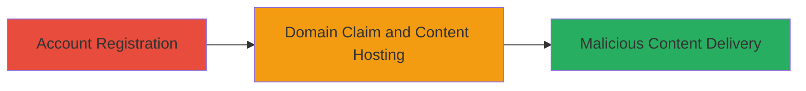

---
tags:
  - subdomain-takeover
  - dns
  - cname
  - webflow
  - phishing
  - malware
type: attack_chain
tools: []
tactics:
  - '[[Initial Access]]'
verified: false
platforms:
  - Web
submitted: true
complexity: medium
created_at: '2023-10-01T00:00:00Z'
procedures:
  - '[[procedures/Register-Webflow-Account-for-Takeover]]'
  - '[[procedures/Host-Malicious-Content-on-Taken-Over-Subdomain]]'
step_count: 2
techniques:
  - '[[Exploit Public-Facing Application]]'
updated_at: '2025-12-14T05:32:23.979Z'
description: >-
  Attack chain exploiting a dangling CNAME record on a subdomain pointing to an
  unused Webflow proxy, allowing takeover to host malicious content for phishing
  or malware distribution.
skill_level: intermediate
impact_level: high
id: 7ceb9a8c-94c2-4138-be73-1f6417e32484
validated: true
mitre_tactics:
  - '[[Initial Access]]'
mitre_techniques:
  - '[[Exploit Public-Facing Application]]'
---
# Subdomain Takeover via Dangling CNAME to Webflow

Multi-stage attack chain demonstrating a complete subdomain takeover workflow on a dangling CNAME record pointing to an unused Webflow service, enabling an attacker to claim the subdomain and host malicious content such as phishing pages targeting Khan Academy users.

## Chain Metrics Dashboard

| Metric | Value |
|--------|-------|
| Chain Status | Unverified |
| Total Steps | 2 |
| Execution Time | ~30 minutes |
| Skill Level | Intermediate |
| Complexity | Medium |
| Impact Level | High |

## Attack Flow Visualization

## Prerequisites & Requirements

### Required Tools

- Web browser for account registration and site building

### Target Environment

- Web platform with DNS configured (CNAME to proxy-ssl.webflow.com)
- No specific ports required beyond standard HTTPS (443)
- Internet access to Webflow

### Initial Access Requirements

- No prior credentials to target
- Publicly resolvable subdomain
- Webflow account (free for registration, paid ~$15 for custom domains)

## Detailed Attack Procedures

### Step 1: Register Webflow Account
procedure: [[procedures/Register-Webflow-Account-for-Takeover]]

**Objective**: Gain access to Webflow's hosting services to claim the dangling subdomain.

**Instructions**: Navigate to webflow.io and complete the registration process using an email address. Verify the account via email confirmation. This provides the necessary permissions to create sites and add custom domains.

**Expected Output**: Active Webflow dashboard with site creation options.

**Success Indicators**:
- Account verification email received
- Dashboard accessible without errors

### Step 2: Claim Subdomain and Host Malicious Content
procedure: [[procedures/Host-Malicious-Content-on-Taken-Over-Subdomain]]

**Objective**: Claim the abandoned subdomain by adding it as a custom domain in Webflow and deploy phishing or malicious content to intercept user traffic.

**Instructions**: Create a new site in Webflow, design a fake login page mimicking Khan Academy, then add the custom domain learnstormindia.khanacademy.org in the site settings. Upgrade to a paid plan if prompted to enable custom domains. Verify the domain propagation by accessing the subdomain, which should now serve the hosted content instead of 404.

**Expected Output**: Subdomain resolves to the attacker's Webflow-hosted page, displaying the malicious content.

**Success Indicators**:
- Subdomain no longer returns 404 from Webflow proxy
- Custom domain status shows as active in Webflow
- Traffic to subdomain loads the fake page

## Attack Chain Summary

### Key Achievements

1. Successful claim of the subdomain learnstormindia.khanacademy.org via Webflow.
2. Deployment of phishing infrastructure to steal user credentials.
3. Potential for broader impacts like malware distribution or XSS on Khan Academy users.

## Technique & Tactic Coverage

### MITRE ATT&CK Techniques

- [[Exploit Public-Facing Application]]

### MITRE ATT&CK Tactics

- [[Initial Access]]

---
*Last updated: 2023-10-01T00:00:00Z*
