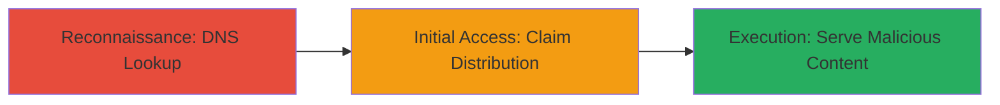

---
tags:
  - subdomain-takeover
  - dns
  - cloudfront
  - aws
  - phishing
type: attack_chain
tools:
  - '[[tools/dig]]'
tactics:
  - '[[Reconnaissance]]'
  - '[[Initial Access]]'
verified: false
platforms:
  - Cloud
  - AWS
  - Web
submitted: true
complexity: medium
created_at: '2023-10-01T00:00:00Z'
procedures:
  - '[[procedures/Detect-Dangling-CNAME-with-DNS-Lookup]]'
  - '[[procedures/Claim-and-Hijack-CloudFront-Distribution]]'
step_count: 2
techniques:
  - '[[Hardware]]'
  - '[[Exploit Public-Facing Application]]'
updated_at: '2025-12-14T05:32:31.398Z'
description: >-
  A multi-stage attack exploiting a dangling DNS CNAME record to claim an
  unowned CloudFront distribution and hijack a trusted subdomain for malicious
  content delivery and phishing.
skill_level: intermediate
impact_level: high
id: 678ea9c5-6fa6-4316-947d-1e8e92c51ebe
validated: true
mitre_tactics:
  - '[[Reconnaissance]]'
  - '[[Initial Access]]'
mitre_techniques:
  - '[[Hardware]]'
  - '[[Exploit Public-Facing Application]]'
---
# Subdomain Takeover via Dangling CloudFront CNAME

Multi-stage attack chain demonstrating a complete subdomain takeover workflow targeting a dangling DNS CNAME to an unclaimed AWS CloudFront distribution.

## Chain Metrics Dashboard

| Metric | Value |
|--------|-------|
| Chain Status | Unverified |
| Total Steps | 2 |
| Execution Time | ~5 minutes |
| Skill Level | Intermediate |
| Complexity | Medium |
| Impact Level | High |

## Attack Flow Visualization



## Prerequisites & Requirements

### Required Tools

- [[tools/dig]]

### Target Environment

- Cloud platform: AWS
- Services: CloudFront, DNS
- Tech stack: DNS resolution, CloudFront distributions

### Initial Access Requirements

- No credentials required for reconnaissance
- Public internet access for DNS queries
- AWS account to claim the distribution

## Detailed Attack Procedures

### Step 1: Reconnaissance - Detect Dangling CNAME
procedure: [[procedures/Detect-Dangling-CNAME-with-DNS-Lookup]]

**Objective**: Identify vulnerable subdomains by querying DNS for dangling CNAME records pointing to unclaimed CloudFront distributions.

**Instructions**: Perform a DNS lookup on the target subdomain using [[commands/dig-dns-lookup-for-cname]] to reveal the CNAME and associated A records.

```bash
dig cloudfront.ubnt.com
```

**Expected Output**: Response showing CNAME to du6drkqe7qw4g.cloudfront.net with multiple A records (e.g., 52.222.171.58), but no active origin, indicating it's claimable.

**Success Indicators**:
- CNAME points to a CloudFront distribution ID
- Multiple global A records returned without origin validation
- No active S3 bucket or custom origin associated

### Step 2: Initial Access - Claim and Hijack Distribution
procedure: [[procedures/Claim-and-Hijack-CloudFront-Distribution]]

**Objective**: Claim the unowned CloudFront distribution and configure it to serve malicious content, enabling subdomain hijacking for phishing or cookie theft.

**Instructions**: Log into AWS Console with an account, navigate to CloudFront, search for the distribution ID (du6drkqe7qw4g.cloudfront.net), claim it by updating origins to point to attacker-controlled content (e.g., S3 bucket with malicious HTML), and obtain SSL certificates via Let's Encrypt to match the subdomain.

```bash
# No direct CLI for claiming, but use AWS CLI to update distribution after claiming via console
aws cloudfront update-distribution --id E123ABC --distribution-config file://config.json
```

**Expected Output**: Distribution updated successfully, with custom origin pointing to attacker's server; subdomain now resolves to malicious content.

**Success Indicators**:
- Distribution claimed and active under attacker's AWS account
- Subdomain traffic routes to attacker's content
- SSL certificate issued for secure cookie theft

## Attack Chain Summary

### Key Achievements

1. Discovered dangling CNAME via DNS reconnaissance
2. Hijacked trusted subdomain by claiming unowned CloudFront distribution
3. Enabled phishing and cookie exfiltration using valid SSL

## Technique & Tactic Coverage

### MITRE ATT&CK Techniques

- [[Hardware]] Gather Victim Host Information: Identify Business Systems
- [[Exploit Public-Facing Application]] Exploit Public-Facing Application

### MITRE ATT&CK Tactics

- [[Reconnaissance]] Reconnaissance
- [[Initial Access]] Initial Access

---
*Last updated: 2023-10-01T00:00:00Z*
