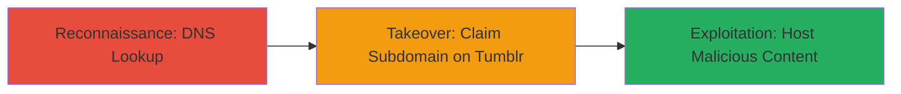

# Subdomain Takeover via Dangling DNS CNAME to Tumblr

Multi-stage attack chain demonstrating detection of a subdomain takeover vulnerability where a dangling CNAME record points to an unused external service like Tumblr's domains.tumblr.com, enabling an attacker to claim the subdomain and host phishing or malicious content under the trusted domain.

## Chain Metrics Dashboard

| Metric | Value |
|--------|-------|
| Chain Status | Unverified |
| Total Steps | 1 |
| Execution Time | ~1 minute |
| Skill Level | Beginner |
| Complexity | Low |
| Impact Level | High |

## Attack Flow Visualization



## Prerequisites & Requirements

### Required Tools

- [[tools/nslookup]]

### Target Environment

- DNS infrastructure with public resolvers
- Access to external services like Tumblr for claiming subdomains
- No special ports beyond 53 (DNS)

### Initial Access Requirements

- Public DNS resolution access
- No credentials needed for detection; Tumblr account for takeover
- Network access to perform DNS queries

## Detailed Attack Procedures

### Step 1: Detect Dangling CNAME Record
procedure: [[procedures/Detect-and-Exploit-Subdomain-Takeover-via-DNS-Lookup]]

**Objective**: Identify misconfigured subdomains with CNAME records pointing to unused external services, confirming takeover potential.

**Instructions**: Perform a DNS lookup on the suspected subdomain using [[commands/nslookup-dns-query-for-cname]] to reveal the CNAME record:

```bash
nslookup engineering.paragonie.com
```

Verify the output shows a CNAME to domains.tumblr.com, indicating the record is dangling if the company no longer uses Tumblr.

**Expected Output**: Resolution showing CNAME to domains.tumblr.com with IP addresses like 66.6.42.22.

**Success Indicators**:
- CNAME record points to external service (e.g., domains.tumblr.com)
- Service confirms subdomain availability for claiming on Tumblr

## Attack Chain Summary

### Key Achievements

1. Identified dangling DNS entry via nslookup
2. Confirmed takeover feasibility on Tumblr
3. Highlighted risks like phishing under trusted domain

## Technique & Tactic Coverage

### MITRE ATT&CK Techniques

- [[Business Relationships]]
- [[Exploit Public-Facing Application]]

### MITRE ATT&CK Tactics

- [[Reconnaissance]]
- [[Initial Access]]

---
*Last updated: 2023-10-01T00:00:00Z*
