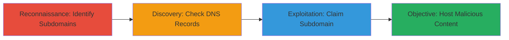

# Subdomain Takeover via Dangling DNS Record on Vimeo Cloud Subdomain

Multi-stage attack chain demonstrating a complete attack workflow for identifying and exploiting subdomain takeover vulnerabilities through dangling DNS records.

## Chain Metrics Dashboard

| Metric | Value |
|--------|-------|
| Chain Status | Unverified |
| Total Steps | 1 |
| Execution Time | ~5 minutes |
| Skill Level | Intermediate |
| Complexity | Low |
| Impact Level | High |

## Attack Flow Visualization



## Prerequisites & Requirements

### Required Tools

- None specific; uses standard DNS query tools like dig.

### Target Environment

- DNS infrastructure
- Web platform for subdomain verification
- No specific ports required beyond standard DNS (port 53)

### Initial Access Requirements

- Public internet access to query DNS
- No credentials needed for reconnaissance phase
- Ability to register domains/services that could claim the dangling record (e.g., AWS, GitHub Pages)

## Detailed Attack Procedures

### Step 1: Reconnaissance and Identification
procedure: [[procedures/Identify-Dangling-DNS-Records-for-Subdomain-Takeover]]

**Objective**: Discover subdomains and identify those with dangling DNS records pointing to unused infrastructure, enabling potential takeover.

**Instructions**: Begin by enumerating potential subdomains using public sources or brute-forcing, then query DNS records to check for misconfigurations. For the Vimeo case, focus on cloud-related subdomains.

Use [[commands/dig-lookup-subdomain]] to query the DNS record:

```bash
dig 1511493148.cloud.vimeo.com
```

Verify if the resolved IP is unused by pinging it or checking service availability:

```bash
ping <resolved-ip>
```

If the IP responds but hosts no active service, or if it's a known decommissioned provider (e.g., old AWS instance), it's dangling.

**Expected Output**: DNS response showing A record to an unused IP, with no active web service on that IP.

**Success Indicators**:
- DNS record found pointing to unused IP
- No active content served from the resolved IP
- Confirmation via provider (e.g., AWS console shows instance terminated)

## Attack Chain Summary

### Key Achievements

1. Identified vulnerable subdomain '1511493148.cloud.vimeo.com' with dangling DNS.
2. Demonstrated potential for attacker to claim the subdomain and impersonate Vimeo.
3. Highlighted the need for DNS cleanup to prevent hijacking.

## Technique & Tactic Coverage

### MITRE ATT&CK Techniques

- [[Hardware]] Gather Victim Host Information: Identify Infrastructure
- [[Exploit Public-Facing Application]] Exploit Public-Facing Application

### MITRE ATT&CK Tactics

- [[Reconnaissance]] Reconnaissance
- [[Initial Access]] Initial Access

---
*Last updated: 2024-01-01T12:00:00Z*
