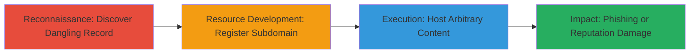

# Subdomain Takeover via Dangling DNS Record on mozaws.net

Multi-stage attack chain demonstrating a complete subdomain takeover workflow by exploiting a misconfigured dangling DNS record under the mozaws.net domain.

## Chain Metrics Dashboard

| Metric | Value |
|--------|-------|
| Chain Status | Unverified |
| Total Steps | 3 |
| Execution Time | ~30 minutes |
| Skill Level | Intermediate |
| Complexity | Medium |
| Impact Level | Medium |

## Attack Flow Visualization

## Prerequisites & Requirements

### Required Tools

- DNS enumeration tools (e.g., dig, nslookup)
- Web hosting service account (e.g., GitHub Pages, Heroku)

### Target Environment

- Public DNS infrastructure
- Target domain: mozaws.net or similar
- Access to third-party services that allow subdomain registration

### Initial Access Requirements

- No credentials required for target
- Public internet access
- Knowledge of target's DNS records

## Detailed Attack Procedures

### Step 1: Discover Dangling DNS Records
procedure: [[procedures/Discover-Dangling-DNS-Records]]

**Objective**: Identify unused or expired DNS records pointing to registrable services.

**Instructions**: Query DNS records for subdomains under the target domain using standard DNS lookup tools. Check for CNAME or other records pointing to services like AWS S3, GitHub Pages, or Heroku that are no longer in use. Verify if the pointed-to resource is claimable by attempting to access the provider's dashboard.

**Expected Output**: List of dangling records, e.g., a CNAME to an unregistered Heroku app.

**Success Indicators**:
- DNS record found pointing to a third-party service
- Service confirms the resource is available for registration

### Step 2: Register and Claim Dangling Subdomain
procedure: [[procedures/Register-and-Claim-Dangling-Subdomain]]

**Objective**: Take control of the subdomain by registering it with the third-party service.

**Instructions**: Navigate to the third-party provider's registration page (e.g., Heroku dashboard) and create a new app or resource using the exact subdomain name from the dangling record. The DNS will automatically resolve to your new resource once registered.

**Expected Output**: Confirmation of subdomain ownership from the provider.

**Success Indicators**:
- Subdomain resolves to your controlled resource
- DNS propagation completes (check with dig or nslookup)

### Step 3: Host Arbitrary Content on Taken-Over Subdomain
procedure: [[procedures/Host-Arbitrary-Content-on-Taken-Over-Subdomain]]

**Objective**: Demonstrate control by serving custom content, simulating phishing or malicious payloads.

**Instructions**: Upload and deploy a simple HTML page or script to the claimed subdomain via the provider's interface. For example, create a proof-of-concept page announcing the takeover. Verify accessibility by browsing to the subdomain.

**Expected Output**: Custom content loads when visiting the subdomain.

**Success Indicators**:
- Arbitrary page visible under the target's subdomain
- No errors in DNS resolution or hosting

## Attack Chain Summary

### Key Achievements

1. Identified and exploited a dangling DNS record under mozaws.net
2. Successfully registered and took control of the subdomain
3. Hosted proof-of-concept content to prove impact

## Technique & Tactic Coverage

### MITRE ATT&CK Techniques

- [[Gather Victim Host Information]] Gather Victim Host Information
- [[T1583.001]] Acquire Infrastructure: Domains

### MITRE ATT&CK Tactics

- [[Reconnaissance]] Reconnaissance
- [[Resource Development]] Resource Development

---
*Last updated: 2023-10-01T00:00:00Z*
