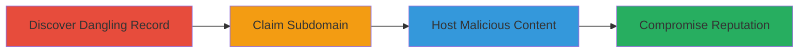

---
tags:
  - subdomain-takeover
  - dns-misconfiguration
  - gcp
  - cloud
type: attack_chain
tools:
  - '[[tools/Subjack]]'
tactics:
  - '[[Initial Access]]'
commands:
  - '[[commands/dig-dns-lookup]]'
platforms:
  - Web
  - DNS
  - Cloud
  - GCP
complexity: medium
procedures:
  - '[[procedures/Discover-Dangling-DNS-Records]]'
  - '[[procedures/Claim-Abandoned-Subdomain]]'
  - '[[procedures/Host-Arbitrary-Content-on-Subdomain]]'
step_count: 3
techniques:
  - '[[Exploit Public-Facing Application]]'
description: >-
  A multi-stage attack exploiting a dangling DNS record to take over a subdomain
  under mozgcp.net, allowing arbitrary content hosting and potential phishing or
  reputation damage to Mozilla.
skill_level: intermediate
impact_level: high
id: 82975740-08dd-4b82-b3a1-5b65edfe7c6f
created_at: '2025-12-14T05:32:23.731Z'
updated_at: '2025-12-14T05:32:23.731Z'
verified: false
validated: true
submitted: true
mitre_tactics:
  - '[[Initial Access]]'
mitre_techniques:
  - '[[Exploit Public-Facing Application]]'
---
# Subdomain Takeover via Dangling DNS Record on mozgcp.net

Multi-stage attack chain demonstrating a complete subdomain takeover workflow by exploiting a dangling DNS record under the mozgcp.net domain, associated with Mozilla's infrastructure.

## Chain Metrics Dashboard

| Metric | Value |
|--------|-------|
| Chain Status | Unverified |
| Total Steps | 3 |
| Execution Time | ~15 minutes |
| Skill Level | Intermediate |
| Complexity | Medium |
| Impact Level | High |

## Attack Flow Visualization



## Prerequisites & Requirements

### Required Tools

- [[tools/Subjack]]
- Access to a DNS provider account (e.g., for registration)

### Target Environment

- DNS infrastructure (GCP-related, domain: mozgcp.net)
- Required services/ports: DNS resolution (port 53)
- Network access requirements: Public internet access for DNS queries and provider registration

### Initial Access Requirements

- No credentials needed initially
- Network position: External attacker
- Prior access needed: None

## Detailed Attack Procedures

### Step 1: Discover Dangling DNS Records
procedure: [[procedures/Discover-Dangling-DNS-Records]]

**Objective**: Identify subdomains with dangling DNS records pointing to decommissioned services, enabling potential takeover.

**Instructions**: Use [[tools/Subjack]] to scan for vulnerable subdomains, or manually query DNS with [[commands/dig-dns-lookup]] to check for records pointing to inactive services like AWS S3 or GCP buckets.

```bash
dig @8.8.8.8 subdomain.mozgcp.net
```

Verify if the resolved IP or CNAME points to a service that returns a 'not found' or takeover-available message.

**Expected Output**: DNS response showing a CNAME or A record to a non-existent service, e.g., 'No such bucket' error.

**Success Indicators**:
- Dangling record identified (e.g., points to unregistered GCP resource)
- Provider confirms subdomain availability

### Step 2: Claim Abandoned Subdomain
procedure: [[procedures/Claim-Abandoned-Subdomain]]

**Objective**: Register and gain control of the vulnerable subdomain on the provider's platform due to the misconfiguration.

**Instructions**: Log into the DNS provider's console (e.g., GCP Cloud DNS) and search for the available subdomain. Complete the registration process to claim ownership, as the dangling record leaves it unclaimed.

No specific command-line tool is required; use the web interface to add the subdomain to your account and update DNS records to point to your controlled service.

**Expected Output**: Confirmation of subdomain ownership in the provider dashboard, with updated DNS propagation.

**Success Indicators**:
- Subdomain registered successfully
- DNS queries now resolve to your controlled resources

### Step 3: Host Arbitrary Content on Subdomain
procedure: [[procedures/Host-Arbitrary-Content-on-Subdomain]]

**Objective**: Demonstrate full control by uploading and serving malicious or proof-of-concept content, potentially for phishing or redirects.

**Instructions**: Once claimed, upload arbitrary files (e.g., HTML page) to the hosting service associated with the subdomain. Use tools like scp or the provider's upload interface to deploy content.

For verification, query the subdomain:

```bash
dig @8.8.8.8 controlled-subdomain.mozgcp.net
```

Access the URL in a browser to confirm your content loads.

**Expected Output**: Custom content served from the subdomain, e.g., a simple index.html page.

**Success Indicators**:
- Arbitrary content accessible via the subdomain URL
- Potential for phishing or traffic redirection confirmed

## Attack Chain Summary

### Key Achievements

1. Identified and exploited a dangling DNS record under mozgcp.net
2. Gained full control of the subdomain through registration
3. Hosted proof-of-concept content, highlighting risks to domain reputation and security

## Technique & Tactic Coverage

### MITRE ATT&CK Techniques

- [[Exploit Public-Facing Application]]

### MITRE ATT&CK Tactics

- [[Initial Access]]

---
*Last updated: 2023-10-01*
