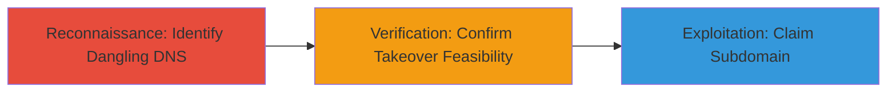

# Subdomain Takeover via Dangling DNS Record to Terminated AWS EC2 Instance

Multi-stage attack chain demonstrating the discovery and exploitation of a DNS misconfiguration allowing subdomain takeover on a staging environment.

## Chain Metrics Dashboard

| Metric | Value |
|--------|-------|
| Chain Status | Unverified |
| Total Steps | 2 |
| Execution Time | ~10 minutes |
| Skill Level | Intermediate |
| Complexity | Medium |
| Impact Level | High |

## Attack Flow Visualization



## Prerequisites & Requirements

### Required Tools

- [[tools/Subfinder]]
- [[tools/Dig]]

### Target Environment

- AWS Cloud platform
- DNS services (e.g., Route 53)
- Access to public DNS resolution

### Initial Access Requirements

- No credentials required
- Public internet access for DNS queries
- No prior access to target infrastructure

## Detailed Attack Procedures

### Step 1: Identify Dangling DNS Record
procedure: [[procedures/Identify-Dangling-DNS-Records-for-Subdomain-Takeover]]

**Objective**: Enumerate subdomains and identify those with dangling DNS records pointing to non-existent or terminated resources.

**Instructions**: Start by enumerating subdomains for the target domain using [[tools/Subfinder]] and the [[commands/subfinder-enumerate-subdomains]] command:

```bash
subfinder -d 8x8.com -o subdomains.txt
```

Then, check DNS resolutions for potential dangling records using [[commands/dig-lookup-subdomain]]:

```bash
cat subdomains.txt | while read sub; do dig +short $sub; done > resolutions.txt
```

Cross-reference resolutions against known terminated AWS resources by checking if the CNAME or alias points to an inactive EC2 endpoint.

**Expected Output**: List of subdomains with resolutions pointing to terminated or unavailable AWS instances, such as █.staging.█.8x8.com resolving to a defunct EC2 alias.

**Success Indicators**:
- Subdomain list generated
- Dangling record identified (e.g., resolves but target resource is terminated)

### Step 2: Verify Misconfiguration for Takeover
procedure: [[procedures/Verify-DNS-Misconfiguration-for-AWS-Subdomain-Takeover]]

**Objective**: Confirm the dangling record allows for takeover by verifying the resource is claimable, such as an unused AWS S3 bucket name.

**Instructions**: Use [[commands/dig-lookup-subdomain]] to verify the specific subdomain resolution:

```bash
挖 +short █.staging.█.8x8.com
```

Check AWS console or use tools to confirm the pointed EC2 instance is terminated. Then, attempt to claim the conflicting resource (e.g., create an S3 bucket with the dangling alias name) to validate takeover potential.

**Expected Output**: DNS query shows CNAME to terminated EC2; no active resource claims the name, confirming takeover feasibility.

**Success Indicators**:
- Resolution confirms dangling status
- Resource name available for registration (e.g., S3 bucket creation succeeds)

## Attack Chain Summary

### Key Achievements

1. Discovered dangling DNS record for staging subdomain
2. Verified termination of underlying EC2 instance
3. Enabled potential subdomain takeover for impersonation

## Technique & Tactic Coverage

### MITRE ATT&CK Techniques

- [[Hardware]] Gather Victim Host Information: DNS
- [[Exploit Public-Facing Application]] Exploit Public-Facing Application

### MITRE ATT&CK Tactics

- [[Reconnaissance]] Reconnaissance
- [[Initial Access]] Initial Access

---
*Last updated: 2023-10-01T00:00:00Z*
