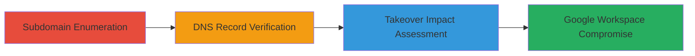

---
tags:
  - subdomain-takeover
  - dns-misconfiguration
  - google-workspace
  - phishing
type: attack_chain
tools:
  - '[[tools/Subfinder]]'
tactics:
  - '[[Reconnaissance]]'
  - '[[Initial Access]]'
verified: false
platforms:
  - Web
submitted: true
complexity: medium
created_at: '2023-10-01T00:00:00Z'
procedures:
  - '[[procedures/Enumerate-and-Verify-Subdomain-Takeover]]'
step_count: 3
techniques:
  - '[[Gather Victim Host Information]]'
  - '[[Exploit Public-Facing Application]]'
updated_at: '2025-12-14T05:32:31.135Z'
description: >-
  Multi-stage attack chain exploiting dangling DNS records in OWOX subdomains to
  enable potential takeover and compromise of associated Google Workspace
  services like Gmail, Calendar, and Drive.
skill_level: intermediate
impact_level: high
id: 50f57356-2de0-48ad-9a35-7cb3eb085c25
validated: true
mitre_tactics:
  - '[[Reconnaissance]]'
  - '[[Initial Access]]'
mitre_techniques:
  - '[[Gather Victim Host Information]]'
  - '[[Exploit Public-Facing Application]]'
---
---
id: 123e4567-e89b-12d3-a456-426614174000
name: Subdomain Takeover via Dangling DNS Records Compromising Google Workspace in OWOX Subdomains
type: attack_chain
description: Multi-stage attack chain exploiting dangling DNS records in OWOX subdomains to enable potential takeover and compromise of associated Google Workspace services like Gmail, Calendar, and Drive.
verified: false
submitted: false
step_count: 3
created_at: 2023-10-01T00:00:00Z
updated_at: 2023-10-01T00:00:00Z
procedures: [[procedures/Enumerate-and-Verify-Subdomain-Takeover]]
techniques: [[Gather Victim Host Information]], [[Exploit Public-Facing Application]]
tactics: [[Reconnaissance]], [[Initial Access]]
tags: subdomain-takeover, dns-misconfiguration, google-workspace, phishing
platforms: Web
tools: [[tools/Subfinder]]
---

# Subdomain Takeover via Dangling DNS Records Compromising Google Workspace in OWOX Subdomains

Multi-stage attack chain demonstrating a complete attack workflow for identifying and exploiting subdomain takeover vulnerabilities in OWOX, Inc., leading to potential hijacking of subdomains and compromise of linked Google Workspace services.

## Chain Metrics Dashboard

| Metric | Value |
|--------|-------|
| Chain Status | Unverified |
| Total Steps | 3 |
| Execution Time | ~30 minutes |
| Skill Level | Intermediate |
| Complexity | Medium |
| Impact Level | High |

## Attack Flow Visualization



## Prerequisites & Requirements

### Required Tools

- [[tools/Subfinder]]
- Standard DNS tools like dig

### Target Environment

- Web platform with DNS resolution
- Access to public DNS records for OWOX, Inc. domains
- No special ports required beyond standard DNS (53)

### Initial Access Requirements

- No credentials needed for enumeration
- Public internet access for DNS queries
- No prior access to target infrastructure

## Detailed Attack Procedures

### Step 1: Subdomain Enumeration
procedure: [[procedures/Enumerate-and-Verify-Subdomain-Takeover]]

**Objective**: Discover all subdomains of the target domain to identify potential takeover candidates.

**Instructions**: Use [[commands/subfinder-enumerate-subdomains]] to perform passive and active subdomain enumeration on owow.com (or relevant OWOX domain):

```bash
subfinder -d owow.com -all -o subdomains.txt
```

Follow up by probing for live subdomains using a tool like httpx, though not detailed here.

**Expected Output**: A text file listing enumerated subdomains, such as app.owow.com, mail.owow.com.

**Success Indicators**:
- At least 10+ subdomains discovered
- List includes potentially sensitive subdomains like those pointing to email or cloud services

### Step 2: DNS Record Verification
procedure: [[procedures/Enumerate-and-Verify-Subdomain-Takeover]]

**Objective**: Inspect DNS records of enumerated subdomains to identify dangling pointers to unused third-party services.

**Instructions**: For each subdomain, query CNAME or other records using [[commands/dig-query-cname]]:

```bash
dig app.owow.com CNAME
```

Look for records pointing to services like AWS S3 buckets, Heroku apps, or Google Workspace that appear unclaimed.

**Expected Output**: DNS response showing CNAME to a third-party service, e.g., "app.owow.com is an alias for unused-heroku-app.herokuapp.com."

**Success Indicators**:
- Identification of dangling records without active ownership
- Records linked to Google Workspace configurations

### Step 3: Takeover Impact Assessment
procedure: [[procedures/Enumerate-and-Verify-Subdomain-Takeover]]

**Objective**: Verify the potential for takeover and assess impact on associated Google services.

**Instructions**: Attempt to claim the dangling service (e.g., register the unused Heroku app) and test hosting a benign page. Check for Google Workspace integration by attempting access to services like Gmail under the subdomain.

**Expected Output**: Successful claim of the service and ability to serve content under the subdomain, revealing Google login prompts.

**Success Indicators**:
- Subdomain hijacked without errors
- Exposure of Google Workspace interfaces (Gmail, Calendar, Drive) under trusted OWOX domain
- Potential for phishing or unauthorized access confirmed

## Attack Chain Summary

### Key Achievements

1. Enumeration of multiple OWOX subdomains revealing misconfigurations
2. Verification of dangling DNS records enabling takeover
3. Assessment of critical impact on Google Workspace services, rated 9.1 severity

## Technique & Tactic Coverage

### MITRE ATT&CK Techniques

- [[Gather Victim Host Information]] Gather Victim Host Information
- [[Exploit Public-Facing Application]] Exploit Public-Facing Application

### MITRE ATT&CK Tactics

- [[Reconnaissance]] Reconnaissance
- [[Initial Access]] Initial Access

---
*Last updated: 2023-10-01T00:00:00Z*
