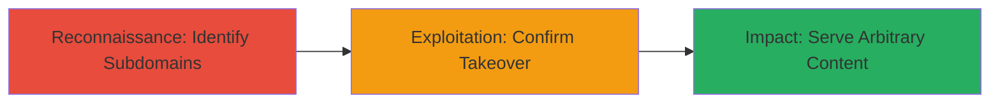

# Subdomain Takeover via Dangling DNS Records on Government Domain

Multi-stage attack chain demonstrating a complete attack workflow exploiting misconfigured DNS records on government-affiliated subdomains, leading to unauthorized control and potential phishing or reputation damage.

## Chain Metrics Dashboard

| Metric | Value |
|--------|-------|
| Chain Status | Unverified |
| Total Steps | 2 |
| Execution Time | ~30 minutes |
| Skill Level | Intermediate |
| Complexity | Medium |
| Impact Level | High |

## Attack Flow Visualization

## Prerequisites & Requirements

### Required Tools

- [[tools/GitHub-Recon-Techniques]]

### Target Environment

- Web platform with DNS services
- Access to public DNS records and GitHub repositories
- No privileged access required initially

### Initial Access Requirements

- Public internet access
- No credentials needed
- Ability to query DNS and interact with GitHub

## Detailed Attack Procedures

### Step 1: Initial Reconnaissance
procedure: [[procedures/Identify-Dangling-Subdomains-Using-GitHub-Recon]]

**Objective**: Discover subdomains linked to the target domain and identify potential dangling DNS records pointing to unused services.

**Instructions**: Apply GitHub reconnaissance techniques to scan for subdomains of the target domain, such as {REDACTED}.data.gov, by searching GitHub for references to DNS providers like GitHub Pages, Heroku, or AWS S3 that may have dangling records.

Use the GitHub Recon Techniques outlined in the referenced blog to enumerate and check for takeovers:

- Search GitHub for repository secrets or configs containing the target domain.
- Query DNS for CNAME records pointing to decommissioned services.

**Expected Output**: A list of 7+ subdomains with dangling records, such as those pointing to unused GitHub Pages or similar.

**Success Indicators**:
- Identification of multiple subdomains with unresolved or dangling CNAMEs
- Confirmation of links to unused services via DNS queries

### Step 2: Execution
procedure: [[procedures/Confirm-and-Demonstrate-Subdomain-Takeover]]

**Objective**: Verify control over identified subdomains by serving arbitrary content, exploiting the server's fallback routing that proxies requests to the main domain while preserving the Host header.

**Instructions**: For each dangling subdomain, claim the associated service (e.g., register the unused GitHub Page or similar) and configure it to serve custom content. Test by sending HTTP requests to the subdomain, which will fallback to {REDACTED}.data.gov's routing, allowing the original Host header to route to your controlled content.

Demonstrate by hosting a simple page or redirect on the subdomain and accessing it via browser or curl.

**Expected Output**: Successful serving of arbitrary content on the subdomain, visible in browser or response body.

**Success Indicators**:
- Arbitrary content loads on the subdomain URL
- No errors in DNS resolution or routing
- Potential for phishing simulation confirmed

## Attack Chain Summary

### Key Achievements

1. Discovery of 7 vulnerable subdomains through GitHub-linked dangling records
2. Successful takeover and content serving on government-affiliated domains
3. Highlighted risks of reputation damage and phishing via trusted subdomains

## Technique & Tactic Coverage

### MITRE ATT&CK Techniques

- [[Gather Victim Host Information]] Gather Victim Host Information
- [[Exploit Public-Facing Application]] Exploit Public-Facing Application

### MITRE ATT&CK Tactics

- [[Reconnaissance]] Reconnaissance
- [[Initial Access]] Initial Access

---
*Last updated: 2023-10-01T12:00:00Z*
