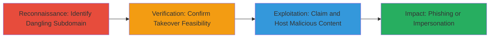

# Subdomain Takeover via Dangling FreshDesk DNS Record

Multi-stage attack chain demonstrating a subdomain takeover workflow by exploiting a dangling DNS record pointing to an expired third-party service like FreshDesk.

## Chain Metrics Dashboard

| Metric | Value |
|--------|-------|
| Chain Status | Unverified |
| Total Steps | 3 |
| Execution Time | ~5 minutes |
| Skill Level | Beginner |
| Complexity | Low |
| Impact Level | High |

## Attack Flow Visualization



## Prerequisites & Requirements

### Required Tools

- Web browser or [[commands/curl-resolve-subdomain]]

### Target Environment

- DNS infrastructure with unmonitored third-party service records (e.g., FreshDesk)
- Expired SaaS service account (e.g., FreshDesk subdomain verification)
- Publicly resolvable subdomain

### Initial Access Requirements

- No credentials required
- Internet access to resolve DNS and visit subdomains
- No prior access to target network

## Detailed Attack Procedures

### Step 1: Reconnaissance - Identify Dangling Subdomain
procedure: [[procedures/Identify-and-Verify-Dangling-Subdomain]]

**Objective**: Discover subdomains pointing to expired or unused third-party services.

**Instructions**: Start by enumerating subdomains of the target domain (e.g., kiwi.ki) using DNS tools or manual checks. Focus on service-related subdomains like 'service.kiwi.ki'. Resolve the subdomain and visit it to check for signs of expired services.

Use a browser to visit the subdomain or execute [[commands/curl-resolve-subdomain]] to probe:

```bash
curl -I http://service.kiwi.ki/
```

Observe the response headers or page content for indicators like FreshDesk branding with expired account errors.

**Expected Output**: HTTP response showing resolution to third-party infrastructure (e.g., FreshDesk) but with service unavailability or claimable status.

**Success Indicators**:
- Subdomain resolves to a SaaS provider like FreshDesk
- Page indicates expired or inactive service

### Step 2: Verification - Confirm Takeover Feasibility
procedure: [[procedures/Identify-and-Verify-Dangling-Subdomain]]

**Objective**: Validate that the dangling record can be claimed by registering a new account with the third-party service.

**Instructions**: Research the third-party service's domain claiming process (e.g., FreshDesk allows custom domain verification via DNS). Confirm the original account is expired by attempting to access admin panels or checking public status. No direct commands needed; manual verification via service documentation and DNS lookup.

Use [[commands/dig-dns-lookup]] to inspect the CNAME or A record:

```bash
dig service.kiwi.ki
```

Verify it points to the provider's nameservers without active ownership.

**Expected Output**: DNS record confirms pointer to provider (e.g., freshdesk.com) without active verification.

**Success Indicators**:
- DNS points to expired service infrastructure
- Provider allows new registrations for the pointed domain

### Step 3: Exploitation - Claim and Host Malicious Content
procedure: [[procedures/Claim-Subdomain-via-Expired-Service]]

**Objective**: Register a new account with the third-party service to claim control of the subdomain and deploy malicious content.

**Instructions**: Create a free account on FreshDesk, add the custom domain 'service.kiwi.ki' during setup, and verify via DNS (update if needed, but since dangling, it should auto-claim). Once claimed, upload phishing pages mimicking KIWI support to trick users into providing credentials.

No specific commands; use the service's web interface. Test accessibility with [[commands/curl-resolve-subdomain]]:

```bash
curl -I http://service.kiwi.ki/
```

**Expected Output**: Subdomain now serves attacker-controlled content (e.g., custom FreshDesk page).

**Success Indicators**:
- Domain claimed successfully in service dashboard
- Subdomain loads attacker-hosted phishing site
- Potential for customer confusion or data theft

## Attack Chain Summary

### Key Achievements

1. Identified vulnerable dangling DNS record for service.kiwi.ki
2. Verified expired FreshDesk integration allowing takeover
3. Demonstrated high-impact phishing risk via subdomain impersonation

## Technique & Tactic Coverage

### MITRE ATT&CK Techniques

- [[Exploit Public-Facing Application]]

### MITRE ATT&CK Tactics

- [[Initial Access]]

---

*Last updated: 2024-10-01T00:00:00Z*
