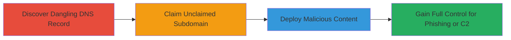

---
tags:
  - subdomain-takeover
  - dns
  - heroku
  - cname
  - cloud
type: attack_chain
tools:
  - '[[tools/Heroku-Dashboard]]'
tactics:
  - '[[Initial Access]]'
verified: false
platforms:
  - Web
  - Cloud (Heroku)
submitted: true
complexity: medium
created_at: '2024-01-01T00:00:00Z'
procedures:
  - '[[procedures/Discover-Dangling-CNAME-Records]]'
  - '[[procedures/Claim-Unclaimed-Heroku-Subdomain]]'
  - '[[procedures/Deploy-Proof-of-Concept-on-Taken-Over-Subdomain]]'
step_count: 3
techniques:
  - '[[Exploit Public-Facing Application]]'
  - '[[Acquire Infrastructure]]'
updated_at: '2025-12-14T04:39:01.817Z'
description: >-
  A multi-step attack exploiting a dangling CNAME record to take over a
  subdomain on Heroku, enabling full control for malicious content hosting.
skill_level: intermediate
impact_level: high
id: 9d1f9156-b626-4823-a567-d867d70a6967
validated: true
mitre_tactics:
  - '[[Initial Access]]'
mitre_techniques:
  - '[[Exploit Public-Facing Application]]'
  - '[[Acquire Infrastructure]]'
---
# Subdomain Takeover via Dangling Heroku CNAME Record

Multi-stage attack chain demonstrating the takeover of a subdomain through a dangling CNAME record pointing to an unclaimed Heroku service, allowing arbitrary content hosting under trusted branding.

## Chain Metrics Dashboard

| Metric | Value |
|--------|-------|
| Chain Status | Unverified |
| Total Steps | 3 |
| Execution Time | ~15 minutes |
| Skill Level | Intermediate |
| Complexity | Medium |
| Impact Level | High |

## Attack Flow Visualization

## Prerequisites & Requirements

### Required Tools

- [[tools/Heroku-Dashboard]]

### Target Environment

- Web platform with DNS records
- Cloud services like Heroku
- Required services/ports: DNS (port 53), HTTP/HTTPS (ports 80/443)
- Network access requirements: Internet access for DNS queries and Heroku API

### Initial Access Requirements

- No prior credentials needed for discovery
- Heroku account for claiming the subdomain
- Public DNS resolution access

## Detailed Attack Procedures

### Step 1: Discover Dangling CNAME Record
procedure: [[procedures/Discover-Dangling-CNAME-Records]]

**Objective**: Identify misconfigured DNS records pointing to unclaimed cloud services, exposing potential takeover opportunities.

**Instructions**: Query the DNS records of the target subdomain to check for CNAME entries. Use online DNS lookup tools or command-line utilities to resolve the CNAME for competition.shopify.com, revealing it points to competition.shopify.com.herokudns.com, a target for unclaimed Heroku apps.

**Expected Output**: DNS response showing the dangling CNAME to an unclaimed Heroku endpoint.

**Success Indicators**:
- CNAME record points to a cloud provider's DNS target (e.g., herokudns.com)
- No active service responds at the resolved endpoint

### Step 2: Claim Unclaimed Heroku Subdomain
procedure: [[procedures/Claim-Unclaimed-Heroku-Subdomain]]

**Objective**: Register the dangling subdomain to a new Heroku app, gaining ownership without authentication barriers.

**Instructions**: Log in to the Heroku Dashboard, create a new app, and add the custom domain 'competition.shopify.com'. Heroku will verify and claim the unclaimed DNS target since no existing app owns it.

**Expected Output**: Confirmation in the Heroku Dashboard that the custom domain has been added successfully.

**Success Indicators**:
- Domain added without errors
- DNS propagation confirms the subdomain now resolves to the new Heroku app

### Step 3: Deploy Proof-of-Concept on Taken Over Subdomain
procedure: [[procedures/Deploy-Proof-of-Concept-on-Taken-Over-Subdomain]]

**Objective**: Upload and configure arbitrary content to demonstrate control, simulating phishing or malware hosting.

**Instructions**: In the Heroku Dashboard, deploy a simple HTML file to a specific path like /329a01fddb5a552265170b02c579c85f.html showing proof of control. Configure the root index to redirect to https://shopify.com. Optionally enable SSL via Let's Encrypt for trusted HTTPS connections.

**Expected Output**: The subdomain loads the uploaded HTML and performs the redirect; SSL certificate issues if enabled.

**Success Indicators**:
- Custom page accessible at the subdomain
- Redirect functions as configured
- SSL certificate active (if enabled)

## Attack Chain Summary

### Key Achievements

1. Identified and exploited a dangling DNS record for subdomain takeover
2. Gained full administrative control of a trusted Shopify-branded subdomain
3. Demonstrated potential for phishing, credential theft, or C2 infrastructure

## Technique & Tactic Coverage

### MITRE ATT&CK Techniques

- [[Exploit Public-Facing Application]]
- [[Acquire Infrastructure]]

### MITRE ATT&CK Tactics

- [[Initial Access]]

---
*Last updated: 2024-01-01T00:00:00Z*
