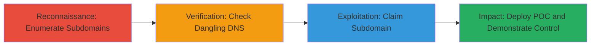

# Subdomain Takeover via Dangling Kajabi DNS Record on course.oberlo.com

Multi-stage attack chain demonstrating a subdomain takeover by exploiting a dangling DNS record pointing to abandoned Kajabi services, granting control over course.oberlo.com for potential phishing, malware distribution, or other attacks leveraging the trusted oberlo.com domain.

## Chain Metrics Dashboard

| Metric | Value |
|--------|-------|
| Chain Status | Unverified |
| Total Steps | 4 |
| Execution Time | ~30 minutes |
| Skill Level | Intermediate |
| Complexity | Medium |
| Impact Level | High |

## Attack Flow Visualization



## Prerequisites & Requirements

### Required Tools

- Web browser for verification
- DNS lookup tools (e.g., dig or nslookup)
- Kajabi account for claiming the site

### Target Environment

- Web platform with DNS-managed subdomains
- Third-party services like Kajabi
- No specific ports required beyond standard DNS (53) and HTTPS (443)

### Initial Access Requirements

- Public internet access
- No prior credentials needed for reconnaissance
- Ability to register on Kajabi

## Detailed Attack Procedures

### Step 1: Enumerate Subdomains for Takeover Opportunities
procedure: [[procedures/Enumerate-Subdomains-for-Takeover-Opportunities]]

**Objective**: Identify potential subdomains that could be vulnerable to takeover by enumerating the target's domain and checking for exposed records.

**Instructions**: Perform subdomain enumeration on oberlo.com to discover subdomains like course.oberlo.com. Use DNS tools to query records and identify those pointing to third-party services.

For example, query DNS records:

```bash
dig course.oberlo.com
```

This reveals CNAME records pointing to Kajabi infrastructure.

**Expected Output**: List of subdomains with their DNS resolutions, highlighting course.oberlo.com.

**Success Indicators**:
- Subdomain course.oberlo.com identified
- DNS points to external service like Kajabi

### Step 2: Verify Dangling DNS Records to Third-Party Services
procedure: [[procedures/Verify-Dangling-DNS-Records-to-Third-Party-Services]]

**Objective**: Confirm if the subdomain's DNS record is dangling by checking if the linked third-party site (Kajabi) is inactive or deleted.

**Instructions**: Resolve the subdomain's DNS and visit the resolved Kajabi URL to verify inactivity. Check Kajabi's site status for the associated configuration.

For example, use browser or curl to access the resolved endpoint:

```bash
curl -I https://course.oberlo.com
```

Look for errors indicating a deleted or abandoned site.

**Expected Output**: HTTP errors or messages confirming the Kajabi site is inactive while DNS still points there.

**Success Indicators**:
- DNS resolves to Kajabi but site returns 404 or similar
- No active content under the subdomain

### Step 3: Claim Abandoned Subdomain on Kajabi
procedure: [[procedures/Claim-Abandoned-Subdomain-on-Kajabi]]

**Objective**: Take control of the subdomain by registering a new Kajabi site with the matching name, hijacking the dangling record.

**Instructions**: Create a free Kajabi account, set up a new site, and configure the custom domain to course.oberlo.com. Kajabi will verify and claim the subdomain since it's unclaimed.

No specific command; perform via Kajabi dashboard: Add custom domain and point to the subdomain.

**Expected Output**: Successful domain verification in Kajabi, with control over https://course.oberlo.com.

**Success Indicators**:
- Kajabi confirms domain ownership
- Subdomain now serves content from your new site

### Step 4: Demonstrate Control with Proof-of-Concept
procedure: [[procedures/Demonstrate-Control-with-Proof-of-Concept]]

**Objective**: Validate takeover by deploying a simple payload and archiving for proof.

**Instructions**: Upload a basic HTML page or message to the Kajabi site, e.g., "POC: Subdomain Taken Over". Access via https://course.oberlo.com/ and capture screenshot or use Wayback Machine to archive.

For example, use browser to view and curl to verify:

```bash
curl https://course.oberlo.com
```

**Expected Output**: Your POC content displayed on the subdomain.

**Success Indicators**:
- Custom content visible
- Archived proof via Wayback Machine

## Attack Chain Summary

### Key Achievements

1. Identified vulnerable subdomain through enumeration
2. Verified and exploited dangling DNS misconfiguration
3. Gained full control of course.oberlo.com
4. Demonstrated potential for phishing or other attacks

## Technique & Tactic Coverage

### MITRE ATT&CK Techniques

- [[Hardware]] Gather Victim Host Information: Domains
- [[Exploit Public-Facing Application]] Exploit Public-Facing Application

### MITRE ATT&CK Tactics

- [[Reconnaissance]] Reconnaissance
- [[Initial Access]] Initial Access

---
*Last updated: 2023-10-01T00:00:00Z*
