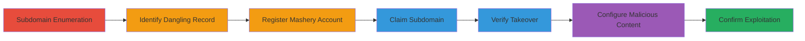

---
tags:
  - subdomain-takeover
  - dns-dangling
  - mashery
  - phishing
  - credential-theft
type: attack_chain
tools:
  - '[[tools/Browser]]'
  - '[[tools/Mashery-Dashboard]]'
tactics:
  - '[[Reconnaissance]]'
  - '[[Initial Access]]'
verified: false
platforms:
  - Web
submitted: true
complexity: medium
created_at: '2023-10-01T00:00:00Z'
procedures:
  - '[[procedures/Enumerate-Target-Subdomains]]'
  - '[[procedures/Identify-Dangling-Mashery-Record]]'
  - '[[procedures/Register-Mashery-Trial-Account]]'
  - '[[procedures/Claim-Subdomain-on-Mashery-Dashboard]]'
  - '[[procedures/Verify-Subdomain-Takeover]]'
  - '[[procedures/Configure-Malicious-Content-on-Takeover]]'
  - '[[procedures/Confirm-Exploitation-with-POC]]'
step_count: 7
techniques:
  - '[[Hardware]]'
  - '[[Exploit Public-Facing Application]]'
updated_at: '2025-12-14T04:38:39.543Z'
description: >-
  A multi-stage attack demonstrating subdomain takeover by exploiting a dangling
  DNS record pointing to the discontinued Mashery service, allowing arbitrary
  content hosting on a trusted Starbucks subdomain for phishing or credential
  theft.
skill_level: intermediate
impact_level: high
id: fbe763e6-452b-4670-99c1-2f1254813db3
validated: true
mitre_tactics:
  - '[[Reconnaissance]]'
  - '[[Initial Access]]'
mitre_techniques:
  - '[[Hardware]]'
  - '[[Exploit Public-Facing Application]]'
---
# Subdomain Takeover via Dangling Mashery DNS on Starbucks Developer Portal

Multi-stage attack chain demonstrating a complete subdomain takeover workflow on developer.openapi.starbucks.com by exploiting a dangling DNS CNAME record to the discontinued Mashery service. This allows an attacker to host arbitrary content, such as phishing pages or malicious JavaScript, under the trusted Starbucks domain, potentially leading to cookie theft, credential harvesting, or session hijacking.

## Chain Metrics Dashboard

| Metric | Value |
|--------|-------|
| Chain Status | Unverified |
| Total Steps | 7 |
| Execution Time | ~15 minutes |
| Skill Level | Intermediate |
| Complexity | Medium |
| Impact Level | High |

## Attack Flow Visualization

## Prerequisites & Requirements

### Required Tools

- [[tools/Browser]]
- [[tools/Mashery-Dashboard]]

### Target Environment

- Web platform
- Open access to port 80 (HTTP)
- DNS resolution for target domain (starbucks.com)
- No authentication required for enumeration and takeover

### Initial Access Requirements

- Public internet access
- No prior credentials needed
- Ability to register free trial accounts on third-party services like Mashery

## Detailed Attack Procedures

### Step 1: Enumerate Target Subdomains
procedure: [[procedures/Enumerate-Target-Subdomains]]

**Objective**: Discover all subdomains of the target domain to identify potential attack surfaces.

**Instructions**: Use subdomain enumeration techniques to list subdomains of starbucks.com. Manually research or use tools to identify developer.openapi.starbucks.com.

**Expected Output**: A list of subdomains, including developer.openapi.starbucks.com.

**Success Indicators**:
- Subdomain list generated
- Target subdomain identified

### Step 2: Identify Dangling Mashery Record
procedure: [[procedures/Identify-Dangling-Mashery-Record]]

**Objective**: Probe the subdomain to detect signs of a dangling DNS record pointing to an unclaimed third-party service.

**Instructions**: Access the subdomain URL via browser and inspect the response headers for indicators like 'Mashery Proxy' server header, confirming a 200 OK with default content.

**Expected Output**: HTTP 200 response with Mashery Proxy header and default page.

**Success Indicators**:
- Server header reveals Mashery service
- Default Mashery page displayed

### Step 3: Register Mashery Trial Account
procedure: [[procedures/Register-Mashery-Trial-Account]]

**Objective**: Gain access to the Mashery platform to potentially claim dangling subdomains.

**Instructions**: Navigate to https://www.mashery.com/ and create a trial account, confirming via email.

**Expected Output**: Active Mashery dashboard access.

**Success Indicators**:
- Account registration successful
- Dashboard login confirmed

### Step 4: Claim Subdomain on Mashery Dashboard
procedure: [[procedures/Claim-Subdomain-on-Mashery-Dashboard]]

**Objective**: Add the dangling subdomain to the attacker's Mashery portal without validation errors.

**Instructions**: In the Mashery dashboard, go to 'Portal Settings' and add developer.openapi.starbucks.com as a custom domain.

**Expected Output**: Subdomain added successfully with no errors.

**Success Indicators**:
- Custom domain configured
- No ownership verification prompted

### Step 5: Verify Subdomain Takeover
procedure: [[procedures/Verify-Subdomain-Takeover]]

**Objective**: Confirm control by observing the attacker's Mashery content on the subdomain.

**Instructions**: Revisit http://developer.openapi.starbucks.com/ and check for the personalized Mashery welcome page from the dashboard.

**Expected Output**: Attacker's Mashery dashboard content served from the subdomain.

**Success Indicators**:
- Subdomain resolves to attacker's portal
- Default attacker content visible

### Step 6: Configure Malicious Content on Takeover
procedure: [[procedures/Configure-Malicious-Content-on-Takeover]]

**Objective**: Inject proof-of-concept or malicious payload to demonstrate control.

**Instructions**: In the Mashery dashboard, edit the welcome page to include JavaScript such as 'alert(document.domain)'.

**Expected Output**: Updated content propagated to the subdomain.

**Success Indicators**:
- Custom JS code saved in dashboard
- Payload ready for execution

### Step 7: Confirm Exploitation with POC
procedure: [[procedures/Confirm-Exploitation-with-POC]]

**Objective**: Trigger the payload to prove full control and potential for attacks like phishing.

**Instructions**: Visit http://developer.openapi.starbucks.com/ to execute the JavaScript alert, confirming domain control.

**Expected Output**: Alert box showing 'developer.openapi.starbucks.com'.

**Success Indicators**:
- JS alert triggered
- Arbitrary content hosting verified

## Attack Chain Summary

### Key Achievements

1. Successful enumeration and identification of vulnerable subdomain
2. Takeover of trusted Starbucks subdomain via Mashery
3. Demonstration of arbitrary content control for phishing or theft

## Technique & Tactic Coverage

### MITRE ATT&CK Techniques

- [[Hardware]] Gather Victim Host Information: Domains
- [[Exploit Public-Facing Application]] Exploit Public-Facing Application

### MITRE ATT&CK Tactics

- [[Reconnaissance]] Reconnaissance
- [[Initial Access]] Initial Access

---

*Last updated: 2023-10-01T00:00:00Z*
