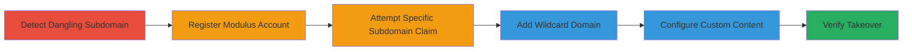

# Subdomain Takeover via Dangling Modulus.io DNS Record

Multi-stage attack chain demonstrating a subdomain takeover by exploiting a dangling DNS record pointing to Modulus.io, allowing an attacker to claim and control the subdomain for potential phishing or malicious content delivery.

## Chain Metrics Dashboard

| Metric | Value |
|--------|-------|
| Chain Status | Unverified |
| Total Steps | 6 |
| Execution Time | ~15 minutes |
| Skill Level | Intermediate |
| Complexity | Medium |
| Impact Level | High |

## Attack Flow Visualization



## Prerequisites & Requirements

### Required Tools

- [[tools/curl]]

### Target Environment

- Web platform with DNS records pointing to Modulus.io
- No active application configured on the hosting service
- Internet access for account creation and DNS verification

### Initial Access Requirements

- No credentials required for detection
- Ability to create a free Modulus.io account
- Network access to the target subdomain

## Detailed Attack Procedures

### Step 1: Detect Dangling Subdomain
procedure: [[procedures/Detect-Dangling-Subdomain-on-Modulus-io]]

**Objective**: Identify if the target subdomain is vulnerable to takeover by checking for Modulus.io error pages.

**Instructions**: Access the subdomain URL directly in a browser or via command line to observe the default error page.

**Expected Output**: Modulus.io error page stating 'NO APPLICATION WAS FOUND FOR api.legalrobot.com'.

**Success Indicators**:
- Error page from Modulus.io appears instead of expected content
- Confirms dangling DNS record

### Step 2: Register Modulus Account and Attempt Claim
procedure: [[procedures/Register-Modulus-io-Account-and-Attempt-Subdomain-Claim]]

**Objective**: Create an account on Modulus.io and try to claim the specific subdomain to assess availability.

**Instructions**: Sign up for a new Modulus.io account via their website and navigate to the dashboard to add the subdomain.

**Expected Output**: Error indicating the subdomain is already added elsewhere, confirming it's dangling but not claimable directly.

**Success Indicators**:
- Account created successfully
- Subdomain addition attempt fails with 'already added' error

### Step 3: Add Wildcard Domain to Claim Subdomain
procedure: [[procedures/Add-Wildcard-Domain-to-Claim-Subdomain]]

**Objective**: Bypass direct claim restrictions by adding a wildcard domain (*.legalrobot.com) to capture the subdomain.

**Instructions**: In the Modulus.io dashboard, add the wildcard domain configuration for *.legalrobot.com.

**Expected Output**: Successful addition of the wildcard domain, allowing control over unmatched subdomains.

**Success Indicators**:
- Wildcard domain added without errors
- Dashboard reflects the new domain configuration

### Step 4: Configure Custom Content
procedure: [[procedures/Configure-Custom-Content-on-Takenover-Subdomain]]

**Objective**: Set up the application to serve arbitrary content on the taken-over subdomain.

**Instructions**: Configure a simple application in Modulus.io to host custom HTML, such as a 'Hello World!' page with an identifying comment.

**Expected Output**: Application deployed and accessible via the subdomain.

**Success Indicators**:
- Custom page visible when accessing the subdomain
- No Modulus.io error page appears

### Step 5: Verify Takeover
procedure: [[procedures/Verify-Subdomain-Takeover-with-Curl]]

**Objective**: Confirm the takeover by fetching and inspecting the content served on the subdomain.

**Instructions**: Use [[commands/curl-verify-subdomain-takeover]] to retrieve the response:

```bash
curl https://api.legalrobot.com
```

**Expected Output**: Custom content like 'Hello World!<!--FRANS ROSEN-->' instead of the error page.

**Success Indicators**:
- Response contains injected custom content
- Subdomain now under attacker control

## Attack Chain Summary

### Key Achievements

1. Detected dangling DNS record pointing to unconfigured Modulus.io
2. Successfully claimed the subdomain via wildcard addition
3. Demonstrated full control by serving custom content
4. Verified takeover, enabling potential impersonation or phishing

## Technique & Tactic Coverage

### MITRE ATT&CK Techniques

- [[Exploit Public-Facing Application]]
- [[T1583.003]]

### MITRE ATT&CK Tactics

- [[Initial Access]]
- [[Reconnaissance]]

---
*Last updated: 2023-10-01T00:00:00Z*
