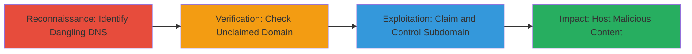

# Subdomain Takeover via Dangling Netlify CNAME on Uber Signup

Multi-stage attack chain demonstrating a complete subdomain takeover workflow on a high-profile target like Uber's signup subdomain.

## Chain Metrics Dashboard

| Metric | Value |
|--------|-------|
| Chain Status | Unverified |
| Total Steps | 3 |
| Execution Time | ~15 minutes |
| Skill Level | Intermediate |
| Complexity | Medium |
| Impact Level | High |

## Attack Flow Visualization



## Prerequisites & Requirements

### Required Tools

- [[tools/dig]]
- [[tools/nslookup]]
- Web browser for Netlify verification

### Target Environment

- Public DNS resolution
- Access to Netlify platform
- No special privileges required beyond public internet

### Initial Access Requirements

- No credentials needed
- Public network access
- Basic knowledge of DNS and hosting platforms

## Detailed Attack Procedures

### Step 1: Identify Dangling DNS Records
procedure: [[procedures/Identify-Dangling-DNS-CNAME-Records]]

**Objective**: Discover misconfigured CNAME records pointing to unclaimed or expired third-party services.

**Instructions**: Use [[commands/dig-cname-lookup]] to query the DNS for the target subdomain:

```bash
dig signup.uber.com CNAME
```

Follow up with [[commands/nslookup-query]] if needed for additional verification:

```bash
nslookup -type=CNAME signup.uber.com
```

**Expected Output**: Resolution showing CNAME to a Netlify domain like example.netlify.app that appears unclaimed.

**Success Indicators**:
- CNAME points to a third-party service (e.g., Netlify)
- No active site resolves from the alias

### Step 2: Verify Unclaimed Domain
procedure: [[procedures/Verify-Unclaimed-Netlify-Domain]]

**Objective**: Confirm the pointed-to domain is available for claiming on the hosting platform.

**Instructions**: Manually visit the Netlify dashboard or use browser to search for the domain alias. No specific command, but simulate with [[commands/curl-netlify-check]] to probe if the site is live:

```bash
curl -I https://unclaimed-site.netlify.app
```

If it returns a Netlify default page or 404 indicating unclaimed, proceed.

**Expected Output**: Netlify's unclaimed site page or error confirming availability.

**Success Indicators**:
- Domain alias is free on Netlify
- No existing site content loads

### Step 3: Claim and Control Subdomain
procedure: [[procedures/Claim-and-Control-Takeover-Domain]]

**Objective**: Take control of the subdomain by claiming it on the third-party platform.

**Instructions**: Sign up for a free Netlify account if not already, then add the custom domain (CNAME target) in the site settings. Point it to a new site hosting malicious content like a phishing page.

Use [[commands/curl-verify-takeover]] post-claim to test control:

```bash
curl -I https://signup.uber.com
```

**Expected Output**: Your hosted content loads on the subdomain.

**Success Indicators**:
- Subdomain resolves to attacker-controlled content
- HTTP traffic routes to attacker's Netlify site

## Attack Chain Summary

### Key Achievements

1. Identified dangling DNS misconfiguration
2. Verified and claimed unclaimed hosting resource
3. Gained control over legitimate subdomain for phishing or malware

## Technique & Tactic Coverage

### MITRE ATT&CK Techniques

- [[Exploit Public-Facing Application]] Exploit Public-Facing Application
- [[Email Accounts]] Compromise Hosting Provider Account

### MITRE ATT&CK Tactics

- [[Initial Access]] Initial Access
- [[Reconnaissance]] Reconnaissance

---
*Last updated: 2023-10-01T00:00:00Z*
