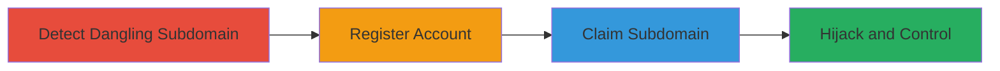

---
tags:
  - subdomain-takeover
  - piwik-cloud
  - hijacking
  - misconfiguration
type: attack_chain
tools: []
tactics:
  - '[[Initial Access]]'
  - '[[Persistence]]'
verified: false
platforms:
  - Web
submitted: true
complexity: low
created_at: '2023-10-01T00:00:00Z'
procedures:
  - '[[procedures/Detect-Dangling-Piwik-Subdomain]]'
  - '[[procedures/Register-Piwik-Cloud-Account]]'
  - '[[procedures/Claim-Dangling-Subdomain]]'
step_count: 4
techniques:
  - '[[Exploit Public-Facing Application]]'
  - '[[Email Accounts]]'
updated_at: '2025-12-14T05:32:31.159Z'
description: >-
  A multi-step attack exploiting a dangling subdomain on Piwik Cloud to hijack
  gratipay.piwik.pro, enabling potential phishing, malicious content hosting, or
  brand impersonation.
skill_level: intermediate
impact_level: high
id: 9cb329c6-8b05-4c60-829b-e0277184c80c
validated: true
mitre_tactics:
  - '[[Initial Access]]'
  - '[[Persistence]]'
mitre_techniques:
  - '[[Exploit Public-Facing Application]]'
  - '[[Email Accounts]]'
---
# Subdomain Takeover via Dangling Piwik Cloud Subdomain on Gratipay

Multi-stage attack chain demonstrating a complete subdomain hijacking workflow by exploiting an unmanaged Piwik Cloud subdomain.

## Chain Metrics Dashboard

| Metric | Value |
|--------|-------|
| Chain Status | Unverified |
| Total Steps | 4 |
| Execution Time | ~5 minutes |
| Skill Level | Intermediate |
| Complexity | Low |
| Impact Level | High |

## Attack Flow Visualization

## Prerequisites & Requirements

### Required Tools

- Web browser (e.g., Chrome or Firefox)

### Target Environment

- Web platform with Piwik Cloud integration
- Access to public internet
- No special services or ports required beyond HTTP/HTTPS

### Initial Access Requirements

- No credentials needed initially
- Public network access to the target subdomain and Piwik Cloud signup
- No prior access to the target domain

## Detailed Attack Procedures

### Step 1: Detect Dangling Subdomain
procedure: [[procedures/Detect-Dangling-Piwik-Subdomain]]

**Objective**: Identify if the target subdomain is available for takeover by checking for availability indicators on Piwik Cloud.

**Instructions**: Open a web browser and navigate to the suspected subdomain URL, such as https://gratipay.piwik.pro/. Look for availability messages indicating the subdomain is unmanaged.

**Expected Output**: A page displaying a message like "THIS SUBDOMAIN IS AVAILABLE! gratipay.piwik.pro is available! Use this subdomain for your Piwik Cloud service."

**Success Indicators**:
- Availability message appears on the subdomain
- No active content or redirect from the original owner

### Step 2: Register Piwik Cloud Account
procedure: [[procedures/Register-Piwik-Cloud-Account]]

**Objective**: Create a new account on Piwik Cloud to gain the ability to claim available subdomains.

**Instructions**: Navigate to the Piwik Cloud signup page at http://piwik.pro/cloud and complete the registration form by entering a username and password.

**Expected Output**: Successful account creation with login credentials provided or confirmation email sent.

**Success Indicators**:
- Account dashboard accessible after login
- Option to add domains or subdomains visible

### Step 3: Claim Dangling Subdomain
procedure: [[procedures/Claim-Dangling-Subdomain]]

**Objective**: Associate the target domain with the new Piwik Cloud account to hijack control of the subdomain.

**Instructions**: Log in to the Piwik Cloud account and add the parent domain (e.g., gratipay.com) to the account settings, which claims the associated subdomain like gratipay.piwik.pro.

**Expected Output**: Confirmation that the domain is added, and the subdomain now resolves to the attacker's controlled Piwik Cloud instance.

**Success Indicators**:
- Subdomain now under attacker control
- Ability to configure analytics or content on the hijacked subdomain

### Step 4: Verify Hijacking and Potential Exploitation

**Objective**: Confirm control over the subdomain and assess impact for further actions like phishing or malicious hosting.

**Instructions**: Visit the hijacked subdomain again to ensure it loads under the attacker's account. Optionally, configure custom JavaScript or redirects to host malicious content.

**Expected Output**: Subdomain loads content controlled by the attacker, such as custom Piwik Cloud analytics setup.

**Success Indicators**:
- Traffic to subdomain now routes through attacker's account
- Potential for phishing pages or brand impersonation confirmed

## Attack Chain Summary

### Key Achievements

1. Identified and confirmed a dangling subdomain on Piwik Cloud.
2. Successfully registered a new account to enable claiming.
3. Hijacked the subdomain, gaining control under the Gratipay domain.
4. Enabled potential for phishing, malicious content, or reputation damage.

## Technique & Tactic Coverage

### MITRE ATT&CK Techniques

- [[Exploit Public-Facing Application]]
- [[Email Accounts]]

### MITRE ATT&CK Tactics

- [[Initial Access]]
- [[Persistence]]

---
*Last updated: 2023-10-01T00:00:00Z*
