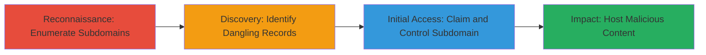

---
tags:
  - subdomain-takeover
  - dns-takeover
  - squarespace
  - phishing
  - xss
  - csrf
type: attack_chain
tools:
  - '[[tools/Subfinder]]'
tactics:
  - '[[Reconnaissance]]'
  - '[[Initial Access]]'
verified: false
platforms:
  - Web
submitted: true
complexity: medium
created_at: '2024-10-01T00:00:00Z'
procedures:
  - '[[procedures/Enumerate-Subdomains-with-Subfinder]]'
  - '[[procedures/Identify-and-Verify-Dangling-Subdomains]]'
  - '[[procedures/Claim-Subdomain-with-Squarespace]]'
step_count: 3
techniques:
  - '[[Hardware]]'
  - '[[Exploit Public-Facing Application]]'
updated_at: '2025-12-14T04:39:09.437Z'
description: >-
  A multi-stage attack exploiting a subdomain takeover vulnerability by
  enumerating subdomains, identifying dangling DNS records pointing to unclaimed
  Squarespace, and claiming control to host malicious content for phishing and
  other attacks.
skill_level: intermediate
impact_level: high
id: 9bc0f313-d5ac-41fe-b40d-fdf69b5e3ba9
validated: true
mitre_tactics:
  - '[[Reconnaissance]]'
  - '[[Initial Access]]'
mitre_techniques:
  - '[[Hardware]]'
  - '[[Exploit Public-Facing Application]]'
---
# Subdomain Takeover via Dangling Squarespace CNAME Record

Multi-stage attack chain demonstrating a subdomain takeover on a target domain by exploiting unclaimed DNS records pointing to Squarespace hosting.

## Chain Metrics Dashboard

| Metric | Value |
|--------|-------|
| Chain Status | Unverified |
| Total Steps | 3 |
| Execution Time | ~15 minutes |
| Skill Level | Intermediate |
| Complexity | Medium |
| Impact Level | High |

## Attack Flow Visualization



## Prerequisites & Requirements

### Required Tools

- [[tools/Subfinder]]
- curl (for HTTP checks)

### Target Environment

- Web platform with DNS records
- Access to public DNS and HTTP endpoints
- No special credentials required initially

### Initial Access Requirements

- Internet access for enumeration and claiming
- Free Squarespace account for takeover
- No prior access to target domain needed

## Detailed Attack Procedures

### Step 1: Enumerate Subdomains
procedure: [[procedures/Enumerate-Subdomains-with-Subfinder]]

**Objective**: Discover all subdomains associated with the target domain to identify potential attack surfaces.

**Instructions**: Use [[commands/subfinder-enumerate-subdomains]] to list subdomains of the target domain:

```bash
subfinder -d consensys.net -o subdomains.txt
```

**Expected Output**: A file containing a list of discovered subdomains, such as www.codefi.consensys.net.

**Success Indicators**:
- subdomains.txt file generated with multiple entries
- At least one subdomain like www.codefi.consensys.net identified

### Step 2: Identify and Verify Dangling Subdomains
procedure: [[procedures/Identify-and-Verify-Dangling-Subdomains]]

**Objective**: Check discovered subdomains for 404 responses and verify if they point to unclaimed services like Squarespace.

**Instructions**: First, probe the subdomains for HTTP status using [[commands/curl-check-http-status]] on each entry from subdomains.txt:

```bash
while read subdomain; do curl -s -o /dev/null -w "%{http_code} %{url_effective}\n" http://$subdomain/; done < subdomains.txt > status_codes.txt
```

Filter for 404s and manually access suspects like http://www.codefi.consensys.net/ to check for the Squarespace "Domain Not Claimed" message.

**Expected Output**: Identification of www.codefi.consensys.net returning 404 with Squarespace error indicating unclaimed domain.

**Success Indicators**:
- 404 status confirmed
- Squarespace unclaimed message observed: "Domain Not Claimed. This domain has been mapped to Squarespace, but it has not yet been claimed by a website."

### Step 3: Claim Subdomain with Squarespace
procedure: [[procedures/Claim-Subdomain-with-Squarespace]]

**Objective**: Gain control over the dangling subdomain by creating a Squarespace site and claiming it.

**Instructions**: Register a free account at squarespace.com, set up a basic website template, then in the dashboard, go to 'use a domain I own', enter http://www.codefi.consensys.net/, and complete the claiming process to upload custom content.

**Expected Output**: Successful claim confirmation in Squarespace dashboard, with ability to host arbitrary HTML/JS on the subdomain.

**Success Indicators**:
- Subdomain now serves custom content from your Squarespace site
- DNS CNAME verified as pointing to your claimed Squarespace instance

## Attack Chain Summary

### Key Achievements

1. Full enumeration of target subdomains using passive and active sources
2. Detection of dangling DNS record leading to unclaimed Squarespace
3. Takeover of subdomain enabling phishing, XSS, CSRF bypass, and OAuth token leakage from main domain

## Technique & Tactic Coverage

### MITRE ATT&CK Techniques

- [[Hardware]] Gather Victim Host Information: Domains
- [[Exploit Public-Facing Application]] Exploit Public-Facing Application

### MITRE ATT&CK Tactics

- [[Reconnaissance]] Reconnaissance
- [[Initial Access]] Initial Access

---

*Last updated: 2024-10-01T00:00:00Z*
