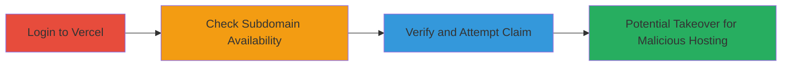

# Subdomain Takeover via Dangling Vercel CNAME

Multi-stage attack chain demonstrating the detection and attempted exploitation of a subdomain takeover on a Vercel-pointing CNAME, as seen in the Sifchain vulnerability where proxies.sifchain.finance and dex2.sifchain.finance were dangling.

## Chain Metrics Dashboard

| Metric | Value |
|--------|-------|
| Chain Status | Unverified |
| Total Steps | 3 |
| Execution Time | ~5 minutes |
| Skill Level | Intermediate |
| Complexity | Medium |
| Impact Level | High |

## Attack Flow Visualization

## Prerequisites & Requirements

### Required Tools

- [[tools/Vercel-Dashboard]]

### Target Environment

- Web platform with DNS resolution
- Access to Vercel services
- No specific ports required beyond standard HTTPS (443)

### Initial Access Requirements

- Valid developer account on Vercel (free tier sufficient)
- Knowledge of target subdomain (e.g., via DNS lookup showing CNAME to cname.vercel-dns.com)
- Network access to vercel.com

## Detailed Attack Procedures

### Step 1: Login to Vercel Dashboard
procedure: [[procedures/Login-to-Vercel-Dashboard]]

**Objective**: Authenticate to Vercel to access domain management features for subdomain checks.

**Instructions**: Navigate to the Vercel login page and sign in using a developer account credentials. This establishes session for subsequent domain operations.

**Expected Output**: Successful dashboard access, redirect to account overview.

**Success Indicators**:
- Dashboard loads without errors
- User profile visible in top-right

### Step 2: Check Subdomain Availability
procedure: [[procedures/Check-Subdomain-Availability-on-Vercel]]

**Objective**: Search for the target subdomain in Vercel settings to determine if it's claimed or dangling.

**Instructions**: From the dashboard, go to your project's settings under Domains tab and input the target subdomain like proxies.sifchain.finance. Observe if it appears as available.

**Expected Output**: Subdomain listed as unclaimed or available for addition.

**Success Indicators**:
- No existing deployment found
- Option to add domain presented

### Step 3: Verify and Attempt Subdomain Claim
procedure: [[procedures/Verify-and-Attempt-Subdomain-Claim]]

**Objective**: Confirm the dangling status and attempt to claim the subdomain for potential takeover, validating the vulnerability.

**Instructions**: Proceed with the add domain flow; if blocked by authorization, note the DEPLOYMENT_NOT_FOUND or similar error, confirming the takeover risk without actual hijack due to Vercel protections.

**Expected Output**: Error or block on claim, but confirmation of no ownership.

**Success Indicators**:
- Subdomain shows as claimable but authorization prevents full takeover
- DNS CNAME verified as pointing to Vercel without project link

## Attack Chain Summary

### Key Achievements

1. Identified dangling CNAME on proxies.sifchain.finance pointing to Vercel
2. Verified unclaimed status via dashboard, enabling potential malicious hosting
3. Assessed impact for phishing and reputation damage, though actual takeover blocked

## Technique & Tactic Coverage

### MITRE ATT&CK Techniques

- [[Exploit Public-Facing Application]] Exploit Public-Facing Application
- [[Vulnerability Scanning]] Vulnerability Scanning

### MITRE ATT&CK Tactics

- [[Initial Access]] Initial Access
- [[Reconnaissance]] Reconnaissance

---
*Last updated: 2023-10-01T00:00:00Z*
