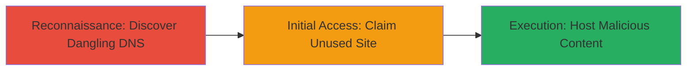

---
tags:
  - subdomain-takeover
  - dns
  - webflow
  - dangling-record
  - phishing
type: attack_chain
tools: []
tactics:
  - '[[Reconnaissance]]'
  - '[[Initial Access]]'
verified: false
platforms:
  - Web
submitted: true
complexity: medium
created_at: '2023-10-01T00:00:00Z'
procedures:
  - '[[procedures/Discover-Dangling-Subdomain-DNS-Record]]'
  - '[[procedures/Claim-Unused-Webflow-Site-for-Takeover]]'
step_count: 2
techniques:
  - '[[Hardware]]'
  - '[[Exploit Public-Facing Application]]'
updated_at: '2025-12-14T05:32:23.896Z'
description: >-
  Attack chain demonstrating discovery of a dangling DNS record pointing to an
  unused Webflow site, enabling potential subdomain takeover for phishing or
  impersonation.
skill_level: intermediate
impact_level: high
id: f98cb2b8-2edd-47a7-854f-d4b36d07d4ef
validated: true
mitre_tactics:
  - '[[Reconnaissance]]'
  - '[[Initial Access]]'
mitre_techniques:
  - '[[Hardware]]'
  - '[[Exploit Public-Facing Application]]'
---
# Subdomain Takeover via Dangling Webflow DNS Record

Multi-stage attack chain demonstrating a complete attack workflow for identifying and exploiting a subdomain takeover vulnerability through a dangling DNS record to an unused Webflow site.

## Chain Metrics Dashboard

| Metric | Value |
|--------|-------|
| Chain Status | Unverified |
| Total Steps | 2 |
| Execution Time | ~5 minutes |
| Skill Level | Intermediate |
| Complexity | Medium |
| Impact Level | High |

## Attack Flow Visualization



## Prerequisites & Requirements

### Required Tools

- Basic DNS resolution tools like dig

### Target Environment

- Web platform with DNS records
- Access to third-party services like Webflow
- No special ports required; standard DNS (port 53) and HTTP (port 80/443)

### Initial Access Requirements

- Public DNS resolution access
- Ability to register/claim on Webflow (no credentials for target needed initially)
- Network access to resolve domains and access web responses

## Detailed Attack Procedures

### Step 1: Reconnaissance - Discover Dangling DNS Record
procedure: [[procedures/Discover-Dangling-Subdomain-DNS-Record]]

**Objective**: Identify subdomains with DNS records pointing to unused third-party hosting services, such as Webflow, to uncover takeover opportunities.

**Instructions**: Start by resolving the DNS records of suspected subdomains using [[commands/dig-resolve-subdomain]] to check the IP and CNAME. For example, target sales.mixmax.com:

```bash
dig sales.mixmax.com +short
```

This should return an IP like 151.101.16.229. Then, verify the HTTP response by curling the subdomain:

```bash
curl -I https://sales.mixmax.com
```

Look for a 404 error or Webflow-specific unused site indicators.

**Expected Output**: DNS IP resolution to a known Webflow proxy (e.g., 151.101.16.229) and a 404 response confirming the site is unused.

**Success Indicators**:
- DNS resolves to third-party IP without active content
- HTTP response shows 404 or proxy error for the service

### Step 2: Initial Access - Claim Unused Site and Take Over Subdomain
procedure: [[procedures/Claim-Unused-Webflow-Site-for-Takeover]]

**Objective**: Claim the unused Webflow site associated with the dangling DNS to gain control of the subdomain and host malicious content.

**Instructions**: Navigate to Webflow's dashboard and search for available sites linked to the proxy IP or domain. If unused, create a new site and configure it to match the dangling record. Update DNS if possible, but since it's dangling, the takeover happens by owning the Webflow backend. Verify control by hosting a test page and accessing via the subdomain:

```bash
curl https://sales.mixmax.com
```

**Expected Output**: Successful claim confirmation in Webflow and custom content loading on the subdomain.

**Success Indicators**:
- Webflow site claimed without conflicts
- Subdomain now serves attacker-controlled content
- Potential for phishing pages under trusted domain

## Attack Chain Summary

### Key Achievements

1. Identified dangling DNS pointer to unused Webflow site
2. Demonstrated potential for subdomain takeover
3. Highlighted risks of phishing and brand impersonation

## Technique & Tactic Coverage

### MITRE ATT&CK Techniques

- [[Hardware]] Gather Victim Host Information: Domains
- [[Exploit Public-Facing Application]] Exploit Public-Facing Application

### MITRE ATT&CK Tactics

- [[Reconnaissance]] Reconnaissance
- [[Initial Access]] Initial Access

---
*Last updated: 2023-10-01T00:00:00Z*
