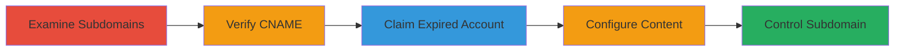

---
tags:
  - subdomain-takeover
  - dns
  - cname
  - phishing
  - defacement
type: attack_chain
tools:
  - '[[tools/dig]]'
tactics:
  - '[[Reconnaissance]]'
  - '[[Initial Access]]'
verified: false
platforms:
  - Web
  - DNS
submitted: true
created_at: '2023-10-01T00:00:00Z'
procedures:
  - '[[procedures/Examine-Subdomains-for-Hosting-Services]]'
  - '[[procedures/Verify-CNAME-Records-for-Dangling-Entries]]'
  - '[[procedures/Claim-Expired-Desk-com-Subdomain]]'
  - '[[procedures/Configure-Custom-Content-on-Taken-Over-Subdomain]]'
step_count: 4
techniques:
  - '[[Hardware]]'
  - '[[Exploit Public-Facing Application]]'
updated_at: '2025-12-14T04:51:26.706Z'
description: >-
  A multi-step attack exploiting an expired Desk.com account to takeover a
  subdomain via dangling CNAME, enabling content control for phishing or
  defacement.
id: 00afef79-8d86-4e65-b4c8-21eab3174f9d
validated: true
mitre_tactics:
  - '[[Reconnaissance]]'
  - '[[Initial Access]]'
mitre_techniques:
  - '[[Hardware]]'
  - '[[Exploit Public-Facing Application]]'
---
# Subdomain Takeover via Expired Desk.com CNAME Record

Multi-stage attack chain demonstrating a subdomain takeover on a Desk.com hosted subdomain due to an expired account and unremoved DNS records.

## Chain Metrics Dashboard

| Metric | Value |
|--------|-------|
| Chain Status | Unverified |
| Total Steps | 4 |
| Execution Time | ~15 minutes |
| Skill Level | Intermediate |
| Complexity | Medium |
| Impact Level | High |

## Attack Flow Visualization



## Prerequisites & Requirements

### Required Tools

- [[tools/dig]]

### Target Environment

- Web platform with DNS resolution
- Access to Desk.com registration
- No special credentials needed beyond public DNS queries

### Initial Access Requirements

- Public internet access for DNS queries
- Ability to register free accounts on Desk.com
- No prior access to target domain required

## Detailed Attack Procedures

### Step 1: Examine Subdomains
procedure: [[procedures/Examine-Subdomains-for-Hosting-Services]]

**Objective**: Identify subdomains potentially hosted on third-party services like Desk.com to find takeover opportunities.

**Instructions**: Manually review or use subdomain enumeration tools to list subdomains of the target domain, such as cloudup.com, and check for those pointing to external services.

**Expected Output**: List of subdomains including help.cloudup.com identified as hosted on Desk.com.

**Success Indicators**:
- Subdomains enumerated
- Potential third-party hosting detected

### Step 2: Verify CNAME Records
procedure: [[procedures/Verify-CNAME-Records-for-Dangling-Entries]]

**Objective**: Confirm if the subdomain has a dangling CNAME pointing to an expired service endpoint.

**Instructions**: Use [[commands/dig-cname-query]] to query the CNAME record:

```bash
dig cname help.cloudup.com +short
```

This resolves to cloudup.desk.com, indicating a potential expired Desk.com setup.

**Expected Output**: CNAME record showing cloudup.desk.com.

**Success Indicators**:
- CNAME points to a third-party service like Desk.com
- No active resolution errors initially

### Step 3: Claim Expired Subdomain
procedure: [[procedures/Claim-Expired-Desk-com-Subdomain]]

**Objective**: Register a new account on Desk.com using the expired subdomain identifier to gain control.

**Instructions**: Navigate to desk.com and attempt to create an account with the identifier cloudup.desk.com. Since the original is expired, registration succeeds.

**Expected Output**: Successful account creation and access to the Desk.com dashboard for the subdomain.

**Success Indicators**:
- Account registration completes without errors
- Dashboard access granted for cloudup.desk.com

### Step 4: Configure Custom Content
procedure: [[procedures/Configure-Custom-Content-on-Taken-Over-Subdomain]]

**Objective**: Set up arbitrary content on the taken-over subdomain to demonstrate control, such as a custom page for phishing.

**Instructions**: In the Desk.com dashboard, configure a custom help page or redirect. Access help.cloudup.com to verify, noting any SSL issues.

**Expected Output**: Custom content loads on the subdomain, though SSL errors may prevent full HTTPS access.

**Success Indicators**:
- Custom page visible on subdomain
- Potential for phishing or defacement confirmed

## Attack Chain Summary

### Key Achievements

1. Identified vulnerable subdomain via enumeration
2. Verified dangling CNAME to expired service
3. Successfully claimed and controlled the subdomain
4. Enabled hosting of malicious content

## Technique & Tactic Coverage

### MITRE ATT&CK Techniques

- [[Hardware]] Gather Victim Host Information: Domains
- [[Exploit Public-Facing Application]] Exploit Public-Facing Application

### MITRE ATT&CK Tactics

- [[Reconnaissance]] Reconnaissance
- [[Initial Access]] Initial Access

---

*Last updated: 2023-10-01T00:00:00Z*
