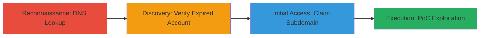

# Subdomain Takeover via Expired Hubspot Account on blog.greenhouse.io

Multi-stage attack chain demonstrating a complete subdomain takeover workflow on Greenhouse.io's blog subdomain, exploiting an expired Hubspot integration to gain control and host malicious content.

## Chain Metrics Dashboard

| Metric | Value |
|--------|-------|
| Chain Status | Unverified |
| Total Steps | 4 |
| Execution Time | ~15 minutes |
| Skill Level | Intermediate |
| Complexity | Medium |
| Impact Level | High |

## Attack Flow Visualization



## Prerequisites & Requirements

### Required Tools

- [[tools/host]]

### Target Environment

- Web platform with DNS resolution
- Access to Hubspot for claiming subdomains
- No special ports required; standard DNS queries over port 53

### Initial Access Requirements

- Public DNS access to the target subdomain
- No credentials needed initially; Hubspot signup for claiming
- Internet connectivity for DNS lookups and Hubspot registration

## Detailed Attack Procedures

### Step 1: Initial Reconnaissance
procedure: [[procedures/DNS-Lookup-for-Subdomain-Enumeration]]

**Objective**: Perform a DNS lookup to identify the subdomain's CNAME alias and detect potential takeover opportunities.

**Instructions**: Use [[commands/host-dns-lookup]] to query the subdomain:

```bash
host blog.greenhouse.io
```

**Expected Output**: Resolution showing aliases like "blog.greenhouse.io is an alias for san.secure001.hubspot.com.edgekey.net. san.secure001.hubspot.com.edgekey.net is an alias for e1395.b.akamaiedge.net."

**Success Indicators**:
- CNAME points to a third-party service like Hubspot
- No active resolution to owned content

### Step 2: Discovery of Vulnerability
procedure: [[procedures/Verify-Expired-Hubspot-Account]]

**Objective**: Confirm that the pointed service (Hubspot) has an expired or inactive account, making the subdomain claimable.

**Instructions**: Manually check Hubspot's subdomain claiming process by attempting to access or search for the alias in Hubspot's dashboard after signing up. No specific command; observe that the DNS alias exists but the content is not served by an active Hubspot account.

**Expected Output**: Inability to access active content on the subdomain, combined with Hubspot allowing claims on dangling DNS records.

**Success Indicators**:
- Subdomain resolves but shows default or error pages
- Hubspot confirms the integration is available for new claims

### Step 3: Initial Access via Takeover
procedure: [[procedures/Claim-Subdomain-on-Hubspot]]

**Objective**: Register and claim control of the subdomain through Hubspot to host arbitrary content.

**Instructions**: Sign up for a Hubspot account if needed, then navigate to Hubspot's domain settings and add the CNAME record for blog.greenhouse.io. Verify control by uploading a test page.

**Expected Output**: Successful subdomain addition in Hubspot dashboard, with control over hosted content.

**Success Indicators**:
- Hubspot dashboard shows the subdomain as active under your account
- DNS propagation confirms your content is served

### Step 4: Execution and Impact Demonstration
procedure: [[procedures/Demonstrate-Subdomain-Exploitation-PoC]]

**Objective**: Host proof-of-concept content to showcase risks like phishing and XSS on the greenhouse.io domain.

**Instructions**: Upload a phishing page mimicking Greenhouse.io login or JavaScript for XSS testing to the claimed subdomain. Access http://blog.greenhouse.io/ to verify.

**Expected Output**: Controlled content loads on the subdomain, e.g., custom HTML/JS executing in the browser context.

**Success Indicators**:
- Arbitrary content visible on blog.greenhouse.io
- Potential for phishing links or XSS payloads confirmed via screenshots or logs

## Attack Chain Summary

### Key Achievements

1. Identified dangling DNS CNAME to expired Hubspot via simple lookup
2. Claimed subdomain without authentication barriers
3. Demonstrated high-impact risks including phishing and XSS
4. Highlighted brand damage potential through PoC

## Technique & Tactic Coverage

### MITRE ATT&CK Techniques

- [[Hardware]]
- [[Exploit Public-Facing Application]]

### MITRE ATT&CK Tactics

- [[Reconnaissance]]
- [[Initial Access]]

---

*Last updated: 2023-10-01T00:00:00Z*
