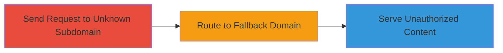

---
tags:
  - subdomain-takeover
  - misconfiguration
  - proxy
  - web
type: attack_chain
tools: []
tactics:
  - '[[Initial Access]]'
verified: false
platforms:
  - Web
submitted: true
complexity: low
created_at: '2023-10-01T00:00:00Z'
procedures:
  - '[[procedures/Demonstrate-Subdomain-Fallback-Routing-Vulnerability]]'
step_count: 3
techniques:
  - '[[Exploit Public-Facing Application]]'
updated_at: '2025-12-14T04:51:10.523Z'
description: >-
  An attack chain exploiting a proxy server misconfiguration on 18f.gov
  subdomains, where unknown subdomain requests fallback to a configured domain
  while preserving the Host header, allowing unauthorized content serving.
skill_level: intermediate
impact_level: medium
id: bc60aca8-73d5-48ca-bd7f-63112e13de18
validated: true
mitre_tactics:
  - '[[Initial Access]]'
mitre_techniques:
  - '[[Exploit Public-Facing Application]]'
---
# Subdomain Takeover via Fallback Routing Misconfiguration

Multi-stage attack chain demonstrating exploitation of a subdomain fallback routing misconfiguration, allowing unauthorized access to content on unconfigured subdomains of 18f.gov.

## Chain Metrics Dashboard

| Metric | Value |
|--------|-------|
| Chain Status | Unverified |
| Total Steps | 3 |
| Execution Time | ~1 minute |
| Skill Level | Intermediate |
| Complexity | Low |
| Impact Level | Medium |

## Attack Flow Visualization



## Prerequisites & Requirements

### Required Tools

- None (uses standard HTTP client like curl)

### Target Environment

- Web platform with proxy server and static website hosting
- Target: Subdomains of a domain like 18f.gov
- Required services/ports: HTTP/80, HTTPS/443
- Network access requirements: Internet access to target domain

### Initial Access Requirements

- No credentials required
- External network position
- No prior access needed

## Detailed Attack Procedures

### Step 1: Send Request to Unknown Subdomain
procedure: [[procedures/Demonstrate-Subdomain-Fallback-Routing-Vulnerability]]

**Objective**: Initiate a request to an unconfigured subdomain to trigger the fallback mechanism.

**Instructions**: Use [[commands/curl-request-unknown-subdomain]] to send an HTTP request to a non-existent subdomain:

```bash
curl -H "Host: unknownsub.18f.gov" http://18f.gov
```

**Expected Output**: The request is processed, but no immediate error; observe if it routes further.

**Success Indicators**:
- Request accepted without immediate 404 or DNS error
- Server begins proxying the request

### Step 2: Server Routes Request to Fallback Domain
procedure: [[procedures/Demonstrate-Subdomain-Fallback-Routing-Vulnerability]]

**Objective**: Verify that the proxy routes the unknown subdomain request to the fallback domain while preserving the Host header.

**Instructions**: Monitor the request flow; the proxy treats it as directed to the fallback like {REDACTED}.18f.gov. No additional command needed beyond Step 1, but inspect headers with [[commands/curl-request-unknown-subdomain]] using verbose mode:

```bash
curl -v -H "Host: unknownsub.18f.gov" http://18f.gov
```

**Expected Output**: Verbose output shows proxying to fallback host with original Host header intact.

**Success Indicators**:
- Logs or response indicate fallback routing
- Original Host header passed through

### Step 3: Host Serves Unauthorized Content
procedure: [[procedures/Demonstrate-Subdomain-Fallback-Routing-Vulnerability]]

**Objective**: Confirm that the static site host serves content as if the unknown subdomain was directly accessed.

**Instructions**: Analyze the response from the previous curl command; the host responds with content tailored to the unknown subdomain's Host header.

```bash
curl -H "Host: unknownsub.18f.gov" http://18f.gov
```

**Expected Output**: Server returns content (e.g., static pages) as if unknownsub.18f.gov was configured, potentially exposing or allowing manipulation.

**Success Indicators**:
- Unauthorized content served for the subdomain
- Potential for DNS pointing to attacker-controlled server if exploited further

## Attack Chain Summary

### Key Achievements

1. Identified fallback routing misconfiguration on subdomains.
2. Demonstrated unauthorized content serving via preserved Host header.
3. Highlighted risk of subdomain takeover without full DNS control.

## Technique & Tactic Coverage

### MITRE ATT&CK Techniques

- [[Exploit Public-Facing Application]]

### MITRE ATT&CK Tactics

- [[Initial Access]]

---
*Last updated: 2023-10-01T00:00:00Z*
