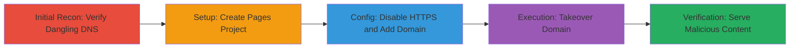

---
tags:
  - subdomain-takeover
  - gitlab
  - misconfiguration
  - dns
  - cname
type: attack_chain
tools:
  - '[[tools/dig]]'
tactics:
  - '[[Initial Access]]'
commands:
  - '[[commands/dig-dns-lookup]]'
verified: false
platforms:
  - Web
  - Cloud
submitted: true
complexity: medium
created_at: '2023-10-01T00:00:00Z'
procedures:
  - '[[procedures/Create-GitLab-Pages-Project]]'
  - '[[procedures/Configure-GitLab-Pages-Domain]]'
  - '[[procedures/Disable-HTTPS-Enforcement-in-GitLab-Pages]]'
  - '[[procedures/Add-Dangling-Custom-Domain-to-GitLab-Pages]]'
  - '[[procedures/Verify-Subdomain-Takeover-on-GitLab-Pages]]'
step_count: 5
techniques:
  - '[[Exploit Public-Facing Application]]'
updated_at: '2025-12-14T04:38:49.290Z'
description: >-
  A multi-stage attack exploiting misconfigured custom domains in GitLab Pages
  to takeover dangling subdomains, allowing attackers to serve malicious content
  on victim-owned domains.
skill_level: intermediate
impact_level: high
id: 3e374e6f-f948-47e4-815f-6d7fc0eb0f1d
validated: true
mitre_tactics:
  - '[[Initial Access]]'
mitre_techniques:
  - '[[Exploit Public-Facing Application]]'
---
# Subdomain Takeover via GitLab Pages Misconfiguration

Multi-stage attack chain demonstrating a complete subdomain takeover workflow in GitLab Pages, exploiting dangling custom domains that point to GitLab's infrastructure without proper verification.

## Chain Metrics Dashboard

| Metric | Value |
|--------|-------|
| Chain Status | Unverified |
| Total Steps | 5 |
| Execution Time | ~10 minutes |
| Skill Level | Intermediate |
| Complexity | Medium |
| Impact Level | High |

## Attack Flow Visualization



## Prerequisites & Requirements

### Required Tools

- [[tools/dig]]

### Target Environment

- GitLab instance with Pages enabled
- Dangling subdomain with CNAME pointing to gitlab-com.gitlab.io (e.g., docs-dev.gitlab.com)
- Attacker account on GitLab
- Network access to create projects and configure Pages

### Initial Access Requirements

- Valid GitLab user account (free tier sufficient)
- No special privileges needed beyond project creation
- Prior reconnaissance to identify dangling domains

## Detailed Attack Procedures

### Step 1: Verify Dangling DNS Record
procedure: [[procedures/Verify-Dangling-DNS-Record-for-Takeover]]

**Objective**: Confirm the target subdomain is dangling and points to GitLab Pages infrastructure via CNAME, enabling takeover potential.

**Instructions**: Use [[commands/dig-dns-lookup]] to query the DNS records of the target domain:

```bash
dig docs-dev.gitlab.com
```

**Expected Output**: CNAME record pointing to gitlab-com.gitlab.io, such as:

```
docs-dev.gitlab.com. 300 IN CNAME gitlab-com.gitlab.io.
gitlab-com.gitlab.io. 300 IN A 35.185.44.232
```

**Success Indicators**:
- CNAME resolves to GitLab's Pages endpoint
- No active content served on the domain (dangling confirmed)

### Step 2: Create GitLab Pages Project
procedure: [[procedures/Create-GitLab-Pages-Project]]

**Objective**: Set up a new GitLab project to host the attacker's content that will be served on the taken-over subdomain.

**Instructions**: Log in to GitLab and create a new project (e.g., https://gitlab.com/g15391522/pn1), then push static content (HTML/JS for malicious payload) to the repository. Enable Pages in the project settings under Deploy > Pages.

**Expected Output**: Project created with Pages site ready for configuration.

**Success Indicators**:
- Project repository accessible
- Basic Pages site deploys successfully on the default subdomain

### Step 3: Disable HTTPS Enforcement
procedure: [[procedures/Disable-HTTPS-Enforcement-in-GitLab-Pages]]

**Objective**: Bypass domain verification by disabling HTTPS requirements, allowing unverified custom domains to be added.

**Instructions**: In the project settings, navigate to Deploy > Pages and uncheck 'Force HTTPS (requires valid certificates)' to avoid TLS validation.

**Expected Output**: HTTPS enforcement disabled in Pages configuration.

**Success Indicators**:
- Option unchecked and saved
- No errors on saving configuration

### Step 4: Add Dangling Custom Domain
procedure: [[procedures/Add-Dangling-Custom-Domain-to-GitLab-Pages]]

**Objective**: Claim the dangling subdomain by adding it as a custom domain in the Pages configuration, triggering immediate content serving without verification.

**Instructions**: In Deploy > Pages, enter the dangling domain (e.g., docs-dev.gitlab.com) as the custom domain and save. GitLab will begin serving the project's content on this domain right away, with a 7-day grace period.

**Expected Output**: Domain added successfully; content starts proxying to the attacker's Pages site.

**Success Indicators**:
- No verification errors on save
- Domain listed as active in Pages settings

### Step 5: Verify Takeover
procedure: [[procedures/Verify-Subdomain-Takeover-on-GitLab-Pages]]

**Objective**: Confirm the takeover by accessing the subdomain and observing the attacker's content being served, potentially with redirects.

**Instructions**: Visit http://docs-dev.gitlab.com/ in a browser to check if the attacker's content loads. Expect an HTTP 302 redirect followed by a 401 response indicating GitLab Pages handling.

**Expected Output**: Attacker's Pages content displayed on the victim's subdomain.

**Success Indicators**:
- Malicious content serves without TLS errors
- Redirects confirm GitLab proxying
- Potential for phishing/cookie theft validated by loading custom JS

## Attack Chain Summary

### Key Achievements

1. Identified and verified dangling subdomain pointing to GitLab infrastructure
2. Configured attacker-controlled Pages project to claim the domain without verification
3. Achieved immediate content serving, enabling phishing, CSP/CORS bypass, and data exfiltration
4. Demonstrated 7-day persistence window for ongoing attacks

## Technique & Tactic Coverage

### MITRE ATT&CK Techniques

- [[Exploit Public-Facing Application]]

### MITRE ATT&CK Tactics

- [[Initial Access]]

---

*Last updated: 2023-10-01T00:00:00Z*
