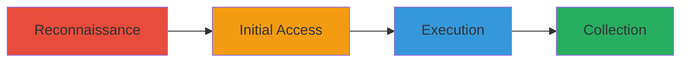

---
tags:
  - subdomain-takeover
  - cookie-theft
  - cors-misconfig
  - phishing
type: attack_chain
tools:
  - '[[tools/HubSpot]]'
tactics:
  - '[[Initial Access]]'
  - '[[Collection]]'
  - '[[Persistence]]'
commands:
  - '[[commands/dig-dns-lookup]]'
  - '[[commands/curl-host-content]]'
platforms:
  - Web
complexity: medium
procedures:
  - '[[procedures/Identify-Dangling-CNAME-for-Subdomain-Takeover]]'
  - '[[procedures/Claim-Unclaimed-HubSpot-Instance]]'
  - '[[procedures/Host-Malicious-Content-on-Taken-Over-Subdomain]]'
  - '[[procedures/Exploit-Cookie-Theft-and-CORS-Misconfiguration]]'
step_count: 4
techniques:
  - '[[Compromise Infrastructure]]'
  - '[[Steal Web Session Cookie]]'
  - '[[Use Alternate Authentication Material]]'
description: >-
  Multi-stage attack exploiting a dangling CNAME to takeover a subdomain, host
  malicious content, steal authentication cookies, and bypass CORS to read
  private chats
skill_level: intermediate
impact_level: high
id: 8492eb63-f339-43bf-baad-dd69b8ad01d6
created_at: '2025-12-11T06:10:30.625Z'
updated_at: '2025-12-11T06:10:30.625Z'
verified: false
validated: true
submitted: true
mitre_tactics:
  - '[[TA0001]]'
  - '[[TA0009]]'
  - '[[TA0003]]'
mitre_techniques:
  - '[[T1584]]'
  - '[[T1539]]'
  - '[[T1550]]'
---
# Subdomain Takeover via HubSpot Leading to Cookie Theft and Chat Access on Roblox

Multi-stage attack chain demonstrating a complete attack workflow exploiting a subdomain takeover on devrel.roblox.com via an unclaimed HubSpot instance, enabling cookie theft, CORS bypass for reading private chats, and potential account takeovers.

## Chain Metrics Dashboard

| Metric | Value |
|--------|-------|
| Chain Status | Unverified |
| Total Steps | 4 |
| Execution Time | ~30 minutes |
| Skill Level | Intermediate |
| Complexity | Medium |
| Impact Level | High |

## Attack Flow Visualization



## Prerequisites & Requirements

### Required Tools

- [[tools/HubSpot]]
- [[commands/dig-dns-lookup]]
- [[commands/curl-host-content]]

### Target Environment

- Web platform
- Required services/ports: DNS (53), HTTPS (443)
- Network access requirements: Public internet access to target subdomain and HubSpot

### Initial Access Requirements

- Credential requirements: None initially, HubSpot account for claiming
- Network position: External attacker
- Prior access needed: None

## Detailed Attack Procedures

### Step 1: Reconnaissance - [[procedures/Identify-Dangling-CNAME-for-Subdomain-Takeover]]

**Procedure**: [[procedures/Identify-Dangling-CNAME-for-Subdomain-Takeover]]

**Objective**: Identify the vulnerable subdomain with a dangling CNAME pointing to an unclaimed HubSpot instance.

**Expected Output**: DNS records showing the CNAME resolution to an expired HubSpot site.

Use [[commands/dig-dns-lookup]] to check DNS records:

```bash
dig devrel.roblox.com
```

Look for CNAME pointing to HubSpot that is unclaimed.

**Success Indicators**:
- CNAME record points to an expired or unclaimed HubSpot instance
- No active content served on the subdomain

### Step 2: Initial Access - [[procedures/Claim-Unclaimed-HubSpot-Instance]]

**Procedure**: [[procedures/Claim-Unclaimed-HubSpot-Instance]]

**Objective**: Claim the unclaimed HubSpot instance associated with the dangling CNAME to gain control over the subdomain.

**Expected Output**: Successful registration and control of the HubSpot site.

Register the unclaimed HubSpot site via their web interface (no command-line, manual process).

**Success Indicators**:
- HubSpot confirms ownership and allows content upload
- Subdomain now resolves to attacker-controlled HubSpot instance

### Step 3: Execution - [[procedures/Host-Malicious-Content-on-Taken-Over-Subdomain]]

**Procedure**: [[procedures/Host-Malicious-Content-on-Taken-Over-Subdomain]]

**Objective**: Upload and host malicious content such as proof-of-concept pages on the taken-over subdomain.

**Expected Output**: Malicious page accessible at https://devrel.roblox.com/subdomain-takeover.

Use [[commands/curl-host-content]] to verify hosted content (after uploading via HubSpot):

```bash
curl https://devrel.roblox.com/subdomain-takeover
```

**Success Indicators**:
- Attacker-controlled content is served on the subdomain
- No errors in resolution or access

### Step 4: Collection - [[procedures/Exploit-Cookie-Theft-and-CORS-Misconfiguration]]

**Procedure**: [[procedures/Exploit-Cookie-Theft-and-CORS-Misconfiguration]]

**Objective**: Host scripts to steal cookies and perform CORS requests to read private chats.

**Expected Output**: Stolen .ROBLOSECURITY cookies and retrieved chat messages.

Host PHP script for cookie theft and JavaScript for CORS requests via HubSpot.

Use [[commands/curl-host-content]] to test:

```bash
curl https://devrel.roblox.com/malicious-script.php
```

**Success Indicators**:
- Cookies are captured by the script
- CORS requests successfully read from chat.roblox.com/v2/get-messages

## Attack Chain Summary

### Key Achievements

1. Successful subdomain takeover via dangling CNAME
2. Hosting of malicious content leading to cookie theft
3. Bypass of CORS to access private user data

## Technique & Tactic Coverage

### MITRE ATT&CK Techniques

- [[Compromise Infrastructure]]
- [[Steal Web Session Cookie]]
- [[Use Alternate Authentication Material]]

### MITRE ATT&CK Tactics

- [[Initial Access]]
- [[Collection]]
- [[Persistence]]

*Last updated: 2023-10-01*
