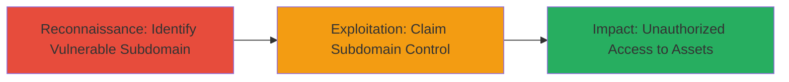

# Subdomain Takeover via Improper Authentication on vex.weather.com

Multi-stage attack chain demonstrating a subdomain takeover vulnerability affecting the 'vex.weather.com' subdomain, stemming from improper authentication mechanisms and unclaimed DNS records. This allowed an attacker to claim control, potentially compromising IBM assets. The issue was reported and remediated by IBM.

## Chain Metrics Dashboard

| Metric | Value |
|--------|-------|
| Chain Status | Unverified |
| Total Steps | 2 |
| Execution Time | ~15 minutes |
| Skill Level | Intermediate |
| Complexity | Medium |
| Impact Level | High |

## Attack Flow Visualization



## Prerequisites & Requirements

### Required Tools

- [[tools/Subfinder]]
- [[tools/Takeover]]

### Target Environment

- Web platform with DNS records
- Access to public DNS queries
- No special credentials required for detection

### Initial Access Requirements

- Internet access for DNS enumeration
- No prior access to target network
- Knowledge of target domain (e.g., weather.com)

## Detailed Attack Procedures

### Step 1: Reconnaissance - Identify Vulnerable Subdomain
procedure: [[procedures/Detect-and-Exploit-Subdomain-Takeover]]

**Objective**: Enumerate subdomains and identify those vulnerable to takeover due to dangling DNS records pointing to unclaimed services.

**Instructions**: Start by enumerating subdomains for the target domain using [[commands/subfinder-enumerate]]:

```bash
subfinder -d weather.com -o subdomains.txt
```

Filter for the specific subdomain 'vex.weather.com' and check DNS records using [[commands/dig-query]]:

```bash
dig vex.weather.com
```

Then, scan for takeover vulnerabilities with [[commands/takeover-check]]:

```bash
takeover -l subdomains.txt
```

**Expected Output**: List of subdomains with fingerprints indicating unclaimed services (e.g., AWS S3, GitHub Pages).

**Success Indicators**:
- 'vex.weather.com' identified with dangling CNAME to unclaimed resource
- Takeover tool reports vulnerability

### Step 2: Exploitation - Claim Subdomain Control
procedure: [[procedures/Detect-and-Exploit-Subdomain-Takeover]]

**Objective**: Exploit the improper authentication to claim and control the subdomain, gaining unauthorized access to host content or redirect traffic.

**Instructions**: If the subdomain points to an unclaimed service like Heroku or GitHub, register an account on that platform and claim the resource. For example, if it's a GitHub Pages CNAME, create a repository matching the subdomain name.

Verify control by updating DNS or service config to point to attacker-controlled content, then test access:

```bash
curl -I https://vex.weather.com
```

**Expected Output**: HTTP response showing attacker-controlled content or redirect.

**Success Indicators**:
- Subdomain resolves to attacker-hosted page
- Potential exposure of IBM assets or phishing capability

## Attack Chain Summary

### Key Achievements

1. Identification of unclaimed subdomain 'vex.weather.com'
2. Successful takeover enabling critical security compromise
3. Remediation prompted by responsible disclosure to IBM

## Technique & Tactic Coverage

### MITRE ATT&CK Techniques

- [[Exploit Public-Facing Application]]
- [[T1583.001]]

### MITRE ATT&CK Tactics

- [[Initial Access]]

---
*Last updated: 2023-10-01T00:00:00Z*
