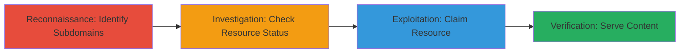

---
tags:
  - subdomain-takeover
  - dns-misconfiguration
  - reconnaissance
  - initial-access
type: attack_chain
tools: []
tactics:
  - '[[Reconnaissance]]'
  - '[[Initial Access]]'
verified: false
platforms:
  - Web
submitted: true
complexity: medium
created_at: '2023-10-01T00:00:00Z'
procedures:
  - '[[procedures/Perform-Domain-Reconnaissance-for-Subdomains]]'
  - '[[procedures/Investigate-Subdomain-Resource-Status]]'
  - '[[procedures/Claim-Inactive-Third-Party-Resource]]'
  - '[[procedures/Verify-Subdomain-Takeover]]'
step_count: 4
techniques:
  - '[[Hardware]]'
  - '[[Exploit Public-Facing Application]]'
updated_at: '2025-12-14T04:51:26.727Z'
description: >-
  A multi-stage attack exploiting a subdomain misconfiguration where a DNS
  record points to an inactive third-party resource, allowing takeover to serve
  malicious content.
skill_level: intermediate
impact_level: high
id: b6da5bcd-0e31-4bd1-8e3a-ca27095570f6
validated: true
mitre_tactics:
  - '[[Reconnaissance]]'
  - '[[Initial Access]]'
mitre_techniques:
  - '[[Hardware]]'
  - '[[Exploit Public-Facing Application]]'
---
# Subdomain Takeover via Inactive Third-Party Service Resource

Multi-stage attack chain demonstrating a complete subdomain takeover workflow by exploiting DNS misconfigurations pointing to inactive third-party resources.

## Chain Metrics Dashboard

| Metric | Value |
|--------|-------|
| Chain Status | Unverified |
| Total Steps | 4 |
| Execution Time | ~30 minutes |
| Skill Level | Intermediate |
| Complexity | Medium |
| Impact Level | High |

## Attack Flow Visualization



## Prerequisites & Requirements

### Required Tools

- DNS lookup tools like [[commands/dig-dns-lookup]]
- Web browser or curl for verification

### Target Environment

- Web platform with DNS records
- Access to third-party services (e.g., AWS S3, GitHub Pages, Heroku)
- No special ports required; standard DNS (port 53) and HTTP/HTTPS (80/443)

### Initial Access Requirements

- Public DNS resolution
- No credentials needed initially
- Internet access for reconnaissance

## Detailed Attack Procedures

### Step 1: Perform Domain Reconnaissance for Subdomains
procedure: [[procedures/Perform-Domain-Reconnaissance-for-Subdomains]]

**Objective**: Identify subdomains of the target domain to uncover potential misconfigurations.

**Instructions**: Use DNS enumeration tools to list subdomains. For example, query common subdomains or use passive reconnaissance.

Execute [[commands/dig-dns-lookup]] to check for specific subdomains:

```bash
dig ███████.target.com
```

Review the output for CNAME or A records pointing to third-party services.

**Expected Output**: DNS records showing the subdomain pointing to a third-party resource, e.g., "███████.target.com. 3600 IN CNAME inactive-resource.thirdparty.com."

**Success Indicators**:
- Subdomain identified with third-party DNS pointer
- Record details noted for further investigation

### Step 2: Investigate Subdomain Resource Status
procedure: [[procedures/Investigate-Subdomain-Resource-Status]]

**Objective**: Verify if the pointed resource on the third-party service is inactive or claimable.

**Instructions**: Access the third-party service dashboard or use DNS tools to check the resource status. Look for dangling or deleted buckets/pages.

Use [[commands/dig-dns-lookup]] again to confirm the record, then manually visit the third-party URL or check service status.

```bash
dig inactive-resource.thirdparty.com
```

If the service returns NXDOMAIN or 404, the resource is inactive.

**Expected Output**: Confirmation that the resource does not exist or is available for claiming.

**Success Indicators**:
- Resource confirmed inactive
- No active content served from the subdomain

### Step 3: Claim Inactive Third-Party Resource
procedure: [[procedures/Claim-Inactive-Third-Party-Resource]]

**Objective**: Register or take over the inactive resource on the third-party service to control the subdomain.

**Instructions**: Log into the third-party service (create account if needed) and claim the dangling resource, such as creating a new bucket or page with the same name.

No specific command; perform via web interface: Navigate to thirdparty.com, search for the resource name, and initiate claim.

**Expected Output**: Confirmation of ownership, e.g., resource dashboard showing control.

**Success Indicators**:
- Resource claimed successfully
- DNS propagation begins (may take minutes)

### Step 4: Verify Subdomain Takeover
procedure: [[procedures/Verify-Subdomain-Takeover]]

**Objective**: Confirm control by serving custom content on the subdomain.

**Instructions**: Upload arbitrary content to the claimed resource and access the subdomain URL to verify.

Use a simple HTML file upload to the resource, then browse to ███████.target.com.

For testing, use [[commands/curl-http-request]] to fetch the page:

```bash
curl -v https://███████.target.com
```

**Expected Output**: Custom content displayed, e.g., "Takeover successful" page.

**Success Indicators**:
- Arbitrary content served
- Subdomain under attacker control

## Attack Chain Summary

### Key Achievements

1. Identified vulnerable subdomain via reconnaissance
2. Confirmed inactive third-party resource
3. Successfully claimed and controlled the subdomain
4. Verified takeover with proof-of-concept content

## Technique & Tactic Coverage

### MITRE ATT&CK Techniques

- [[Hardware]] Gather Victim Host Information: Domains
- [[Exploit Public-Facing Application]] Exploit Public-Facing Application

### MITRE ATT&CK Tactics

- [[Reconnaissance]] Reconnaissance
- [[Initial Access]] Initial Access

---

*Last updated: 2023-10-01T00:00:00Z*
