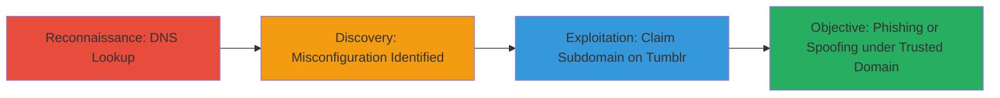

---
tags:
  - subdomain-takeover
  - dns-misconfig
  - phishing
  - spoofing
type: attack_chain
tools:
  - '[[tools/nslookup]]'
tactics:
  - '[[Reconnaissance]]'
  - '[[Initial Access]]'
verified: false
platforms:
  - Web
  - DNS
submitted: true
complexity: low
created_at: '2023-10-01T00:00:00Z'
procedures:
  - '[[procedures/Detect-Subdomain-Takeover-via-DNS-Lookup]]'
step_count: 1
techniques:
  - '[[Hardware]]'
  - '[[Exploit Public-Facing Application]]'
updated_at: '2025-12-14T05:32:23.449Z'
description: >-
  Demonstrates discovery of a subdomain takeover vulnerability through DNS
  misconfiguration, allowing potential claiming of the subdomain for phishing or
  spoofing.
skill_level: beginner
impact_level: high
id: 839530f0-a82b-489b-8b65-309da4deab0e
validated: true
mitre_tactics:
  - '[[Reconnaissance]]'
  - '[[Initial Access]]'
mitre_techniques:
  - '[[Hardware]]'
  - '[[Exploit Public-Facing Application]]'
---
# Subdomain Takeover via Misconfigured DNS CNAME to Tumblr

Multi-stage attack chain demonstrating a complete attack workflow for identifying and exploiting a subdomain takeover vulnerability.

## Chain Metrics Dashboard

| Metric | Value |
|--------|-------|
| Chain Status | Unverified |
| Total Steps | 1 |
| Execution Time | ~1 minute |
| Skill Level | Beginner |
| Complexity | Low |
| Impact Level | High |

## Attack Flow Visualization



## Prerequisites & Requirements

### Required Tools

- [[tools/nslookup]]

### Target Environment

- Web and DNS platforms
- Access to public DNS resolution (no special privileges needed)
- Target services: External platforms like Tumblr

### Initial Access Requirements

- Internet connectivity for DNS queries
- No credentials or prior access required
- Basic knowledge of DNS records (CNAME, A records)

## Detailed Attack Procedures

### Step 1: DNS Reconnaissance and Misconfiguration Detection
procedure: [[procedures/Detect-Subdomain-Takeover-via-DNS-Lookup]]

**Objective**: Perform a DNS lookup on the target subdomain to identify if it points to an unused external service, indicating a takeover risk.

**Instructions**: Use the [[commands/nslookup-dns-query]] command to query the DNS for the subdomain:

```bash
nslookup engineering.zomato.com
```

Analyze the output for CNAME records pointing to external services like domains.tumblr.com. If resolved IPs match the external service (e.g., 66.6.42.22, 66.6.43.22), verify if the service is claimable by checking Tumblr's subdomain registration.

**Expected Output**: Resolution showing CNAME to domains.tumblr.com and associated IPs.

**Success Indicators**:
- CNAME points to unused external service (e.g., Tumblr)
- IPs resolve to the external provider
- Subdomain is unclaimed and available for takeover

## Attack Chain Summary

### Key Achievements

1. Identified DNS misconfiguration via simple lookup
2. Highlighted risk of subdomain takeover on Tumblr
3. Enabled potential phishing or content spoofing under trusted domain

## Technique & Tactic Coverage

### MITRE ATT&CK Techniques

- [[Hardware]]
- [[Exploit Public-Facing Application]]

### MITRE ATT&CK Tactics

- [[Reconnaissance]]
- [[Initial Access]]

---
*Last updated: 2023-10-01T00:00:00Z*
