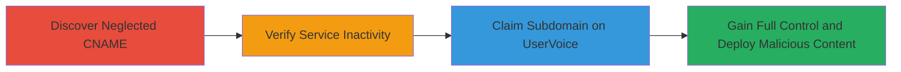

---
tags:
  - subdomain-takeover
  - dns-misconfiguration
  - uservoice
  - phishing
type: attack_chain
tools: []
tactics:
  - '[[Initial Access]]'
commands:
  - '[[commands/dig-lookup-cname]]'
  - '[[commands/curl-check-url]]'
verified: false
platforms:
  - Web
  - DNS
submitted: true
complexity: low
created_at: '2023-10-01T00:00:00Z'
procedures:
  - '[[procedures/Discover-Neglected-CNAME-DNS-Record]]'
  - '[[procedures/Verify-Inactivity-of-UserVoice-Service]]'
  - '[[procedures/Claim-Subdomain-by-Signing-Up-on-UserVoice]]'
  - '[[procedures/Gain-Control-Over-the-Subdomain]]'
step_count: 4
techniques:
  - '[[Exploit Public-Facing Application]]'
updated_at: '2025-12-14T04:51:10.586Z'
description: >-
  A multi-stage attack exploiting a neglected DNS CNAME record pointing to an
  inactive UserVoice service, allowing takeover of feedback.screenhero.com for
  phishing or malicious hosting.
skill_level: intermediate
impact_level: high
id: 0bcb8ed6-5fd1-43ed-8826-d9a2579feb0b
validated: true
mitre_tactics:
  - '[[Initial Access]]'
mitre_techniques:
  - '[[Exploit Public-Facing Application]]'
---
# Subdomain Takeover via Neglected UserVoice CNAME on Screenhero Domain

Multi-stage attack chain demonstrating a subdomain takeover on feedback.screenhero.com, an acquired domain of Slack, by exploiting a dangling CNAME to an inactive UserVoice instance.

## Chain Metrics Dashboard

| Metric | Value |
|--------|-------|
| Chain Status | Unverified |
| Total Steps | 4 |
| Execution Time | ~15 minutes |
| Skill Level | Intermediate |
| Complexity | Low |
| Impact Level | High |

## Attack Flow Visualization



## Prerequisites & Requirements

### Required Tools

- Basic DNS lookup tools like dig
- Web browser or curl for HTTP checks

### Target Environment

- Public DNS resolution
- Access to UserVoice signup page
- Internet connectivity

### Initial Access Requirements

- No prior credentials needed
- Public network access to DNS and web services

## Detailed Attack Procedures

### Step 1: Discover Neglected CNAME DNS Record
procedure: [[procedures/Discover-Neglected-CNAME-DNS-Record]]

**Objective**: Identify misconfigured DNS records pointing to inactive services on the target domain.

**Instructions**: Perform a DNS lookup on the subdomain to reveal the CNAME record. Use [[commands/dig-lookup-cname]] to query the CNAME for feedback.screenhero.com:

```bash
dig feedback.screenhero.com CNAME
```

This will show the record pointing to screenhero.uservoice.com.

**Expected Output**: CNAME record confirming the pointer to an external service.

**Success Indicators**:
- CNAME record found pointing to a third-party service like UserVoice
- No active resolution errors

### Step 2: Verify Inactivity of UserVoice Service
procedure: [[procedures/Verify-Inactivity-of-UserVoice-Service]]

**Objective**: Confirm that the targeted third-party service is inactive, making it vulnerable to takeover.

**Instructions**: Check the HTTP response of the pointed domain to verify it's not serving content. Use [[commands/curl-check-url]] to probe screenhero.uservoice.com:

```bash
curl -I https://screenhero.uservoice.com
```

Look for error responses indicating the instance is deactivated.

**Expected Output**: HTTP 404, 503, or similar error indicating inactivity.

**Success Indicators**:
- Service returns an inactive or error page
- No active UserVoice instance detected

### Step 3: Claim Subdomain by Signing Up on UserVoice
procedure: [[procedures/Claim-Subdomain-by-Signing-Up-on-UserVoice]]

**Objective**: Register an account on UserVoice and claim the unverified subdomain namespace.

**Instructions**: Navigate to the UserVoice signup page (uservoice.com) in a web browser. Create a new account and select the 'Screenhero' username during setup. UserVoice associates this with the existing CNAME without verification.

**Expected Output**: Successful account creation with control over the 'Screenhero' instance.

**Success Indicators**:
- Account claimed without errors
- Custom content can be uploaded to the instance

### Step 4: Gain Control Over the Subdomain
procedure: [[procedures/Gain-Control-Over-the-Subdomain]]

**Objective**: Deploy malicious content on the taken-over subdomain to achieve phishing or other attacks.

**Instructions**: Log into the claimed UserVoice account and configure the site to host a cloned feedback form or redirect. The subdomain feedback.screenhero.com now serves content from your controlled UserVoice instance.

**Expected Output**: Subdomain resolves to attacker-controlled content.

**Success Indicators**:
- DNS still points to UserVoice, but content is attacker-modified
- Visitors to feedback.screenhero.com see phishing page

## Attack Chain Summary

### Key Achievements

1. Identified and exploited a dangling DNS CNAME to an inactive service
2. Claimed control of a legitimate-looking subdomain without authentication
3. Enabled potential for credential phishing, malware injection, or brand damage

## Technique & Tactic Coverage

### MITRE ATT&CK Techniques

- [[Exploit Public-Facing Application]]

### MITRE ATT&CK Tactics

- [[Initial Access]]

---
*Last updated: 2023-10-01T00:00:00Z*
