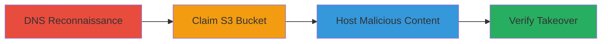

---
tags:
  - subdomain-takeover
  - aws-s3
  - dns-misconfiguration
  - phishing
type: attack_chain
tools:
  - '[[tools/dig]]'
tactics:
  - '[[Initial Access]]'
verified: false
platforms:
  - Web
  - AWS
submitted: true
complexity: medium
created_at: '2023-10-01T00:00:00Z'
procedures:
  - '[[procedures/Discover-Subdomain-Takeover-with-DNS-Lookup]]'
  - '[[procedures/Claim-Orphaned-AWS-S3-Bucket]]'
  - '[[procedures/Host-Content-on-Taken-Over-Subdomain]]'
step_count: 3
techniques:
  - '[[Exploit Public-Facing Application]]'
updated_at: '2025-12-14T04:51:26.507Z'
description: >-
  Demonstrates subdomain takeover by exploiting a DNS CNAME pointing to a
  non-existent AWS S3 bucket, allowing control over the subdomain to host
  malicious content.
skill_level: intermediate
impact_level: high
id: 10d304fc-e847-4a7d-9e0c-3f18b4191486
validated: true
mitre_tactics:
  - '[[Initial Access]]'
mitre_techniques:
  - '[[Exploit Public-Facing Application]]'
---
# Subdomain Takeover via Orphaned AWS S3 Bucket

Multi-stage attack chain demonstrating a complete subdomain takeover workflow on an AWS S3 bucket misconfiguration, enabling an attacker to impersonate a domain and serve malicious content.

## Chain Metrics Dashboard

| Metric | Value |
|--------|-------|
| Chain Status | Unverified |
| Total Steps | 3 |
| Execution Time | ~15 minutes |
| Skill Level | Intermediate |
| Complexity | Medium |
| Impact Level | High |

## Attack Flow Visualization



## Prerequisites & Requirements

### Required Tools

- [[tools/dig]]
- AWS CLI or AWS Console access (for claiming bucket)

### Target Environment

- Web platform with DNS records
- AWS S3 service in us-west-1 region
- No specific ports required; assumes public internet access

### Initial Access Requirements

- No credentials needed for discovery
- AWS account required for claiming the bucket
- Network access to query DNS and access AWS

## Detailed Attack Procedures

### Step 1: DNS Reconnaissance
procedure: [[procedures/Discover-Subdomain-Takeover-with-DNS-Lookup]]

**Objective**: Identify misconfigured subdomains pointing to orphaned cloud resources like AWS S3 buckets.

**Instructions**: Use [[commands/dig-dns-lookup]] to query the subdomain's DNS records and reveal the CNAME chain to an S3 endpoint.

```bash
dig test.www.midigator.com
```

**Expected Output**: DNS resolution showing CNAME to s3-website-us-west-1.amazonaws.com, indicating an orphaned bucket.

**Success Indicators**:
- CNAME record points to a non-existent S3 bucket
- No A record resolution to a live service

### Step 2: Claim the Orphaned Bucket
procedure: [[procedures/Claim-Orphaned-AWS-S3-Bucket]]

**Objective**: Register and take control of the available S3 bucket referenced in the DNS record.

**Instructions**: Access the AWS Console or use AWS CLI to create the bucket with the exact name derived from the CNAME (e.g., test.www.midigator.com.s3-website-us-west-1.amazonaws.com). Configure it for static website hosting.

```bash
aws s3 mb s3://test.www.midigator.com --region us-west-1
aws s3 website s3://test.www.midigator.com --index-document index.html --error-document error.html --region us-west-1
```

**Expected Output**: Bucket created successfully with website hosting enabled.

**Success Indicators**:
- Bucket creation succeeds without conflicts
- DNS propagation allows access to the new bucket via the subdomain

### Step 3: Host and Verify Content
procedure: [[procedures/Host-Content-on-Taken-Over-Subdomain]]

**Objective**: Upload custom content to the claimed bucket and confirm the subdomain serves it, demonstrating takeover.

**Instructions**: Upload proof-of-concept files to the bucket and access the subdomain in a browser to verify.

```bash
echo "<h1>Subdomain Taken Over</h1>" > index.html
aws s3 cp index.html s3://test.www.midigator.com/ --region us-west-1
```

Then, navigate to http://test.www.midigator.com and confirm the content loads.

**Expected Output**: Subdomain serves the uploaded HTML content instead of a 404 error.

**Success Indicators**:
- Custom content visible on the subdomain
- Potential for phishing or reputation damage confirmed

## Attack Chain Summary

### Key Achievements

1. Discovered DNS misconfiguration leading to subdomain vulnerability
2. Claimed control over an orphaned AWS S3 bucket
3. Demonstrated ability to host arbitrary content, enabling impersonation attacks

## Technique & Tactic Coverage

### MITRE ATT&CK Techniques

- [[Exploit Public-Facing Application]]

### MITRE ATT&CK Tactics

- [[Initial Access]]

---

*Last updated: 2023-10-01T00:00:00Z*
