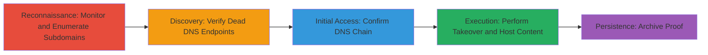

---
tags:
  - subdomain-takeover
  - dns
  - azure
  - reconnaissance
  - initial-access
  - ntlm-capture
type: attack_chain
tools:
  - '[[tools/takeover-cyberint]]'
  - '[[tools/subfinder]]'
  - '[[tools/tko-subs]]'
  - '[[tools/Responder]]'
  - '[[tools/Wayback-Machine]]'
tactics:
  - '[[Reconnaissance]]'
  - '[[Initial Access]]'
verified: false
platforms:
  - Azure
  - Cloud
  - Web
submitted: true
complexity: medium
created_at: '2023-10-01T00:00:00Z'
procedures:
  - '[[procedures/Monitor-for-Subdomain-Takeover-Vulnerabilities]]'
  - '[[procedures/Enumerate-and-Verify-Dead-Subdomains]]'
  - '[[procedures/Confirm-DNS-Record-Chain-to-Dead-Endpoint]]'
  - '[[procedures/Perform-Subdomain-Takeover-and-Host-Content]]'
  - '[[procedures/Archive-Takeover-Proof-with-Wayback-Machine]]'
step_count: 5
techniques:
  - '[[Hardware]]'
  - '[[Exploit Public-Facing Application]]'
updated_at: '2025-12-14T04:51:26.804Z'
description: >-
  A multi-stage attack exploiting stale DNS records pointing to a decommissioned
  Azure CloudApp VM, allowing takeover of a subdomain to host malicious content
  and capture NTLM hashes from users.
skill_level: intermediate
impact_level: high
id: f5d472f2-9fd5-4f7a-91f0-f02889858f2b
validated: true
mitre_tactics:
  - '[[Reconnaissance]]'
  - '[[Initial Access]]'
mitre_techniques:
  - '[[Hardware]]'
  - '[[Exploit Public-Facing Application]]'
---
# Subdomain Takeover via Stale Azure DNS Records Enabling Malicious Hosting and NTLM Capture

Multi-stage attack chain demonstrating a subdomain takeover on a target domain like starbucks.com, exploiting stale DNS records to a decommissioned Azure VM, allowing the attacker to host malicious content, phish users, or capture NTLM hashes using tools like Responder.

## Chain Metrics Dashboard

| Metric | Value |
|--------|-------|
| Chain Status | Unverified |
| Total Steps | 5 |
| Execution Time | ~30 minutes |
| Skill Level | Intermediate |
| Complexity | Medium |
| Impact Level | High |

## Attack Flow Visualization



## Prerequisites & Requirements

### Required Tools

- [[tools/takeover-cyberint]]
- [[tools/subfinder]]
- [[tools/tko-subs]]
- [[tools/Responder]]
- [[tools/Wayback-Machine]]

### Target Environment

- Cloud platform: Azure (CloudApp, Traffic Manager)
- Services: DNS resolution, Azure endpoints
- Tech stack: DNS, trafficmanager.net

### Initial Access Requirements

- Public internet access to the target domain
- No credentials needed initially; relies on public DNS misconfigurations
- Tools installed on a Linux/macOS system for enumeration

## Detailed Attack Procedures

### Step 1: Monitor for Subdomain Takeover Vulnerabilities
procedure: [[procedures/Monitor-for-Subdomain-Takeover-Vulnerabilities]]

**Objective**: Scan the target domain for potential subdomain takeover vulnerabilities by identifying dangling DNS records.

**Instructions**: Access the online tool [[tools/takeover-cyberint]] and input the target domain (e.g., starbucks.com) to monitor for issues. The tool scans DNS records and flags subdomains with stale or dead entries.

**Expected Output**: A report listing flagged subdomains, such as 2 subdomains with issues pointing to claimable resources.

**Success Indicators**:
- Flagged subdomains identified
- Issues like dead Azure endpoints detected

### Step 2: Enumerate and Verify Dead Subdomains
procedure: [[procedures/Enumerate-and-Verify-Dead-Subdomains]]

**Objective**: Discover all subdomains and check which ones point to dead or claimable cloud resources.

**Instructions**: Use [[commands/subfinder-enumerate-subdomains]] to list subdomains:

```bash
subfinder -d starbucks.com -o subdomains.txt
```

Then verify takeover eligibility with [[commands/tko-subs-check-takeover]]:

```bash
tko-subs -l subdomains.txt
```

This identifies svcardproxydevus.starbucks.com as pointing to a dead Azure resource via trafficmanager.net.

**Expected Output**: List of subdomains and status, e.g., "svcardproxydevus.starbucks.com: dead Azure CloudApp".

**Success Indicators**:
- Subdomains enumerated
- Takeover-eligible dead endpoints confirmed

### Step 3: Confirm DNS Record Chain to Dead Endpoint
procedure: [[procedures/Confirm-DNS-Record-Chain-to-Dead-Endpoint]]

**Objective**: Trace the DNS resolution path to verify the endpoint is decommissioned and claimable.

**Instructions**: Use standard DNS tools like dig or nslookup to trace the chain manually. For example:

```bash
dig svcardproxydevus.starbucks.com
```

Follow the CNAME chain: svcardproxydevus.starbucks.com -> s00307ntmp0svcardproxydev0.trafficmanager.net -> s00307dpipsvcardproxy00.eastus.cloudapp.azure.com, confirming the final IP responds with no service (dead).

**Expected Output**: DNS resolution showing stale pointers to non-responsive Azure VM.

**Success Indicators**:
- Full DNS chain traced
- Endpoint confirmed dead (no HTTP response or timeout)

### Step 4: Perform Subdomain Takeover and Host Content
procedure: [[procedures/Perform-Subdomain-Takeover-and-Host-Content]]

**Objective**: Claim the dangling cloud resource and host proof-of-concept malicious content.

**Instructions**: Register the decommissioned Azure CloudApp resource (s00307dpipsvcardproxy00.eastus.cloudapp.azure.com) via Azure portal or API if accessible, or exploit the takeover by pointing it to attacker-controlled hosting. Upload an HTML page with a comment linking to your HackerOne profile. For impact demonstration, host images with UNC paths (\\attacker.com\share) to trigger Responder for NTLM hash capture when support staff views the site.

**Expected Output**: Subdomain resolves to attacker-hosted content, verifiable via browser access to http://svcardproxydevus.starbucks.com/.

**Success Indicators**:
- Subdomain under attacker control
- Malicious content (e.g., porn, phishing) hosted
- NTLM hashes captured if Responder deployed

### Step 5: Archive Takeover Proof with Wayback Machine
procedure: [[procedures/Archive-Takeover-Proof-with-Wayback-Machine]]

**Objective**: Preserve evidence of the takeover for reporting without alerting the target prematurely.

**Instructions**: Visit [[tools/Wayback-Machine]] and submit a snapshot request for http://svcardproxydevus.starbucks.com/ to archive the hosted content.

**Expected Output**: Archived snapshot timestamped, e.g., 2018-07-10, showing the HTML with HackerOne link.

**Success Indicators**:
- Archive created and accessible
- Proof of control preserved

## Attack Chain Summary

### Key Achievements

1. Identified and claimed a live subdomain via stale Azure DNS
2. Demonstrated potential for phishing, malicious hosting, and NTLM relay attacks
3. Provided verifiable proof via archiving without direct notification

## Technique & Tactic Coverage

### MITRE ATT&CK Techniques

- [[Hardware]] Gather Victim Host Information: Domains
- [[Exploit Public-Facing Application]] Exploit Public-Facing Application

### MITRE ATT&CK Tactics

- [[Reconnaissance]] Reconnaissance
- [[Initial Access]] Initial Access

---
*Last updated: 2023-10-01T00:00:00Z*
