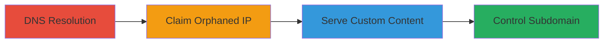

# Subdomain Takeover via Stale DNS Record on AWS EC2

Multi-stage attack chain demonstrating a complete subdomain takeover workflow on AWS infrastructure.

## Chain Metrics Dashboard

| Metric | Value |
|--------|-------|
| Chain Status | Unverified |
| Total Steps | 3 |
| Execution Time | ~30 minutes |
| Skill Level | Intermediate |
| Complexity | Medium |
| Impact Level | High |

## Attack Flow Visualization



## Prerequisites & Requirements

### Required Tools

- [[tools/dig]]
- [[tools/curl]]
- AWS CLI and credentials for launching EC2 instances

### Target Environment

- AWS Cloud platform
- EC2 service
- DNS resolution access

### Initial Access Requirements

- No prior credentials needed for reconnaissance
- AWS account with EC2 launch permissions for claiming IP
- Public internet access for DNS queries

## Detailed Attack Procedures

### Step 1: Enumerate Subdomain IP
procedure: [[procedures/Enumerate-Subdomain-IP-via-DNS-Resolution]]

**Objective**: Resolve the target's subdomain DNS to identify the IP address and detect if it's orphaned.

**Instructions**: Use [[commands/dig-resolve-subdomain]] to query the DNS record:

```bash
dig +short fr1.vpn.zomans.com
```

**Expected Output**: The IP address, e.g., 52.47.57.107.

**Success Indicators**:
- IP address returned
- Further verification shows the IP is not responding to HTTP/HTTPS or is decommissioned

### Step 2: Claim Orphaned IP
procedure: [[procedures/Claim-Orphaned-AWS-EC2-IP-for-Takeover]]

**Objective**: Launch a new EC2 instance on the orphaned IP to gain control of the subdomain.

**Instructions**: Use AWS CLI or console to launch an EC2 instance specifying the orphaned IP (52.47.57.107). Configure the instance with a web server to respond to the subdomain.

**Expected Output**: Successful instance launch confirmation and the instance running on the target IP.

**Success Indicators**:
- EC2 instance active on the IP
- No conflicts during launch (IP is free)

### Step 3: Serve and Verify Content
procedure: [[procedures/Serve-and-Verify-Custom-Content-on-Taken-Over-Subdomain]]

**Objective**: Configure the instance to serve custom content and verify control over the subdomain.

**Instructions**: On the new EC2 instance, set up a web server (e.g., Apache/Nginx) to host a page for fr1.vpn.zomans.com. Then use [[commands/curl-fetch-subdomain]] to test:

```bash
curl fr1.vpn.zomans.com
```

**Expected Output**: Custom page content, e.g., HTML with <!-- hackerone.com/ian --> comment.

**Success Indicators**:
- Custom content served
- TLS certificate obtainable for the subdomain

## Attack Chain Summary

### Key Achievements

1. Identified stale DNS record pointing to orphaned IP
2. Claimed control of the subdomain via new EC2 launch
3. Demonstrated full control by serving arbitrary content, enabling phishing or payload delivery

## Technique & Tactic Coverage

### MITRE ATT&CK Techniques

- [[Hardware]] Gather Victim Host Information: DNS
- [[Exploit Public-Facing Application]] Exploit Public-Facing Application

### MITRE ATT&CK Tactics

- [[Reconnaissance]] Reconnaissance
- [[Initial Access]] Initial Access

---

*Last updated: 2023-10-01T00:00:00Z*
