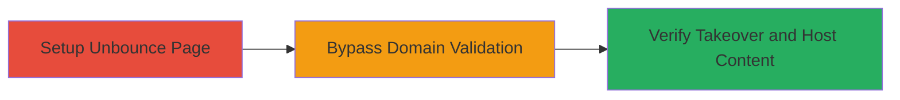

# Subdomain Takeover via Unbounce API Domain Validation Bypass

Multi-stage attack chain demonstrating exploitation of Unbounce's API flaw to bypass domain validation, allowing takeover of vulnerable subdomains with CNAME records pointing to unbouncepages.com. This enables attackers to host arbitrary content, such as phishing pages, on the victim's subdomain to steal credentials or sensitive data.

## Chain Metrics Dashboard

| Metric | Value |
|--------|-------|
| Chain Status | Unverified |
| Total Steps | 3 |
| Execution Time | ~15 minutes |
| Skill Level | Intermediate |
| Complexity | Medium |
| Impact Level | High |

## Attack Flow Visualization



## Prerequisites & Requirements

### Required Tools

- [[tools/Burp-Suite]]
- [[tools/ThreatCrowd]]

### Target Environment

- Web platform with Unbounce service
- DNS records with CNAME to unbouncepages.com
- Network access to Unbounce API (app.unbounce.com)

### Initial Access Requirements

- No prior credentials needed for Unbounce signup
- Proxy setup for request interception
- Target subdomain with dangling CNAME to unbouncepages.com

## Detailed Attack Procedures

### Step 1: Setup Unbounce Account and Create Page
procedure: [[procedures/Setup-Unbounce-Account-and-Create-Page]]

**Objective**: Establish a legitimate Unbounce presence to prepare for API manipulation.

**Instructions**: Sign up for a free Unbounce account at app.unbounce.com. Once logged in, navigate to /pages/new, create a simple page with any content (e.g., a blank page), and save it. Then, use the 'CHANGE URL' option to set a custom path like /blank-page-123133617adasdasdsa, initially using the default unbouncepages.com domain.

**Expected Output**: A new page created with a URL like https://unbouncepages.com/blank-page-123133617adasdasdsa/.

**Success Indicators**:
- Account created successfully
- Page saved and URL configurable

### Step 2: Bypass Domain Validation Using Proxy
procedure: [[procedures/Bypass-Unbounce-Domain-Validation-Using-Proxy]]

**Objective**: Intercept and modify the API request to override the domain parameter, bypassing client-side restrictions.

**Instructions**: Configure [[tools/Burp-Suite]] as a proxy to intercept traffic from your browser. Attempt to change the page URL again, triggering a POST request to /pages/{id}/url/confirm_or_update. Intercept this request, modify the page[domain] parameter from unbouncepages.com to the target subdomain (e.g., info.hacker.one), and forward the request.

**Expected Output**: The API accepts the modified domain without validation errors.

**Success Indicators**:
- Request modification successful
- No server-side rejection of arbitrary domain

### Step 3: Verify Subdomain Takeover
procedure: [[procedures/Verify-Subdomain-Takeover]]

**Objective**: Confirm control over the subdomain and demonstrate impact by hosting PoC content.

**Instructions**: Refresh the Unbounce page tab, close and reopen if needed, to load the updated URL. Verify the page now serves under the target subdomain (e.g., http://info.hacker.one/blank-page-123133617adasdasdsa/). Add PoC content like a JavaScript alert box to the page. To assess scope, use [[commands/host-dns-lookup]] on potential targets:

```bash
host lp.nutrex-hawaii.com
```

Additionally, query [[tools/ThreatCrowd]] for reverse DNS on Unbounce IPs (e.g., https://www.threatcrowd.org/ip.php?ip=54.225.142.127) to identify other vulnerable subdomains.

**Expected Output**: Page loads on target subdomain with custom content; DNS output shows CNAME alias to unbouncepages.com.

**Success Indicators**:
- Custom content visible on victim subdomain
- DNS confirms CNAME resolution to Unbounce servers

## Attack Chain Summary

### Key Achievements

1. Bypassed Unbounce's domain validation to claim arbitrary subdomains
2. Enabled hosting of malicious content on victim infrastructure
3. Demonstrated potential for phishing or data exfiltration via subdomain control

## Technique & Tactic Coverage

### MITRE ATT&CK Techniques

- [[Exploit Public-Facing Application]] Exploit Public-Facing Application
- [[T1073.004]] Web Service

### MITRE ATT&CK Tactics

- [[Initial Access]] Initial Access
- [[Discovery]] Discovery

---
*Last updated: 2023-10-01T00:00:00Z*
