# Subdomain Takeover via Unbounce Pages Arbitrary Domain Update

Multi-stage attack chain demonstrating a complete subdomain takeover workflow by exploiting a validation flaw in the Unbounce Pages application, allowing attackers to claim unowned subdomains like info.hacker.one.

## Chain Metrics Dashboard

| Metric | Value |
|--------|-------|
| Chain Status | Unverified |
| Total Steps | 7 |
| Execution Time | ~10 minutes |
| Skill Level | Intermediate |
| Complexity | Medium |
| Impact Level | High |

## Attack Flow Visualization

```mermaid
graph LR
    A[Login and Setup] --> B[Create Page]
    B --> C[Trigger Update Request]
    C --> D[Intercept and Modify]
    D --> E[Forward Modified Request]
    E --> F[Verify Takeover]
    F --> G[Host Malicious Content]

    style A fill:#e74c3c
    style B fill:#f39c12
    style C fill:#f39c12
    style D fill:#3498db
    style E fill:#3498db
    style F fill:#27ae60
    style G fill:#27ae60
```

## Prerequisites & Requirements

### Required Tools

- [[tools/Burp-Suite]]

### Target Environment

- Web platform with Unbounce Pages application
- Access to a valid Unbounce account
- HTTP proxy setup for request interception

### Initial Access Requirements

- Valid credentials for Unbounce account
- Network access to Unbounce services
- No prior subdomain ownership required

## Detailed Attack Procedures

### Step 1: Login to Unbounce Account
procedure: [[procedures/Exploit-Unbounce-Pages-for-Subdomain-Takeover]]

**Objective**: Authenticate to gain access to the Unbounce Pages application.

**Instructions**: Navigate to the Unbounce login page and enter valid credentials to access the dashboard.

**Expected Output**: Successful login redirect to the Unbounce dashboard.

**Success Indicators**:
- Dashboard accessible
- Pages app visible

### Step 2: Create a New Page Under Controlled Domain
procedure: [[procedures/Exploit-Unbounce-Pages-for-Subdomain-Takeover]]

**Objective**: Set up a base page to trigger the vulnerable update endpoint.

**Instructions**: In the Pages app, select 'Create New Page' and configure it under a domain you control (e.g., your own test domain).

**Expected Output**: New page created and listed in the dashboard.

**Success Indicators**:
- Page creation confirmation
- Page details editable

### Step 3: Access Edit Notes Section
procedure: [[procedures/Exploit-Unbounce-Pages-for-Subdomain-Takeover]]

**Objective**: Navigate to the feature that triggers the vulnerable POST request.

**Instructions**: Open the created page and go to the 'Edit Notes' section.

**Expected Output**: Notes input field displayed.

**Success Indicators**:
- Edit interface loaded
- Update button available

### Step 4: Fill in Notes to Trigger Update
procedure: [[procedures/Exploit-Unbounce-Pages-for-Subdomain-Takeover]]

**Objective**: Initiate the HTTP request that can be intercepted for modification.

**Instructions**: Enter arbitrary text (e.g., 'test') in the notes field and submit to trigger the POST to /<account-id>/pages/<page-id>.

**Expected Output**: Request sent, but intercepted before completion.

**Success Indicators**:
- Proxy captures the request
- Request body visible with original parameters

### Step 5: Intercept the Request Using Proxy
procedure: [[procedures/Exploit-Unbounce-Pages-for-Subdomain-Takeover]]

**Objective**: Capture the update request for tampering.

**Instructions**: Configure [[tools/Burp-Suite]] as a proxy and ensure all traffic routes through it. Submit the notes update to capture the POST request.

**Expected Output**: Intercepted POST request in Burp Suite.

**Success Indicators**:
- Request details including headers and body captured
- Endpoint matches /<account-id>/pages/<page-id>

### Step 6: Modify Request Body for Arbitrary Domain
procedure: [[procedures/Exploit-Unbounce-Pages-for-Subdomain-Takeover]]

**Objective**: Alter the domain parameter to target the victim's subdomain.

**Instructions**: In the intercepted request, modify the body to include 'page[description]=test&page[domain]=info.hacker.one' along with other parameters like utf8=✓&_method=put&authenticity_token=...&page[path]=full-takeover. Ensure the method remains POST.

**Expected Output**: Modified request ready for forwarding.

**Success Indicators**:
- Body updated with target domain
- No syntax errors in parameters

### Step 7: Forward Modified Request and Verify Takeover
procedure: [[procedures/Exploit-Unbounce-Pages-for-Subdomain-Takeover]]

**Objective**: Execute the exploit and confirm control over the subdomain.

**Instructions**: Forward the modified request in Burp Suite, then refresh the page. Access http://info.hacker.one/full-takeover/ to verify.

**Expected Output**: Page resolves under the targeted subdomain, displaying your content (e.g., an alert box).

**Success Indicators**:
- Subdomain points to your page
- Malicious content (e.g., phishing page) hosted successfully

## Attack Chain Summary

### Key Achievements

1. Bypassed prior subdomain protections on hacker.one
2. Achieved full control of info.hacker.one for malicious hosting
3. Enabled potential phishing or data theft via subdomain impersonation

## Technique & Tactic Coverage

### MITRE ATT&CK Techniques

- [[Exploit Public-Facing Application]]

### MITRE ATT&CK Tactics

- [[Initial Access]]

---
*Last updated: 2023-10-01T00:00:00Z*
