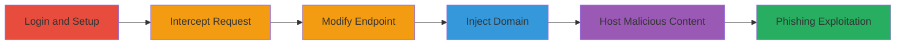

# Subdomain Takeover via Unbounce URL Update Endpoint

Multi-stage attack chain demonstrating a complete subdomain takeover workflow in the Unbounce platform, allowing attackers to claim and host malicious content on customer subdomains such as info.hacker.one.

## Chain Metrics Dashboard

| Metric | Value |
|--------|-------|
| Chain Status | Unverified |
| Total Steps | 7 |
| Execution Time | ~15 minutes |
| Skill Level | Intermediate |
| Complexity | Medium |
| Impact Level | High |

## Attack Flow Visualization

## Prerequisites & Requirements

### Required Tools

- [[tools/Burp-Suite]]

### Target Environment

- Web platform using Unbounce for landing pages
- Access to an Unbounce account (legitimate or compromised)
- No specific ports required; operates over HTTPS

### Initial Access Requirements

- Valid Unbounce credentials
- Network access to Unbounce application
- Proxy tool configured to intercept traffic (e.g., browser proxy set to Burp)

## Detailed Attack Procedures

### Step 1: Login to Unbounce Account
procedure: [[procedures/Exploit-Unbounce-Subdomain-Takeover]]

**Objective**: Gain authenticated access to the Unbounce platform to create and modify pages.

**Instructions**: Open the Unbounce web application in a browser configured with a proxy like Burp Suite. Enter valid credentials to authenticate.

**Expected Output**: Successful login dashboard displaying account pages and settings.

**Success Indicators**:
- User is redirected to the main dashboard
- Account ID is visible in the URL or page source for later use

### Step 2: Create a New Page
procedure: [[procedures/Exploit-Unbounce-Subdomain-Takeover]]

**Objective**: Build a landing page that can be used for URL manipulation.

**Instructions**: Use the Unbounce interface to create a new landing page under any domain or the default unbouncepages.com. Build basic content and save the page. Note the generated page ID from the URL or settings.

**Expected Output**: A saved page with a unique page ID, ready for URL configuration.

**Success Indicators**:
- Page is listed in the account dashboard
- Page ID (e.g., 4d2a5d74-2119-4c68-8d93-f456566f2fe8) is obtainable

### Step 3: Navigate to Change URL Feature
procedure: [[procedures/Exploit-Unbounce-Subdomain-Takeover]]

**Objective**: Access the URL modification settings to prepare for request interception.

**Instructions**: In the page settings, select the 'Change URL' option to open the form for modifying the page's URL configuration.

**Expected Output**: URL change form loaded, with fields for domain and path input.

**Success Indicators**:
- Form is visible and interactive
- No immediate validation errors on load

### Step 4: Fill Form with Arbitrary Input
procedure: [[procedures/Exploit-Unbounce-Subdomain-Takeover]]

**Objective**: Trigger the URL update request that can be intercepted and modified.

**Instructions**: Enter any arbitrary values in the URL change form fields, such as a placeholder domain and path, then submit the form.

**Expected Output**: HTTP POST request sent to Unbounce servers, captured by the proxy.

**Success Indicators**:
- Request is intercepted in Burp Suite
- Form submission does not error out prematurely

### Step 5: Intercept the Request
procedure: [[procedures/Exploit-Unbounce-Subdomain-Takeover]]

**Objective**: Capture the outgoing HTTP request for modification using a proxy tool.

**Instructions**: With Burp Suite active, ensure the request is intercepted during form submission. Review the POST request details in the proxy interface.

**Expected Output**: Raw HTTP POST request visible, including headers and body.

**Success Indicators**:
- Request path and body are editable
- Account and page IDs are present in the request

### Step 6: Modify the Endpoint Path
procedure: [[procedures/Exploit-Unbounce-Subdomain-Takeover]]

**Objective**: Redirect the request to the vulnerable URL update endpoint.

**Instructions**: In Burp Suite, edit the request path to /[account-id]/pages/[page-id]/url, replacing placeholders with actual IDs (e.g., /2235922/pages/4d2a5d74-2119-4c68-8d93-f456566f2fe8/url).

**Expected Output**: Updated request path targeting the specific endpoint.

**Success Indicators**:
- Path modification accepted without syntax errors
- Request remains valid for forwarding

### Step 7: Inject Arbitrary Domain Parameter
procedure: [[procedures/Exploit-Unbounce-Subdomain-Takeover]]

**Objective**: Exploit the lack of domain validation by injecting a target subdomain into the request body.

**Instructions**: Add or modify the body parameter &page%5Burl%5D=info.hacker.one/testing-new-takeover-04-10-17 (URL-encoded as page[url]=info.hacker.one/testing-new-takeover-04-10-17). Forward the modified request to the server.

**Expected Output**: Server accepts the request, and the page URL is updated to point to the injected subdomain, enabling takeover.

**Success Indicators**:
- No server rejection (e.g., 200 OK response)
- Accessing the subdomain (e.g., info.hacker.one/testing-new-takeover-04-10-17) serves the attacker's Unbounce page content
- Potential for hosting phishing pages to steal HackerOne user credentials

## Attack Chain Summary

### Key Achievements

1. Bypassed previous subdomain takeover fixes in Unbounce by targeting a new endpoint and parameter.
2. Successfully injected arbitrary domains, claiming subdomains like info.hacker.one for malicious hosting.
3. Enabled phishing attacks against HackerOne users by serving fake content on trusted subdomains.

## Technique & Tactic Coverage

### MITRE ATT&CK Techniques

- [[Exploit Public-Facing Application]]

### MITRE ATT&CK Tactics

- [[Initial Access]]

---
*Last updated: 2023-10-01T00:00:00Z*
