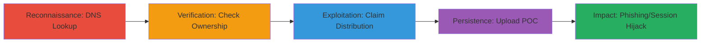

---
tags:
  - subdomain-takeover
  - aws
  - cloudfront
  - dns
  - phishing
type: attack_chain
tools:
  - '[[tools/AWS-CLI]]'
tactics:
  - '[[Initial Access]]'
  - '[[Reconnaissance]]'
commands:
  - '[[commands/dig-cname-lookup]]'
  - '[[commands/aws-cloudfront-list-distributions]]'
  - '[[commands/aws-cloudfront-create-distribution]]'
  - '[[commands/aws-s3-cp-upload-poc]]'
platforms:
  - AWS
  - Web
complexity: medium
procedures:
  - '[[procedures/DNS-Lookup-for-Subdomain-CNAME-Records]]'
  - '[[procedures/Verify-AWS-CloudFront-Distribution-Unclaimed]]'
  - '[[procedures/Claim-Unclaimed-AWS-CloudFront-Distribution]]'
  - '[[procedures/Upload-POC-to-Demonstrate-Subdomain-Takeover]]'
step_count: 4
techniques:
  - '[[Exploit Public-Facing Application]]'
  - '[[Hardware]]'
description: >-
  A multi-stage attack exploiting a dangling DNS CNAME record pointing to an
  unclaimed AWS CloudFront distribution, allowing full control over the
  subdomain for phishing and session hijacking.
skill_level: intermediate
impact_level: high
id: a2d89f67-025c-4ffd-b60e-cf375dac22fe
created_at: '2025-12-14T04:38:49.857Z'
updated_at: '2025-12-14T04:38:49.857Z'
verified: false
validated: true
submitted: true
mitre_tactics:
  - '[[Initial Access]]'
  - '[[Reconnaissance]]'
mitre_techniques:
  - '[[Exploit Public-Facing Application]]'
  - '[[Hardware]]'
---
# Subdomain Takeover via Unclaimed AWS CloudFront Distribution on cdn.grab.com

Multi-stage attack chain demonstrating a complete subdomain takeover workflow by exploiting a dangling CNAME record to an unclaimed AWS CloudFront distribution. This allows an attacker to gain control over cdn.grab.com, enabling phishing attacks using Grab's branding and potential theft of session cookies if scoped to *.grab.com, leading to session hijacking or XSS-like exploits.

## Chain Metrics Dashboard

| Metric | Value |
|--------|-------|
| Chain Status | Unverified |
| Total Steps | 4 |
| Execution Time | ~30 minutes |
| Skill Level | Intermediate |
| Complexity | Medium |
| Impact Level | High |

## Attack Flow Visualization



## Prerequisites & Requirements

### Required Tools

- [[tools/AWS-CLI]]
- [[commands/dig-cname-lookup]]

### Target Environment

- AWS Cloud platform
- DNS services for the target domain
- Access to AWS account (attacker's own)

### Initial Access Requirements

- No prior credentials on target
- Public DNS resolution
- AWS account for claiming the distribution

## Detailed Attack Procedures

### Step 1: DNS Reconnaissance
procedure: [[procedures/DNS-Lookup-for-Subdomain-CNAME-Records]]

**Objective**: Identify misconfigured DNS records, specifically CNAMEs pointing to external services like AWS CloudFront.

**Instructions**: Perform a DNS lookup on the target subdomain to reveal the CNAME record using [[commands/dig-cname-lookup]]:

```bash
dig cdn.grab.com CNAME
```

**Expected Output**: Resolution showing cdn.grab.com CNAME to d1234567890.cloudfront.net (or similar unclaimed distribution ID).

**Success Indicators**:
- CNAME record points to *.cloudfront.net
- No immediate error in resolution

### Step 2: Verify Unclaimed Distribution
procedure: [[procedures/Verify-AWS-CloudFront-Distribution-Unclaimed]]

**Objective**: Confirm that the CloudFront distribution referenced by the CNAME is not owned or monitored by the target organization.

**Instructions**: Use AWS CLI to list distributions and check for ownership, or manually inspect via AWS console. For automated check, query distributions with [[commands/aws-cloudfront-list-distributions]] (requires AWS credentials if testing own account, but for verification, public APIs or console search):

```bash
aws cloudfront list-distributions --query 'DistributionList.Items[?Aliases.Items.contains(@, `cdn.grab.com`)].Id'
```

If no output or unassociated, it's unclaimed. Manually verify in AWS console by searching for the distribution ID.

**Expected Output**: No matching distribution owned by the target, confirming it's available for claim.

**Success Indicators**:
- Distribution ID found but not linked to target's AWS account
- Console shows option to associate the CNAME

### Step 3: Claim the Distribution
procedure: [[procedures/Claim-Unclaimed-AWS-CloudFront-Distribution]]

**Objective**: Register the unclaimed CloudFront distribution under the attacker's AWS account to gain control.

**Instructions**: Create a new CloudFront distribution and add the target's subdomain as an alternate domain name (CNAME) using [[commands/aws-cloudfront-create-distribution]]:

```bash
aws cloudfront create-distribution --distribution-config '{"CallerReference":"unique-ref","Origins":{"Quantity":1,"Items":[{"Id":"origin1","DomainName":"example-bucket.s3.amazonaws.com","CustomOriginConfig":{"HTTPPort":80,"HTTPSPort":443,"OriginProtocolPolicy":"https-only"}}]},"DefaultCacheBehavior":{"TargetOriginId":"origin1","ViewerProtocolPolicy":"redirect-to-https"},"Aliases":{"Quantity":1,"Items":["cdn.grab.com"]}}'
```

Wait for deployment (monitor status). Replace origin with attacker's S3 bucket or server.

**Expected Output**: Distribution created with ID, and CNAME now resolves to attacker's control.

**Success Indicators**:
- Distribution status: Deployed
- DNS propagation shows new control

### Step 4: Demonstrate Takeover
procedure: [[procedures/Upload-POC-to-Demonstrate-Subdomain-Takeover]]

**Objective**: Upload malicious content to prove control and simulate impact like phishing.

**Instructions**: Upload a proof-of-concept HTML file to the origin (e.g., S3 bucket) using [[commands/aws-s3-cp-upload-poc]]:

```bash
aws s3 cp index.html s3://example-bucket/
```

Access via http://cdn.grab.com/index.html to verify.

**Expected Output**: POC page loads from the subdomain, confirming takeover.

**Success Indicators**:
- Custom content served from cdn.grab.com
- Potential for cookie theft if browsing with session

## Attack Chain Summary

### Key Achievements

1. Identified dangling CNAME to unclaimed CloudFront
2. Verified lack of ownership and claimed the distribution
3. Gained full control over cdn.grab.com
4. Demonstrated phishing potential and session risks

## Technique & Tactic Coverage

### MITRE ATT&CK Techniques

- [[Exploit Public-Facing Application]]
- [[Hardware]]

### MITRE ATT&CK Tactics

- [[Initial Access]]
- [[Reconnaissance]]

---
*Last updated: 2023-10-01T00:00:00Z*
