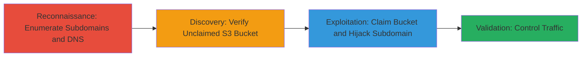

# Subdomain Takeover via Unclaimed Amazon S3 Bucket

Multi-stage attack chain demonstrating a complete attack workflow for hijacking a subdomain through an unclaimed AWS S3 bucket.

## Chain Metrics Dashboard

| Metric | Value |
|--------|-------|
| Chain Status | Unverified |
| Total Steps | 3 |
| Execution Time | ~10 minutes |
| Skill Level | Intermediate |
| Complexity | Low |
| Impact Level | Low |

## Attack Flow Visualization



## Prerequisites & Requirements

### Required Tools

- [[tools/dig]]
- [[tools/aws-cli]]

### Target Environment

- Cloud platform: AWS
- Services: Amazon S3, DNS (CNAME records)
- Network access: Public internet for DNS queries; AWS credentials for claiming bucket (attacker must have AWS account)

### Initial Access Requirements

- No prior credentials needed for reconnaissance
- Attacker AWS account for claiming the bucket
- Public DNS resolution access

## Detailed Attack Procedures

### Step 1: Enumerate Subdomains and DNS Records
procedure: [[procedures/Enumerate-Subdomains-and-DNS-Records]]

**Objective**: Identify potential subdomains and check their DNS records for dangling pointers to cloud services like S3.

**Instructions**: Start by enumerating subdomains using passive reconnaissance tools, then query DNS for CNAME records pointing to AWS S3 endpoints.

Use [[commands/dig-cname-lookup]] to check specific subdomains:

```bash
dig +short CNAME musical.ly.example.com
```

Follow up with a broader scan if needed using tools like subfinder (not detailed here) to list subdomains, then batch DNS queries.

**Expected Output**: CNAME record showing pointer to an S3 bucket, e.g., "bucket-name.s3.amazonaws.com".

**Success Indicators**:
- Dangling CNAME identified pointing to S3
- Subdomain confirmed resolvable but bucket unclaimed

### Step 2: Verify and Claim Unclaimed S3 Bucket
procedure: [[procedures/Verify-and-Claim-Unclaimed-S3-Bucket]]

**Objective**: Confirm the S3 bucket is unclaimed and register it under attacker control to redirect subdomain traffic.

**Instructions**: Attempt to access the bucket via AWS console or CLI to verify it's available. If unclaimed, create it using AWS CLI.

First, verify with [[commands/aws-s3-ls-bucket]]:

```bash
aws s3 ls s3://bucket-name --no-sign-request
```

If it returns an access denied or no such bucket, claim it with [[commands/aws-s3-mb-bucket]]:

```bash
aws s3 mb s3://bucket-name --region us-east-1
```

Upload a simple index.html to test control:

```bash
echo '<h1>Hijacked</h1>' > index.html
aws s3 cp index.html s3://bucket-name/
```

**Expected Output**: Bucket created successfully; file uploaded without errors.

**Success Indicators**:
- Bucket creation succeeds
- Subdomain now resolves to attacker's content

### Step 3: Validate Subdomain Hijacking
procedure: [[procedures/Validate-Subdomain-Hijacking]]

**Objective**: Confirm control over the subdomain by accessing it and observing redirected traffic.

**Instructions**: Query the subdomain DNS again and browse to verify the hijacked content is served.

Use [[commands/curl-subdomain-test]] to fetch content:

```bash
curl -I https://musical.ly.example.com
```

Browse to the URL in a browser to see the uploaded page.

**Expected Output**: HTTP response serving attacker's index.html; 200 OK with custom content.

**Success Indicators**:
- Traffic to subdomain controlled by attacker
- Potential for phishing or redirects enabled

## Attack Chain Summary

### Key Achievements

1. Identified dangling DNS record to unclaimed S3 bucket
2. Claimed the bucket to takeover the musical.ly subdomain
3. Enabled potential phishing or traffic manipulation without exposing user data

## Technique & Tactic Coverage

### MITRE ATT&CK Techniques

- [[Active Scanning]] Active Scanning
- [[Exploit Public-Facing Application]] Exploit Public-Facing Application

### MITRE ATT&CK Tactics

- [[Reconnaissance]] Reconnaissance
- [[Initial Access]] Initial Access

---
*Last updated: 2023-10-01T12:00:00Z*
