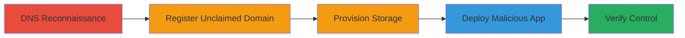

# Subdomain Takeover via Unclaimed Azure Cloud App

Multi-stage attack chain demonstrating a complete subdomain takeover workflow on an Azure-integrated Starbucks subdomain, allowing full control for malicious content hosting.

## Chain Metrics Dashboard

| Metric | Value |
|--------|-------|
| Chain Status | Unverified |
| Total Steps | 5 |
| Execution Time | ~30 minutes |
| Skill Level | Intermediate |
| Complexity | Medium |
| Impact Level | High |

## Attack Flow Visualization



## Prerequisites & Requirements

### Required Tools

- [[tools/Azure-Portal]]
- [[tools/Visual-Studio]]

### Target Environment

- Azure Cloud platform
- DNS records pointing to deleted Azure resources
- No authentication required for public DNS queries

### Initial Access Requirements

- Internet access to query DNS
- Azure account for registration
- No prior credentials on target

## Detailed Attack Procedures

### Step 1: DNS Reconnaissance
procedure: [[procedures/Analyze-DNS-Records-for-Subdomain-Takeover]]

**Objective**: Identify vulnerable subdomains by analyzing DNS records for dangling CNAMEs pointing to unclaimed cloud resources.

**Instructions**: Query the DNS records of the target subdomain to reveal the CNAME chain leading to an unregistered Azure domain.

Use tools like dig or nslookup to inspect records:

```bash
dig CNAME svcgatewayus.starbucks.com
```

Follow the chain: svcgatewayus.starbucks.com -> s00197tmp0crdfulprod0.trafficmanager.net -> 1fd05821-7501-40de-9e44-17235e7ab48b.cloudapp.net.

**Expected Output**: CNAME records showing the unclaimed .cloudapp.net domain.

**Success Indicators**:
- Unclaimed Azure domain identified in DNS chain
- No active Azure resource responds to the final domain

### Step 2: Register Unclaimed Domain
procedure: [[procedures/Register-Unclaimed-Azure-Cloud-App-Domain]]

**Objective**: Claim the unclaimed Azure cloud app domain to gain control over the DNS-pointed resource.

**Instructions**: Log in to the Azure Portal and create a new Cloud Service matching the unregistered subdomain name.

Navigate to Azure Portal > Create a resource > Cloud Services (classic) > Provide the exact name 1fd05821-7501-40de-9e44-17235e7ab48b.cloudapp.net.

**Expected Output**: Successful creation of the Cloud Service with the hijacked domain.

**Success Indicators**:
- Domain registered without errors
- Azure confirms ownership of the .cloudapp.net resource

### Step 3: Provision Storage
procedure: [[procedures/Create-Storage-Account-for-Azure-Cloud-Service]]

**Objective**: Set up necessary storage for the cloud service to support application deployment.

**Instructions**: In the Azure Portal, under the new Cloud Service, create a storage account.

Select Storage Accounts > Create > Choose subscription, resource group, and name the account (e.g., hijackedstorage).

**Expected Output**: Provisioned storage account linked to the Cloud Service.

**Success Indicators**:
- Storage account active and accessible
- No conflicts with existing resources

### Step 4: Deploy Malicious Application
procedure: [[procedures/Deploy-ASP-NET-Application-to-Hijacked-Subdomain]]

**Objective**: Deploy custom content to the hijacked subdomain for exploitation.

**Instructions**: Use Visual Studio to create a simple ASP.NET app, package it for Azure Cloud Services, and upload via Azure Portal.

In Visual Studio: New Project > ASP.NET Web Application > Add content like 'Subdomain takeover PoC' > Build deployment package per Azure docs > Upload to Cloud Service in Portal.

**Expected Output**: Application deployed and serving content on the subdomain.

**Success Indicators**:
- Deployment succeeds without errors
- Custom page loads when accessing the domain

### Step 5: Verify Control
procedure: [[procedures/Verify-Control-of-Hijacked-Subdomain]]

**Objective**: Confirm full control by accessing the subdomain and observing deployed content.

**Instructions**: Send HTTP requests to the original subdomain to check if it resolves to the deployed app.

Use curl or browser: curl http://svcgatewayus.starbucks.com

**Expected Output**: Response from the custom ASP.NET app, e.g., 'Subdomain takeover PoC'.

**Success Indicators**:
- Subdomain serves attacker-controlled content
- DNS propagation complete, no redirects to original service

## Attack Chain Summary

### Key Achievements

1. Identified and exploited dangling DNS CNAME for subdomain takeover
2. Registered unclaimed Azure resource to hijack traffic
3. Deployed proof-of-concept application demonstrating full control
4. Enabled potential for phishing, malware, XSS, and SSL issuance

## Technique & Tactic Coverage

### MITRE ATT&CK Techniques

- [[Exploit Public-Facing Application]]
- [[Active Scanning]]

### MITRE ATT&CK Tactics

- [[Initial Access]]
- [[Reconnaissance]]

---
*Last updated: 2023-10-01T12:00:00Z*
