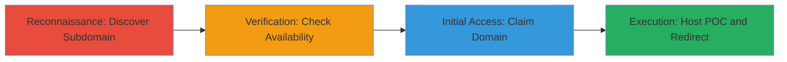

# Subdomain Takeover via Unclaimed Azure Endpoint on U.S. Department of Defense Domain

Multi-stage attack chain demonstrating a subdomain takeover vulnerability on a U.S. Department of Defense domain, where a CNAME record points to an unclaimed Azure endpoint, enabling an attacker to register the domain and gain control for malicious activities like phishing, cookie hijacking, or XSS to steal sensitive information.

## Chain Metrics Dashboard

| Metric | Value |
|--------|-------|
| Chain Status | Unverified |
| Total Steps | 4 |
| Execution Time | ~30 minutes |
| Skill Level | Intermediate |
| Complexity | Medium |
| Impact Level | High |

## Attack Flow Visualization



## Prerequisites & Requirements

### Required Tools

- DNS lookup tools like [[commands/dig-dns-query]]
- WHOIS client for domain checks
- Domain registrar account (e.g., GoDaddy, Namecheap)
- Web hosting service for POC

### Target Environment

- Target: Public DNS records of government or enterprise domains
- Required services/ports: DNS (port 53), HTTP/HTTPS (ports 80/443)
- Network access requirements: Internet access for DNS queries and domain registration

### Initial Access Requirements

- No prior credentials needed
- Publicly resolvable DNS
- Ability to register .azurewebsites.net or similar dangling domains

## Detailed Attack Procedures

### Step 1: Discover Vulnerable Subdomain
procedure: [[procedures/Discover-Vulnerable-Subdomain-via-DNS-Enumeration]]

**Objective**: Identify subdomains with CNAME records pointing to unclaimed or outdated cloud services.

**Instructions**: Enumerate subdomains of the target domain (e.g., dod.gov) using passive or active DNS tools. Query the CNAME for suspicious entries pointing to Azure endpoints.

Use [[commands/dig-dns-query]] to check a specific subdomain:

```bash
dig +short CNAME vulnerable-sub.dod.gov
```

Follow up by resolving the target:

```bash
dig +short vulnerable-sub.dod.gov
```

**Expected Output**: CNAME record showing "█████ --> ████" (outdated Azure endpoint).

**Success Indicators**:
- CNAME points to a cloud provider like Azure
- Target endpoint appears unclaimed or dangling

### Step 2: Verify Domain Availability
procedure: [[procedures/Verify-Unclaimed-Domain-Availability]]

**Objective**: Confirm the dangling domain is available for registration to assess takeover risk.

**Instructions**: Use WHOIS to check if the target domain (e.g., ████.azurewebsites.net) is registered. Search on domain registrars for availability.

Execute [[commands/whois-domain-check]]:

```bash
whois ████.azurewebsites.net
```

If no registrant info or expired, confirm on Azure portal or registrar site.

**Expected Output**: No active registration or expired status.

**Success Indicators**:
- Domain shows as available
- No current owner listed

### Step 3: Claim the Domain
procedure: [[procedures/Claim-Unclaimed-Domain-for-Takeover]]

**Objective**: Register the unclaimed domain to demonstrate control over the subdomain.

**Instructions**: Navigate to a domain registrar (e.g., GoDaddy) and search for the dangling domain. Complete registration process.

No specific command; use web interface:
- Search for ████
- Add to cart and checkout with payment

Post-registration, update DNS records if needed to point to your hosting.

**Expected Output**: Confirmation email and domain control panel access.

**Success Indicators**:
- Domain registered under your account
- DNS propagation confirms ownership

### Step 4: Host Proof-of-Concept and Redirect Traffic
procedure: [[procedures/Host-Proof-of-Concept-and-Redirect-Traffic]]

**Objective**: Demonstrate takeover by hosting a POC file and redirecting to mitigate or show impact.

**Instructions**: Set up hosting on the claimed domain. Upload a POC text file and configure redirect to a blank page.

Use a simple HTTP server or registrar's hosting:

```bash
# Example using Python for local testing before upload
echo "POC: Subdomain taken over" > proof.e7437329-ab61-4f22-a049-df5b3685313a.txt
python -m http.server 80
```

Configure redirect in DNS or .htaccess to blank page.

**Expected Output**: Accessible POC at https://████████/proof.e7437329-ab61-4f22-a049-df5b3685313a.txt.

**Success Indicators**:
- POC file loads from subdomain
- Traffic redirects as configured

## Attack Chain Summary

### Key Achievements

1. Identified dangling CNAME to unclaimed Azure domain
2. Verified and claimed the domain to prevent malicious use
3. Hosted POC to prove control without exploitation
4. Demonstrated potential for phishing/XSS on DoD subdomain

## Technique & Tactic Coverage

### MITRE ATT&CK Techniques

- [[Scanning IP Blocks]] Active Scanning: Scanning IP Blocks (subdomain enumeration)
- [[Exploit Public-Facing Application]] Exploit Public-Facing Application (takeover via DNS misconfig)

### MITRE ATT&CK Tactics

- [[Reconnaissance]] Reconnaissance
- [[Initial Access]] Initial Access

---
*Last updated: 2023-10-01T12:00:00Z*
