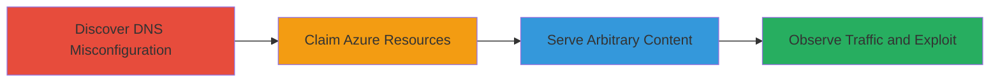

---
tags:
  - subdomain-takeover
  - azure
  - dns
  - traffic-manager
  - phishing
type: attack_chain
tools:
  - '[[tools/dig]]'
tactics:
  - '[[Reconnaissance]]'
  - '[[Initial Access]]'
commands:
  - '[[commands/dig-query-svcgatewayloadus-starbucks-com-A]]'
  - '[[commands/dig-query-svcgatewaydevus-starbucks-com-A]]'
verified: false
platforms:
  - Cloud
  - Web
  - Azure
submitted: true
complexity: medium
procedures:
  - '[[procedures/Discover-Unclaimed-Subdomains-via-DNS-Query]]'
  - '[[procedures/Claim-Unclaimed-Azure-Resources]]'
  - '[[procedures/Serve-Arbitrary-Content-on-Taken-Over-Subdomains]]'
step_count: 3
techniques:
  - '[[Hardware]]'
  - '[[Exploit Public-Facing Application]]'
description: >-
  Attack chain exploiting DNS misconfiguration allowing takeover of Starbucks
  subdomains pointing to unclaimed Azure Traffic Manager endpoints, enabling
  arbitrary content serving for phishing or malware.
skill_level: intermediate
impact_level: high
id: 59dca430-f64d-4519-8eb6-cbcedd5cc616
created_at: '2025-12-14T04:51:26.616Z'
updated_at: '2025-12-14T04:51:26.616Z'
validated: true
mitre_tactics:
  - '[[Reconnaissance]]'
  - '[[Initial Access]]'
mitre_techniques:
  - '[[Hardware]]'
  - '[[Exploit Public-Facing Application]]'
---
# Subdomain Takeover via Unclaimed Azure Traffic Manager Endpoints

Multi-stage attack chain demonstrating a subdomain takeover vulnerability on Starbucks subdomains due to unclaimed Azure Traffic Manager endpoints, allowing an attacker to serve arbitrary content and potentially phish users or distribute malware.

## Chain Metrics Dashboard

| Metric | Value |
|--------|-------|
| Chain Status | Unverified |
| Total Steps | 3 |
| Execution Time | ~60 minutes |
| Skill Level | Intermediate |
| Complexity | Medium |
| Impact Level | High |

## Attack Flow Visualization



## Prerequisites & Requirements

### Required Tools

- [[tools/dig]]
- Azure account (free tier sufficient for claiming resources)
- Web server or hosting service to serve content

### Target Environment

- Cloud platform: Azure
- Services: Azure Traffic Manager, DNS
- Ports: 53 (DNS)
- Network access: Public internet for DNS queries and resource claiming

### Initial Access Requirements

- No prior credentials needed for discovery
- Azure subscription for claiming endpoints
- Public DNS resolution access

## Detailed Attack Procedures

### Step 1: Discover DNS Misconfiguration
procedure: [[procedures/Discover-Unclaimed-Subdomains-via-DNS-Query]]

**Objective**: Identify subdomains with CNAME records pointing to unclaimed Azure Traffic Manager endpoints.

**Instructions**: Query DNS A records for target subdomains to reveal CNAMEs and check for NXDOMAIN responses indicating unclaimed resources. Use [[commands/dig-query-svcgatewayloadus-starbucks-com-A]] for the load subdomain:

```bash
dig svcgatewayloadus.starbucks.com A
```

Follow with [[commands/dig-query-svcgatewaydevus-starbucks-com-A]] for the dev subdomain:

```bash
dig svcgatewaydevus.starbucks.com A
```

**Expected Output**: CNAME records to unclaimed endpoints like s00197tmp0crdfulload0.trafficmanager.net with NXDOMAIN.

**Success Indicators**:
- CNAME points to Azure Traffic Manager
- NXDOMAIN confirms unclaimed status

### Step 2: Claim Azure Resources
procedure: [[procedures/Claim-Unclaimed-Azure-Resources]]

**Objective**: Register and gain control over the unclaimed Azure Traffic Manager endpoints.

**Instructions**: Log in to the Azure portal with an active subscription, navigate to Traffic Manager, and create profiles matching the unclaimed endpoint names (e.g., s00197tmp0crdfulload0). Assign endpoints to route traffic to attacker-controlled servers.

**Expected Output**: Successful creation of Traffic Manager profiles owning the CNAME targets.

**Success Indicators**:
- Azure resources claimed without conflicts
- DNS propagation confirms control

### Step 3: Serve Arbitrary Content on Taken Over Subdomains
procedure: [[procedures/Serve-Arbitrary-Content-on-Taken-Over-Subdomains]]

**Objective**: Host malicious content on the taken over subdomains to intercept traffic.

**Instructions**: Configure the claimed Traffic Manager endpoints to forward traffic to a server hosting phishing pages or malware. Access http://svcgatewayloadus.starbucks.com/ and http://svcgatewaydevus.starbucks.com/ to verify control and monitor incoming requests.

**Expected Output**: Custom content loads on subdomains; traffic logs show requests from unique IPs (e.g., 1603 requests from 29 IPs in 45 minutes).

**Success Indicators**:
- Subdomains resolve to attacker content
- Incoming traffic observed

## Attack Chain Summary

### Key Achievements

1. Identified unclaimed Azure endpoints via DNS queries
2. Claimed control over Starbucks subdomains
3. Demonstrated potential for phishing or XSS by serving arbitrary content

## Technique & Tactic Coverage

### MITRE ATT&CK Techniques

- [[Hardware]]
- [[Exploit Public-Facing Application]]

### MITRE ATT&CK Tactics

- [[Reconnaissance]]
- [[Initial Access]]

---
*Last updated: 2024-10-01T00:00:00Z*
