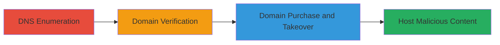

---
tags:
  - subdomain-takeover
  - dns
  - cname
  - misconfiguration
type: attack_chain
tools:
  - '[[tools/DomainTools]]'
tactics:
  - '[[Initial Access]]'
verified: false
platforms:
  - Web
  - DNS
submitted: true
complexity: medium
created_at: '2023-10-01T00:00:00Z'
procedures:
  - '[[procedures/DNS-CNAME-Enumeration-for-Subdomain-Takeover]]'
  - '[[procedures/Verify-Domain-Availability-for-Takeover]]'
step_count: 2
techniques:
  - '[[Exploit Public-Facing Application]]'
updated_at: '2025-12-14T04:51:10.813Z'
description: >-
  Demonstrates a subdomain takeover attack by identifying a misconfigured CNAME
  record pointing to an unclaimed domain, allowing purchase and control for
  malicious content hosting.
skill_level: intermediate
impact_level: high
id: 429bac72-cc7f-4db4-b062-153894582c16
validated: true
mitre_tactics:
  - '[[Initial Access]]'
mitre_techniques:
  - '[[Exploit Public-Facing Application]]'
---
# Subdomain Takeover via Unclaimed CNAME Target Domain

Multi-stage attack chain demonstrating a complete subdomain takeover workflow targeting misconfigured DNS records.

## Chain Metrics Dashboard

| Metric | Value |
|--------|-------|
| Chain Status | Unverified |
| Total Steps | 2 |
| Execution Time | ~5 minutes |
| Skill Level | Intermediate |
| Complexity | Medium |
| Impact Level | High |

## Attack Flow Visualization

## Prerequisites & Requirements

### Required Tools

- [[tools/DomainTools]]

### Target Environment

- DNS infrastructure with public subdomains
- Access to domain registration services
- No special ports required; standard DNS resolution (port 53)

### Initial Access Requirements

- Public internet access for DNS queries
- No credentials needed for reconnaissance phase
- Ability to purchase domains for exploitation

## Detailed Attack Procedures

### Step 1: DNS CNAME Enumeration
procedure: [[procedures/DNS-CNAME-Enumeration-for-Subdomain-Takeover]]

**Objective**: Identify misconfigured CNAME records pointing to unclaimed external domains to enable potential subdomain takeover.

**Instructions**: Use [[tools/DomainTools]] to perform a DNS lookup on the target subdomain:

Access DomainTools and query the CNAME record for the subdomain, such as recommendation.algolia.com.

**Expected Output**: CNAME record revealing the target domain, e.g., recommendation.us.

**Success Indicators**:
- CNAME record points to an external, non-owned domain
- No active resolution to legitimate content

### Step 2: Domain Availability Verification
procedure: [[procedures/Verify-Domain-Availability-for-Takeover]]

**Objective**: Confirm that the CNAME target domain is available for purchase, allowing takeover of the subdomain.

**Instructions**: Using [[tools/DomainTools]], perform a WHOIS lookup on the identified domain:

Query WHOIS, DNS, and domain status for recommendation.us to check availability.

**Expected Output**: Domain status showing it is unregistered and available for purchase.

**Success Indicators**:
- WHOIS indicates no current owner or expiration leading to availability
- No active DNS records or website hosted

## Attack Chain Summary

### Key Achievements

1. Identified vulnerable CNAME misconfiguration
2. Verified domain availability for takeover
3. Enabled potential reputation damage via malicious content hosting

## Technique & Tactic Coverage

### MITRE ATT&CK Techniques

- [[Exploit Public-Facing Application]]

### MITRE ATT&CK Tactics

- [[Initial Access]]

---
*Last updated: 2023-10-01T00:00:00Z*
