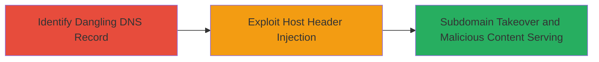

---
tags:
  - subdomain-takeover
  - host-header-injection
  - dns
  - netlify
  - web-vulnerability
type: attack_chain
tools:
  - '[[tools/curl]]'
  - '[[tools/Burp-Suite]]'
tactics:
  - '[[Initial Access]]'
verified: false
platforms:
  - Web
submitted: true
complexity: medium
created_at: '2023-10-01T00:00:00Z'
procedures:
  - '[[procedures/Identify-Vulnerable-Subdomain-via-DNS-Enumeration]]'
  - '[[procedures/Exploit-Host-Header-Injection-for-Subdomain-Takeover]]'
step_count: 2
techniques:
  - '[[Exploit Public-Facing Application]]'
  - '[[Upload Malware]]'
updated_at: '2025-12-14T04:51:26.636Z'
description: >-
  A multi-stage attack exploiting an unclaimed CNAME record on a DoD subdomain
  pointing to Netlify, combined with host header injection to takeover and serve
  malicious content.
skill_level: intermediate
impact_level: high
id: ddcfef7e-fac8-4c19-9a31-202751516847
validated: true
mitre_tactics:
  - '[[Initial Access]]'
mitre_techniques:
  - '[[Exploit Public-Facing Application]]'
  - '[[Upload Malware]]'
---
# Subdomain Takeover via Unclaimed CNAME and Host Header Injection

Multi-stage attack chain demonstrating subdomain takeover on a DoD domain by exploiting an unclaimed Netlify CNAME record and host header injection to access and manipulate unauthorized content.

## Chain Metrics Dashboard

| Metric | Value |
|--------|-------|
| Chain Status | Unverified |
| Total Steps | 2 |
| Execution Time | ~5 minutes |
| Skill Level | Intermediate |
| Complexity | Medium |
| Impact Level | High |

## Attack Flow Visualization



## Prerequisites & Requirements

### Required Tools

- [[tools/curl]]
- [[tools/Burp-Suite]]

### Target Environment

- Web platform with DNS records
- Services: Netlify hosting
- Required ports: 443 (HTTPS)
- Network access: Public internet access to the target subdomain

### Initial Access Requirements

- No credentials required
- External network position
- No prior access needed, but DNS enumeration tools assumed available

## Detailed Attack Procedures

### Step 1: Identify Vulnerable Subdomain
procedure: [[procedures/Identify-Vulnerable-Subdomain-via-DNS-Enumeration]]

**Objective**: Discover the dangling CNAME record pointing to an unclaimed Netlify subdomain, enabling potential takeover.

**Instructions**: Use DNS lookup tools to enumerate subdomains and inspect CNAME records for unclaimed services like Netlify. For example, query the target domain's DNS:

```bash
nslookup -type=CNAME www.target.gov
```

Verify if the pointed resource (e.g., example.netlify.app) is unclaimed by attempting to access it directly or checking Netlify's claim status.

**Expected Output**: CNAME record showing pointer to unclaimed netlify.app subdomain.

**Success Indicators**:
- Unclaimed CNAME identified
- No active content on the Netlify endpoint

### Step 2: Exploit Host Header Injection
procedure: [[procedures/Exploit-Host-Header-Injection-for-Subdomain-Takeover]]

**Objective**: Manipulate HTTP requests to inject the host header, allowing visualization and potential control of the unclaimed subdomain content under the DoD domain.

**Instructions**: Send a crafted HTTPS request to the target subdomain using [[commands/curl-host-header-injection-poc]] to override the Host header:

```bash
curl -skS https://www.target.gov --header "Host: example.netlify.app"
```

Intercept and modify requests using [[tools/Burp-Suite]] for more complex testing, such as replaying with altered headers to confirm injection success.

**Expected Output**: HTTP response displaying content from the Netlify subdomain, as if served from the DoD domain.

**Success Indicators**:
- Unauthorized Netlify content accessible via DoD subdomain
- No server-side validation of Host header

## Attack Chain Summary

### Key Achievements

1. Identified unclaimed CNAME for subdomain takeover opportunity
2. Demonstrated host header injection to impersonate and access external content
3. Highlighted critical risks including phishing, malware distribution, and reputation damage to DoD

## Technique & Tactic Coverage

### MITRE ATT&CK Techniques

- [[Exploit Public-Facing Application]]
- [[Upload Malware]]

### MITRE ATT&CK Tactics

- [[Initial Access]]

---

*Last updated: 2023-10-01T00:00:00Z*
