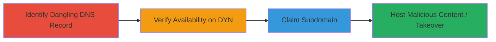

# Subdomain Takeover via Unclaimed DYN DNS Record

Multi-stage attack chain demonstrating how to identify, verify, and exploit a subdomain takeover vulnerability using an unclaimed DYN DNS hostname, leading to full control over the subdomain for hosting malicious content.

## Chain Metrics Dashboard

| Metric | Value |
|--------|-------|
| Chain Status | Unverified |
| Total Steps | 4 |
| Execution Time | ~15 minutes |
| Skill Level | Intermediate |
| Complexity | Low |
| Impact Level | High |

## Attack Flow Visualization



## Prerequisites & Requirements

### Required Tools

- [[tools/Detectify-Labs-Blog]] (for reference on takeover techniques)
- Web browser for DYN platform interaction
- DNS lookup tool like [[commands/dig-dns-lookup]]

### Target Environment

- DNS infrastructure using DYN service
- Publicly resolvable subdomains
- No authentication required for initial DNS checks

### Initial Access Requirements

- Internet access to query DNS and visit DYN's website
- No prior credentials needed; relies on public misconfiguration

## Detailed Attack Procedures

### Step 1: Identify Unclaimed DNS Subdomain
procedure: [[procedures/Identify-Unclaimed-DNS-Subdomain]]

**Objective**: Detect a subdomain with a DNS record pointing to DYN infrastructure but without an active configuration, indicating a potential takeover opportunity.

**Instructions**: Start by performing a DNS lookup on the target subdomain to confirm it resolves to DYN's nameservers or infrastructure. Use [[commands/dig-dns-lookup]] for verification:

```bash
dig web.mopub.com
```

Review the output for DYN-specific records (e.g., pointing to dyn.com or similar). Cross-reference with known DYN IP ranges to confirm it's unclaimed.

**Expected Output**: DNS response showing delegation to DYN without active host setup.

**Success Indicators**:
- Subdomain resolves to DYN infrastructure
- No active content or configuration detected

### Step 2: Verify Subdomain Availability on DYN
procedure: [[procedures/Verify-Subdomain-Availability-on-DYN]]

**Objective**: Confirm the subdomain is available for registration on DYN's platform, proving it's dangling and claimable.

**Instructions**: Navigate to DYN's DNS management portal and search for the subdomain. Use a web browser to visit http://dyn.com/dns/ and input the subdomain for availability check. No command-line tool is needed here, but document the process with screenshots.

**Expected Output**: Platform indicates the hostname is available and can be added to a cart.

**Success Indicators**:
- Search results show availability
- Subdomain can be selected for purchase/claim

### Step 3: Demonstrate Subdomain Claiming Process
procedure: [[procedures/Demonstrate-Subdomain-Claiming-Process]]

**Objective**: Simulate the claiming process to validate control acquisition without completing purchase, highlighting the vulnerability.

**Instructions**: On DYN's platform, add the subdomain to the shopping cart to test registration. Remove it afterward to avoid actual purchase. Repeat from a different account if needed for confirmation. Capture screenshots of the cart addition and any confirmation messages.

**Expected Output**: Cart confirmation message stating DNS services are active but purchasable; subdomain temporarily reserved.

**Success Indicators**:
- Subdomain added to cart successfully
- Platform acknowledges availability and potential activation

### Step 4: Observe External Subdomain Takeover
procedure: [[procedures/Observe-External-Subdomain-Takeover]]

**Objective**: Illustrate real-world impact by noting when another party claims the subdomain post-removal, leading to full control and content hosting.

**Instructions**: After removing the subdomain from the cart, monitor DNS resolution and website content. Use [[commands/dig-dns-lookup]] again to check for changes:

```bash
dig web.mopub.com
```

Visit the subdomain URL to observe hosted content, confirming takeover by an external actor (e.g., via credit card claim).

**Expected Output**: DNS updates to point to the claimant's configuration; arbitrary content appears on the subdomain.

**Success Indicators**:
- DNS records altered by external party
- Malicious or unauthorized content hosted

## Attack Chain Summary

### Key Achievements

1. Identified a dangling DNS record on DYN, exposing the subdomain to takeover.
2. Verified and demonstrated the claiming process, proving exploitability.
3. Highlighted potential for phishing, XSS, malware, and brand damage.
4. Observed actual takeover, underscoring real impact.

## Technique & Tactic Coverage

### MITRE ATT&CK Techniques

- [[Exploit Public-Facing Application]] Exploit Public-Facing Application
- [[Compromise Accounts]] Compromise Accounts

### MITRE ATT&CK Tactics

- [[Initial Access]] Initial Access

---
*Last updated: 2023-10-01T00:00:00Z*
