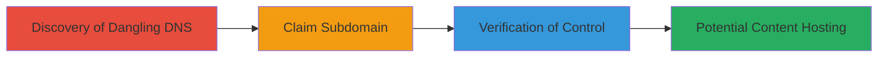

---
tags:
  - subdomain-takeover
  - shopify
  - dns
  - misconfiguration
type: attack_chain
tools: []
tactics:
  - '[[Initial Access]]'
verified: false
platforms:
  - Web
  - DNS
submitted: true
created_at: '2023-10-01T00:00:00Z'
procedures:
  - '[[procedures/Discover-Unclaimed-Shopify-Subdomain]]'
  - '[[procedures/Claim-Subdomain-in-Personal-Shopify-Store]]'
  - '[[procedures/Verify-Subdomain-Takeover]]'
step_count: 3
techniques:
  - '[[Exploit Public-Facing Application]]'
updated_at: '2025-12-14T04:51:10.851Z'
description: >-
  A multi-step attack demonstrating subdomain takeover by identifying and
  claiming an unclaimed DNS record pointing to Shopify infrastructure, allowing
  control over the subdomain.
id: f9e3ae05-fb6f-452b-a900-edb930d4e13a
validated: true
mitre_tactics:
  - '[[Initial Access]]'
mitre_techniques:
  - '[[Exploit Public-Facing Application]]'
---
# Subdomain Takeover via Unclaimed Shopify DNS Record

Multi-stage attack chain demonstrating a complete subdomain takeover workflow targeting unclaimed DNS records associated with third-party services like Shopify.

## Chain Metrics Dashboard

| Metric | Value |
|--------|-------|
| Chain Status | Unverified |
| Total Steps | 3 |
| Execution Time | ~5 minutes |
| Skill Level | Intermediate |
| Complexity | Low |
| Impact Level | Medium |

## Attack Flow Visualization

## Prerequisites & Requirements

### Required Tools

- Web browser for DNS checks and Shopify access
- Access to a personal Shopify store account

### Target Environment

- Target: Domain with potential dangling DNS records (e.g., *.example.com)
- Required services/ports: DNS resolution (port 53), HTTPS (port 443)
- Network access requirements: Internet connectivity for DNS queries and Shopify API interactions

### Initial Access Requirements

- No prior credentials on target domain
- Valid Shopify account for claiming the subdomain
- Knowledge of DNS records and subdomain enumeration techniques

## Detailed Attack Procedures

### Step 1: Discover Unclaimed Subdomain
procedure: [[procedures/Discover-Unclaimed-Shopify-Subdomain]]

**Objective**: Identify subdomains with DNS records pointing to unclaimed third-party infrastructure, such as Shopify.

**Instructions**: Manually query DNS records for target subdomains using online tools or command-line utilities like dig or nslookup. Check if the CNAME or A record points to known services like Shopify's servers (e.g., shops.myshopify.com) but verify no active store is associated by attempting to access the URL.

**Expected Output**: Confirmation that the subdomain resolves to Shopify infrastructure without loading a valid store page (e.g., 404 or unclaimed error).

**Success Indicators**:
- DNS record points to Shopify
- No active Shopify store responds at the subdomain

### Step 2: Claim the Subdomain
procedure: [[procedures/Claim-Subdomain-in-Personal-Shopify-Store]]

**Objective**: Take control of the dangling subdomain by associating it with a personal Shopify store.

**Instructions**: Log in to your Shopify admin panel, navigate to Settings > Domains, and add the target subdomain as a custom domain. Follow Shopify's verification prompts, which may involve updating DNS records if needed, but in this case, leverage the existing dangling record.

**Expected Output**: Shopify confirms the domain addition, and the subdomain begins resolving to your store.

**Success Indicators**:
- Domain added successfully in Shopify dashboard
- Subdomain DNS propagates to your store

### Step 3: Verify the Takeover
procedure: [[procedures/Verify-Subdomain-Takeover]]

**Objective**: Confirm control over the subdomain by accessing it and observing hosted content.

**Instructions**: After claiming, wait for DNS propagation (typically minutes), then visit https://[subdomain] in a browser. Ensure it loads your personal store's content instead of the original or an error.

**Expected Output**: The subdomain serves your Shopify store's homepage or configured content.

**Success Indicators**:
- Subdomain loads personal store content
- No errors or redirects to original unclaimed state

## Attack Chain Summary

### Key Achievements

1. Identified a dangling DNS record for blog.exchangemarketplace.com pointing to unclaimed Shopify infrastructure.
2. Successfully claimed the subdomain in a personal Shopify store, gaining control.
3. Verified the takeover with no significant barriers, allowing potential arbitrary content hosting under the trusted domain.

## Technique & Tactic Coverage

### MITRE ATT&CK Techniques

- [[Exploit Public-Facing Application]]

### MITRE ATT&CK Tactics

- [[Initial Access]]

---
*Last updated: 2023-10-01T00:00:00Z*
