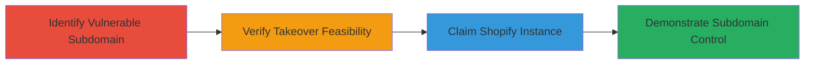

# Subdomain Takeover via Unclaimed Shopify Instance

Multi-stage attack chain demonstrating a complete attack workflow for subdomain takeover using an unclaimed Shopify service.

## Chain Metrics Dashboard

| Metric | Value |
|--------|-------|
| Chain Status | Unverified |
| Total Steps | 4 |
| Execution Time | ~30 minutes |
| Skill Level | Intermediate |
| Complexity | Medium |
| Impact Level | High |

## Attack Flow Visualization

## Prerequisites & Requirements

### Required Tools

- Web browser for DNS queries and Shopify account creation
- DNS lookup tools (e.g., manual dig or online resolvers)

### Target Environment

- Web platform with DNS-managed subdomains
- External services like Shopify
- No special ports required; standard DNS (port 53) and HTTPS (port 443)

### Initial Access Requirements

- Public access to DNS records
- No credentials needed initially; ability to create a free Shopify account
- Internet access for verification

## Detailed Attack Procedures

### Step 1: Identify Vulnerable Subdomain
procedure: [[procedures/Identify-Vulnerable-Subdomain-Pointing-to-Unclaimed-Service]]

**Objective**: Discover a subdomain whose DNS records point to an unclaimed external service like Shopify.

**Instructions**: Query DNS records for the target domain and its subdomains to identify any pointing to discontinued services. Use online DNS lookup tools or command-line utilities to check CNAME or A records.

**Expected Output**: DNS resolution showing the subdomain points to a Shopify IP or CNAME (e.g., shops.myshopify.com) that is no longer active.

**Success Indicators**:
- Subdomain identified with dangling DNS to external service
- Service confirmed as discontinued by the organization

### Step 2: Verify Takeover Vulnerability
procedure: [[procedures/Verify-Subdomain-Takeover-Vulnerability]]

**Objective**: Confirm the pointed service (Shopify instance) is unclaimed and available for registration.

**Instructions**: Attempt to access the subdomain URL in a browser. If it shows a Shopify claim page or error indicating the store is inactive, it is vulnerable. Check Shopify's status for the specific shop name derived from the DNS.

**Expected Output**: Browser shows an unclaimed Shopify store page or availability message.

**Success Indicators**:
- No active content loads; instead, a claim prompt appears
- DNS points to valid but unused Shopify endpoint

### Step 3: Claim the Instance
procedure: [[procedures/Claim-Unclaimed-Shopify-Instance]]

**Objective**: Register a new account and add the custom subdomain to take ownership of the instance.

**Instructions**: Create a free Shopify account at shopify.com. During setup, add the vulnerable subdomain as a custom domain in the account settings, following Shopify's domain verification process (no additional verification needed for unclaimed instances).

**Expected Output**: Shopify dashboard confirms the domain is added and active under your account.

**Success Indicators**:
- Domain successfully linked without errors
- Subdomain now resolves to your new Shopify store

### Step 4: Demonstrate Control
procedure: [[procedures/Demonstrate-Control-Over-Subdomain]]

**Objective**: Prove ownership by modifying the site content, such as adding a password-protected page.

**Instructions**: In the Shopify admin, create a new page, enable password protection on the store, and set the password to 'test'. Publish the page and access the subdomain to verify the protection is in place.

**Expected Output**: Visiting the subdomain prompts for the password 'test', revealing your controlled content.

**Success Indicators**:
- Password gate active on subdomain
- Ability to host arbitrary content under the organization's domain

## Attack Chain Summary

### Key Achievements

1. Identified and verified a dangling DNS record to an unclaimed Shopify service.
2. Successfully claimed the instance, gaining subdomain control.
3. Demonstrated potential for phishing or malicious hosting by setting up protected content.

## Technique & Tactic Coverage

### MITRE ATT&CK Techniques

- [[Exploit Public-Facing Application]]

### MITRE ATT&CK Tactics

- [[Initial Access]]

---
*Last updated: 2023-10-01T00:00:00Z*
