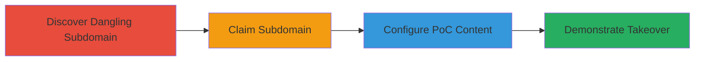

---
tags:
  - subdomain-takeover
  - shopify
  - dns
  - cname
  - dangling-record
type: attack_chain
tools: []
tactics:
  - '[[Initial Access]]'
commands: []
platforms:
  - Web
  - DNS
complexity: medium
procedures:
  - '[[procedures/Discover-Dangling-Subdomain-to-Unclaimed-Shopify]]'
  - '[[procedures/Claim-Unclaimed-Shopify-Subdomain]]'
  - '[[procedures/Configure-Proof-of-Concept-on-Taken-Over-Subdomain]]'
  - '[[procedures/Demonstrate-Subdomain-Takeover-with-Evidence]]'
step_count: 4
techniques:
  - '[[Exploit Public-Facing Application]]'
description: >-
  Attack chain exploiting a dangling CNAME record to take over a staging
  subdomain and host arbitrary content under a legitimate domain.
skill_level: intermediate
impact_level: high
id: e0562004-9d28-409b-9534-9d0048b62c57
created_at: '2025-12-14T04:51:10.905Z'
updated_at: '2025-12-14T04:51:10.905Z'
verified: false
validated: true
submitted: true
mitre_tactics:
  - '[[Initial Access]]'
mitre_techniques:
  - '[[Exploit Public-Facing Application]]'
---
# Subdomain Takeover via Unclaimed Shopify Store

Multi-stage attack chain demonstrating a complete subdomain takeover workflow by exploiting a misconfigured CNAME record pointing to an unclaimed Shopify store, allowing an attacker to claim control and host malicious content under the victim's legitimate domain.

## Chain Metrics Dashboard

| Metric | Value |
|--------|-------|
| Chain Status | Unverified |
| Total Steps | 4 |
| Execution Time | ~30 minutes |
| Skill Level | Intermediate |
| Complexity | Medium |
| Impact Level | High |

## Attack Flow Visualization

## Prerequisites & Requirements

### Required Tools

- Shopify Partner Account (free to create)
- Web browser for access and verification

### Target Environment

- Public DNS resolution
- Target domain with misconfigured subdomains pointing to third-party services like Shopify
- No authentication required for discovery

### Initial Access Requirements

- Internet access
- No prior credentials needed for the target
- Ability to register for Shopify partner dashboard

## Detailed Attack Procedures

### Step 1: Discover Dangling Subdomain
procedure: [[procedures/Discover-Dangling-Subdomain-to-Unclaimed-Shopify]]

**Objective**: Identify subdomains with dangling CNAME records pointing to unclaimed resources on third-party platforms like Shopify.

**Instructions**: Access the suspected subdomain URL directly in a web browser, such as https://de-headless.staging.gymshark.com/. Observe if it resolves to a default unclaimed store page on Shopify, indicating the resource is abandoned and available for takeover.

**Expected Output**: Browser displays a Shopify default page stating the store is unclaimed or not set up.

**Success Indicators**:
- Subdomain resolves to Shopify's unclaimed store template
- No custom content from the target organization is present

### Step 2: Claim Subdomain
procedure: [[procedures/Claim-Unclaimed-Shopify-Subdomain]]

**Objective**: Register and claim ownership of the unclaimed subdomain through the third-party service's dashboard.

**Instructions**: Log in to the Shopify Partner Dashboard (create an account if needed). Use the domain claiming process to associate the dangling subdomain (e.g., de-headless.staging.gymshark.com) with a new or existing store, as it is unclaimed and publicly available.

**Expected Output**: Confirmation in the dashboard that the subdomain has been successfully claimed and linked to your store.

**Success Indicators**:
- Dashboard shows the subdomain as active under your account
- DNS propagation may take a few minutes; verify by accessing the URL

### Step 3: Configure Proof-of-Concept Content
procedure: [[procedures/Configure-Proof-of-Concept-on-Taken-Over-Subdomain]]

**Objective**: Set up custom content on the claimed subdomain to demonstrate control, simulating malicious payloads.

**Instructions**: In the Shopify store admin panel, create a custom page or theme. Add proof-of-concept content, such as text reading 'A-p0c Subdomain Takeover PoC', along with images or videos for evidence. Initially set password protection if needed, then remove it after configuration to allow public access. Address any Shopify-specific issues, like theme rendering, by testing iteratively.

**Expected Output**: The subdomain URL now loads your custom page instead of the default unclaimed template.

**Success Indicators**:
- Custom text, images, or video appear on the subdomain
- No errors in Shopify admin when publishing changes

### Step 4: Demonstrate Takeover with Evidence
procedure: [[procedures/Demonstrate-Subdomain-Takeover-with-Evidence]]

**Objective**: Capture and share proof of the takeover to validate the vulnerability.

**Instructions**: Access the configured subdomain URL (e.g., https://de-headless.staging.gymshark.com/) and take screenshots of the PoC page. Record a short video demonstrating the before (unclaimed) and after (claimed with custom content) states. Submit these artifacts along with the URL to the vulnerability disclosure program.

**Expected Output**: Screenshots and video files showing control over the subdomain.

**Success Indicators**:
- Evidence clearly shows the subdomain under attacker control
- Submission accepted by the program for review

## Attack Chain Summary

### Key Achievements

1. Identified and exploited a dangling CNAME for subdomain takeover
2. Gained full control over a legitimate staging subdomain
3. Hosted proof-of-concept content to simulate real-world attacks like phishing
4. Demonstrated high-impact potential for deception and malware distribution

## Technique & Tactic Coverage

### MITRE ATT&CK Techniques

- [[Exploit Public-Facing Application]]

### MITRE ATT&CK Tactics

- [[Initial Access]]

---
*Last updated: 2023-10-01*
