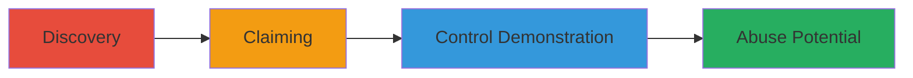

---
tags:
  - subdomain-takeover
  - dns
  - uptime-robot
  - web
type: attack_chain
tools: []
tactics:
  - '[[Initial Access]]'
verified: false
platforms:
  - Web
submitted: true
complexity: low
created_at: '2023-10-01T00:00:00Z'
procedures:
  - '[[procedures/Discover-Vulnerable-Subdomain]]'
  - '[[procedures/Claim-Subdomain-on-UptimeRobot]]'
  - '[[procedures/Demonstrate-Control-of-Subdomain]]'
step_count: 3
techniques:
  - '[[Exploit Public-Facing Application]]'
updated_at: '2025-12-14T04:51:10.472Z'
description: >-
  Attack chain exploiting an unclaimed DNS pointer to UptimeRobot for subdomain
  takeover, enabling control over the subdomain for potential abuse.
skill_level: beginner
impact_level: medium
id: 77a3d9e4-27d3-48e1-bcf2-7ce8b1e91b39
validated: true
mitre_tactics:
  - '[[Initial Access]]'
mitre_techniques:
  - '[[Exploit Public-Facing Application]]'
---
# Subdomain Takeover via Unclaimed UptimeRobot Pointer

Multi-stage attack chain demonstrating a complete attack workflow for subdomain takeover through an unclaimed DNS record pointing to UptimeRobot.

## Chain Metrics Dashboard

| Metric | Value |
|--------|-------|
| Chain Status | Unverified |
| Total Steps | 3 |
| Execution Time | ~5 minutes |
| Skill Level | Beginner |
| Complexity | Low |
| Impact Level | Medium |

## Attack Flow Visualization

## Prerequisites & Requirements

### Required Tools

- Web browser
- UptimeRobot account (free signup)

### Target Environment

- Web platform with DNS records pointing to third-party services like UptimeRobot
- No specific ports required; relies on public DNS resolution

### Initial Access Requirements

- Internet access to resolve and visit subdomains
- No prior credentials needed for discovery

## Detailed Attack Procedures

### Step 1: Discover the Vulnerable Subdomain
procedure: [[procedures/Discover-Vulnerable-Subdomain]]

**Objective**: Identify subdomains with DNS records pointing to unclaimed third-party services, such as UptimeRobot, indicating potential takeover opportunities.

**Instructions**: Visit the target subdomain in a web browser to check for indicators of an unclaimed pointer. For example, navigate to https://uptime.btfs.io/ and observe the response.

**Expected Output**: A 'not found' or default error page from the third-party service (e.g., UptimeRobot), confirming the DNS points there but no active account claims it.

**Success Indicators**:
- DNS resolves to the third-party infrastructure
- Error message specific to the service (e.g., UptimeRobot's 'site not found')

### Step 2: Claim the Subdomain on UptimeRobot
procedure: [[procedures/Claim-Subdomain-on-UptimeRobot]]

**Objective**: Register an account on the third-party service and claim the unclaimed subdomain due to lax verification policies.

**Instructions**: Sign up for a free account on UptimeRobot's website (uptimerobot.com). Once logged in, use the service's claiming feature to associate the subdomain with your new account, as their policy allows reassignment of unclaimed sites without additional verification.

**Expected Output**: Confirmation that the subdomain is now under your control within the UptimeRobot dashboard.

**Success Indicators**:
- Subdomain appears in your account's monitored sites list
- No errors during the claiming process

### Step 3: Demonstrate Control of Subdomain
procedure: [[procedures/Demonstrate-Control-of-Subdomain]]

**Objective**: Verify and showcase full control over the subdomain by accessing its management dashboard and performing actions on its behalf.

**Instructions**: Log into the UptimeRobot dashboard associated with the claimed subdomain. Use a simple password like 'A123456789' for demonstration purposes to access and configure monitoring settings, proving administrative control.

**Expected Output**: Access to the subdomain's configuration panel, allowing edits to monitoring, alerts, or other features.

**Success Indicators**:
- Successful login and dashboard access for the subdomain
- Ability to modify settings or view historical data

## Attack Chain Summary

### Key Achievements

1. Identified an unclaimed DNS pointer to UptimeRobot on uptime.btfs.io
2. Claimed full control of the subdomain without verification
3. Demonstrated potential for abuse including phishing, malware hosting, and email spoofing

## Technique & Tactic Coverage

### MITRE ATT&CK Techniques

- [[Exploit Public-Facing Application]]

### MITRE ATT&CK Tactics

- [[Initial Access]]

---
*Last updated: 2023-10-01T00:00:00Z*
