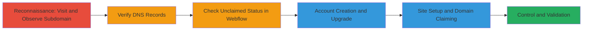

---
id: ac-uuid-placeholder
name: Subdomain Takeover via Unclaimed Webflow Service on jet.acronis.com
type: attack_chain
description: This attack chain demonstrates the detection and exploitation of a subdomain takeover vulnerability where a neglected CNAME record points to an unclaimed Webflow service, allowing an attacker to claim full control over the subdomain for malicious purposes.
verified: false
submitted: false
step_count: 8
created_at: 2023-10-01T00:00:00Z
updated_at: 2023-10-01T00:00:00Z
procedures: [[procedures/Detect-Unclaimed-Webflow-Subdomain]], [[procedures/Claim-and-Control-Webflow-Subdomain]]
techniques: [[Exploit Public-Facing Application]], [[T1583.003]]
tactics: [[Initial Access]], [[Resource Development]]
tags: subdomain-takeover, webflow, dns, cname, initial-access
platforms: Web, DNS
tools: []
complexity: medium
skill_level: intermediate
impact_level: high
---

# Subdomain Takeover via Unclaimed Webflow Service on jet.acronis.com

Multi-stage attack chain demonstrating a complete subdomain takeover workflow targeting a neglected DNS configuration pointing to Webflow.

## Chain Metrics Dashboard

| Metric | Value |
|--------|-------|
| Chain Status | Unverified |
| Total Steps | 8 |
| Execution Time | ~30 minutes |
| Skill Level | Intermediate |
| Complexity | Medium |
| Impact Level | High |

## Attack Flow Visualization

## Prerequisites & Requirements

### Required Tools

- Web browser (e.g., Chrome or Firefox)
- Access to Webflow portal (free signup possible, but paid upgrade needed for custom domains)

### Target Environment

- Web platform with DNS resolution
- Services: Webflow hosting
- Tech stack: DNS (CNAME records), Webflow
- No specific ports required; standard HTTPS (443)

### Initial Access Requirements

- No prior credentials needed for detection
- Internet access for DNS queries and Webflow signup
- No internal network position required; fully external

## Detailed Attack Procedures

### Step 1: Visit the Subdomain to Observe Default Page
procedure: [[procedures/Detect-Unclaimed-Webflow-Subdomain]]

**Objective**: Identify if the subdomain exhibits signs of an unclaimed hosting service.

**Instructions**: Open a web browser and navigate to the target subdomain https://jet.acronis.com. Look for a default Webflow 404 error page, which indicates an unclaimed service.

**Expected Output**: A Webflow-branded error page stating something like "This domain isn't connected to a site yet" or a generic 404.

**Success Indicators**:
- Default Webflow page loads without custom content
- No Acronis-specific content appears

### Step 2: Check DNS Records to Confirm CNAME
procedure: [[procedures/Detect-Unclaimed-Webflow-Subdomain]]

**Objective**: Verify the DNS configuration points to a third-party service.

**Instructions**: Use a DNS lookup tool or command-line utility like `dig` or online services (e.g., dig web interface) to query the CNAME record for jet.acronis.com.

**Expected Output**: CNAME record showing jet.acronis.com points to proxy-ssl.webflow.com.

**Success Indicators**:
- CNAME confirmed to Webflow
- No A/AAAA records overriding the CNAME

### Step 3: Verify Unclaimed Status in Webflow Portal
procedure: [[procedures/Detect-Unclaimed-Webflow-Subdomain]]

**Objective**: Confirm the domain is available for claiming in the service provider's dashboard.

**Instructions**: Log in to your Webflow account (create one if needed) and navigate to the custom domains section or search for the domain in the Webflow dashboard to check availability.

**Expected Output**: The domain jet.acronis.com shows as unclaimed or expired in the portal.

**Success Indicators**:
- Domain status: Available/Unclaimed
- No existing site linked

### Step 4: Create a Webflow Account
procedure: [[procedures/Claim-and-Control-Webflow-Subdomain]]

**Objective**: Establish an account to initiate the claiming process.

**Instructions**: Visit webflow.com and sign up for a new account using an email address.

**Expected Output**: Successful account creation with login credentials.

**Success Indicators**:
- Account dashboard accessible
- Verification email received

### Step 5: Upgrade to Basic Paid Plan
procedure: [[procedures/Claim-and-Control-Webflow-Subdomain]]

**Objective**: Unlock custom domain features, as free plans do not support them.

**Instructions**: In the Webflow dashboard, go to account settings and upgrade to the basic site plan (requires payment).

**Expected Output**: Plan upgraded; custom domain option enabled in project settings.

**Success Indicators**:
- Upgrade confirmation
- Hosting tab shows custom domain support

### Step 6: Create a New Site
procedure: [[procedures/Claim-and-Control-Webflow-Subdomain]]

**Objective**: Set up a project to associate with the custom domain.

**Instructions**: From the dashboard, click "New Project" or "Create Site" and set up a basic blank site.

**Expected Output**: New site created with editable pages.

**Success Indicators**:
- Site dashboard loads
- Ready for domain association

### Step 7: Add Custom Domain in Project Settings
procedure: [[procedures/Claim-and-Control-Webflow-Subdomain]]

**Objective**: Link the unclaimed domain to the new site.

**Instructions**: In the site dashboard, navigate to Project Settings > Hosting > Custom Domains, enter jet.acronis.com, and follow the prompts to verify and add it.

**Expected Output**: Domain added; Webflow issues SSL and propagates changes.

**Success Indicators**:
- Domain status: Connected/Pending
- DNS verification instructions provided (if needed)

### Step 8: Claim and Control the Subdomain
procedure: [[procedures/Claim-and-Control-Webflow-Subdomain]]

**Objective**: Validate control and deploy malicious content.

**Instructions**: Publish the site with custom content (e.g., a PoC message in HTML source). Revisit https://jet.acronis.com to confirm changes.

**Expected Output**: Subdomain now serves custom Webflow site content.

**Success Indicators**:
- Custom page loads on subdomain
- Source code shows attacker-controlled elements
- SSL certificate issued by Webflow

## Attack Chain Summary

### Key Achievements

1. Detected unclaimed subdomain via reconnaissance and DNS verification
2. Successfully claimed control by leveraging Webflow's custom domain feature
3. Gained ability to host arbitrary content, enabling phishing, malware distribution, or redirects

## Technique & Tactic Coverage

### MITRE ATT&CK Techniques

- [[Exploit Public-Facing Application]] Exploit Public-Facing Application
- [[T1583.003]] Virtual Private Server (for infrastructure acquisition via hosting)

### MITRE ATT&CK Tactics

- [[Initial Access]] Initial Access
- [[Resource Development]] Resource Development

---
*Last updated: 2023-10-01T00:00:00Z*
