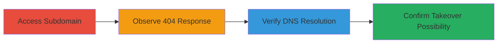

---
tags:
  - subdomain-takeover
  - dns
  - wix
  - cname
  - reconnaissance
type: attack_chain
tools: []
tactics:
  - '[[Reconnaissance]]'
  - '[[Initial Access]]'
verified: false
platforms:
  - Web
  - DNS
submitted: true
complexity: medium
created_at: '2023-10-01T00:00:00Z'
procedures:
  - '[[procedures/Detect-and-Confirm-Subdomain-Takeover-on-Wix]]'
step_count: 4
techniques:
  - '[[Hardware]]'
  - '[[Exploit Public-Facing Application]]'
updated_at: '2025-12-14T04:38:49.226Z'
description: >-
  Multi-stage reconnaissance and verification process to identify and confirm a
  subdomain takeover vulnerability on an unclaimed Wix-hosted subdomain,
  enabling potential control over the domain for malicious purposes.
skill_level: intermediate
impact_level: high
id: 20bd8658-2c5a-4102-8034-cee429ba0b9d
validated: true
mitre_tactics:
  - '[[Reconnaissance]]'
  - '[[Initial Access]]'
mitre_techniques:
  - '[[Hardware]]'
  - '[[Exploit Public-Facing Application]]'
---
# Subdomain Takeover via Unclaimed Wix CNAME for Cyberlynx.lu

Multi-stage attack chain demonstrating the identification and confirmation of a subdomain takeover vulnerability, where a dangling CNAME record points to unclaimed Wix infrastructure, allowing an attacker to claim control and host malicious content.

## Chain Metrics Dashboard

| Metric | Value |
|--------|-------|
| Chain Status | Unverified |
| Total Steps | 4 |
| Execution Time | ~5 minutes |
| Skill Level | Intermediate |
| Complexity | Medium |
| Impact Level | High |

## Attack Flow Visualization



## Prerequisites & Requirements

### Required Tools

- None (uses built-in commands like curl and dig)

### Target Environment

- Web platform with DNS resolution
- Access to internet for HTTP requests and DNS queries
- No special services or ports required beyond standard HTTP (80) and DNS (53)

### Initial Access Requirements

- Public internet access
- No credentials or prior access needed
- Target: www.cyberlynx.lu or similar dangling subdomain

## Detailed Attack Procedures

### Step 1: Access the Subdomain
procedure: [[procedures/Detect-and-Confirm-Subdomain-Takeover-on-Wix]]

**Objective**: Attempt to access the target subdomain to check for availability or error responses.

**Instructions**: Use [[commands/curl-http-head]] to send an HTTP HEAD request to the subdomain:

```bash
curl -I http://www.cyberlynx.lu/
```

**Expected Output**: HTTP response headers, potentially indicating a 404 or redirect.

**Success Indicators**:
- Response received without authentication prompt
- No active site content loaded

### Step 2: Observe the 404 Response
procedure: [[procedures/Detect-and-Confirm-Subdomain-Takeover-on-Wix]]

**Objective**: Analyze the response to identify signs of an unclaimed hosting platform.

**Instructions**: Follow up the HEAD request with a full GET using [[commands/curl-http-get]] to view the error page:

```bash
curl http://www.cyberlynx.lu/
```

Inspect the output for Wix-specific 404 messaging indicating the site is unclaimed and available for registration.

**Expected Output**: HTML page with Wix branding and a message like "This site is not configured" or similar availability notice.

**Success Indicators**:
- 404 error page from Wix infrastructure
- No custom content from the target organization

### Step 3: Verify DNS Resolution
procedure: [[procedures/Detect-and-Confirm-Subdomain-Takeover-on-Wix]]

**Objective**: Perform a DNS lookup to trace the CNAME chain and confirm it points to Wix without active resolution.

**Instructions**: Use [[commands/dig-cname-lookup]] to query the CNAME records:

```bash
dig www.cyberlynx.lu CNAME
```

Examine the chain for pointers to wixdns.net domains.

**Expected Output**: CNAME records showing www.cyberlynx.lu -> www118.wixdns.net -> balancer.wixdns.net -> etc.

**Success Indicators**:
- CNAME chain resolves to Wix DNS infrastructure
- No A record or active IP assignment

### Step 4: Confirm Takeover Possibility
procedure: [[procedures/Detect-and-Confirm-Subdomain-Takeover-on-Wix]]

**Objective**: Validate that the subdomain is unclaimed and can be registered on the hosting platform.

**Instructions**: Based on the 404 page, manually verify on Wix's platform (via browser) that the domain is available for claiming. No command needed, but document the unclaimed status.

**Expected Output**: Wix dashboard or error confirming availability for registration.

**Success Indicators**:
- Confirmation of unclaimed status
- Potential to register without ownership conflicts

## Attack Chain Summary

### Key Achievements

1. Identified dangling CNAME to unclaimed Wix subdomain
2. Verified via HTTP and DNS that no active site exists
3. Confirmed attacker can claim control for phishing or defacement
4. Highlighted risk to main domain reputation

## Technique & Tactic Coverage

### MITRE ATT&CK Techniques

- [[Hardware]] Gather Victim Host Information: Identify Infrastructure
- [[Exploit Public-Facing Application]] Exploit Public-Facing Application

### MITRE ATT&CK Tactics

- [[Reconnaissance]] Reconnaissance
- [[Initial Access]] Initial Access

---
*Last updated: 2023-10-01T00:00:00Z*
